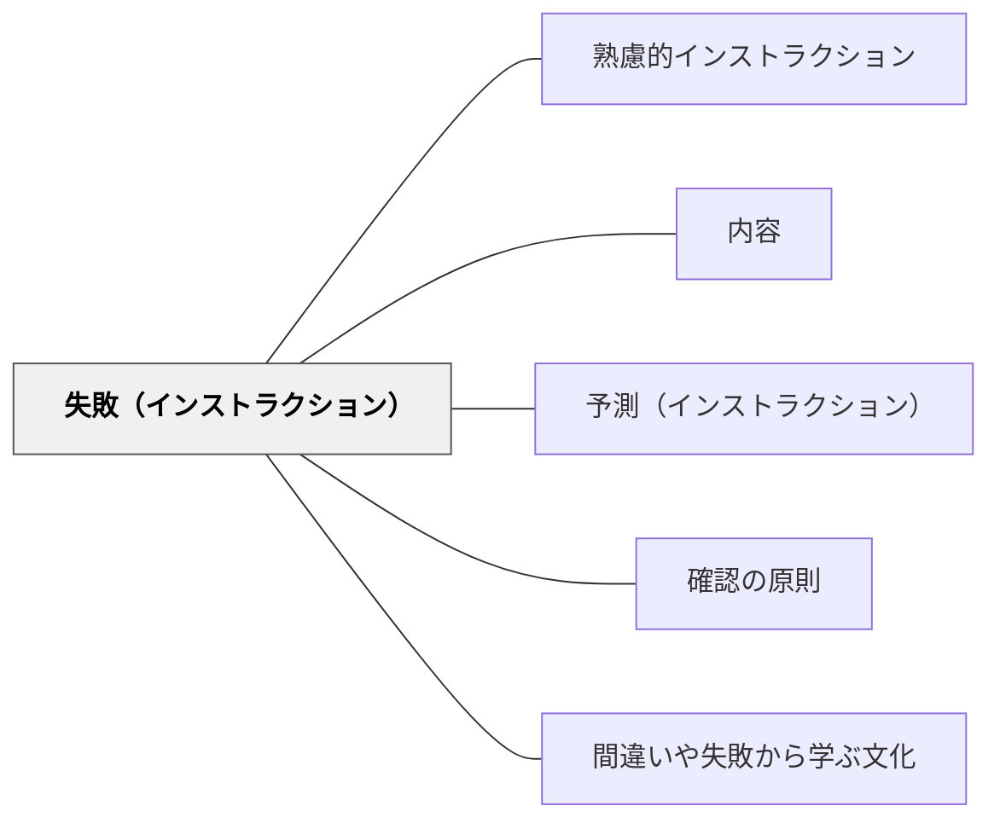

# 失敗（インストラクション）

> 「こうなったらやり直し」を示す警告信号が、受け手のフラストレーションを最も減らす。

## 背景（Context）
ワーマンの「理解の秘密」が示すインストラクションの内容6要素の一つが「失敗」である。ワーマンは6要素の中で最もよく欠落しながら、受け手のフラストレーションを最も軽減できる要素として「失敗の警告信号」を挙げる。失敗の徴候を前もって伝えることで、受け手は自分で誤りに気づき修正できる。

## 問題（Problem）
インストラクションには「正しい行動」だけが示され、「間違えたときのサイン」が省かれることがほとんどである。受け手が間違った方向に進んでも、誤りのサインを知らないまま作業を続け、後になって大きな失敗として発覚する。早期の修正が難しくなる。

## 力のかたち（Forces）
- 失敗のサインを示すことで、受け手は自律的な修正が可能になる
- 失敗情報を詳しく伝えすぎると、受け手が「失敗するかもしれない」と萎縮する可能性がある
- 「失敗」と「予測」はセットで機能し、正常と異常の両方を示す必要がある

## 解決（Solution）
**「もし〇〇になったら、それはやり過ぎのサインです」「△△が起きたら一度戻ってください」という形で、失敗・やり過ぎの警告信号をインストラクションに含める。**

たとえば「文章が長くなりすぎたら、もう一度問いを読み直してください」「グループがまとまらないまま10分が過ぎたら、まず各自で考える時間を取りましょう」のように、具体的な徴候と修正行動をセットで伝える。

## 結果（Consequences）
- 受け手が早期に誤りを発見し、自律的に修正できる
- 教師への質問・中断が減り、受け手の主体性が育つ
- 失敗を「恥ずかしいこと」ではなく「修正のサイン」として扱う文化が生まれる

## クラスター図

## Actionable Insight

- 活動指示に「もし〇〇になったら、それはやり過ぎのサインです」という失敗の警告を1つ加える——失敗のサインを事前に知ることで受け手が自律的に誤りを発見・修正できる
- 「正常の予測」と「失敗の警告」をセットで伝える習慣をつくる——両方があることで受け手は自分の状態を正確に自己評価できる
- 失敗情報を「怒られるサイン」でなく「修正のチャンス」として伝える——失敗を学びの手がかりとして扱う姿勢が学習者の主体的な修正行動を促す

## 出典

- 一つの教育のパタン・ランゲージ（岩井輝久）

## 関連パタン
- [[パタン/熟慮的インストラクション]] — 親パタン
- [[パタン/内容]] — 失敗を含む6要素システム
- [[パタン/予測（インストラクション）]] — 失敗と対になる正常の予告
- [[パタン/確認の原則]] — 誤りを確認する仕組み
- [[パタン/間違いや失敗から学ぶ文化]] — 失敗を学びに転換する文化的基盤
