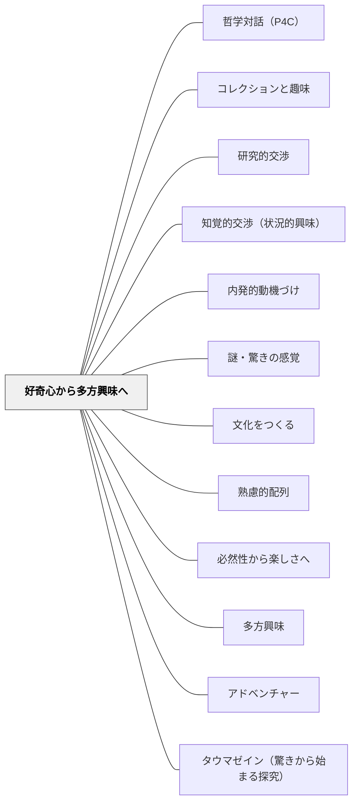

# 好奇心から多方興味へ

> 一点の好奇心が、やがて世界全体への窓になる。

## [Pattern Connection]

**Dewey（1910）How We Think 統合（2026-05-31）：**

*How We Think* Preface で Dewey は本書の中心命題を次のように述べる：「子どもの未教化の態度——熱烈な好奇心・豊かな想像力・実験的探究への愛——は、科学的精神の態度と非常に近い」。本パタン「好奇心から多方興味へ」の哲学的基盤として直接機能する。

**好奇心三位一体：**  
Deweyは Preface で**好奇心（curiosity）・想像力（imagination）・実験的探究への愛（love of experimental inquiry）**の三位一体を提示する：

| 要素 | 内容 | 牧口の多方興味との対応 |
|---|---|---|
| 好奇心（curiosity） | 「なぜ？」への開かれた態度 | 一点への好奇心の出発点 |
| 想像力（imagination） | 見えないものを見る力・仮説を立てる力 | 好奇心が他の領域へ広がる際の「橋かけ」の力 |
| 実験的探究への愛（love of experimental inquiry） | 試してみることへの喜び | 多方興味が「深い探究」へと根を張る原動力 |

**好奇心は命令できない——場の設計が仕事：**  
Deweyは Ch.2-3 で「子どもの好奇心は命令で生まれない——場の設計で引き出す」と述べる。これは [[パタン/タウマゼイン（驚きから始まる探究）]] と同じ論点——タウマゼインもfelt difficultyも好奇心も、強制できない内側の状態であり、教師の仕事は「その状態が生まれやすい場を設計すること」。

**本書の目的（Preface）：**  
Deweyは「このつながり（子どもの態度と科学的精神の近さ）を認識し、教育実践での承認が個人の幸福と社会的無駄の削減に貢献する」という確信を本書の目的として掲げる。「多方興味を育てる」という実践が「社会全体の知的資源の最大化」につながるというスケールの大きな論拠がここにある。

- **既存パタンとの関連**：牧口常三郎の「多方興味」概念に哲学的・教育学的根拠を加える。「一点の好奇心を大切に育て、そこから接続を広げる」という本パタンの解決に、Deweyの「三位一体の維持」という設計原則が重なる
- **補強された点**：「多方興味」が「広く浅く関心を持つこと」でなく「好奇心・想像力・探究の三位一体を維持しながら広がること」として理解できる。この三位一体が科学的精神の前身であるという論拠が、多方興味の価値を強化する
- **他のパタンへの波及**：[[パタン/タウマゼイン（驚きから始まる探究）]] — 好奇心はタウマゼインの日常的形態；[[パタン/作ることで学ぶ]] — 実験的探究への愛は「作る」活動で育つ；[[文献/How We Think（Dewey）]] — 本統合の出典

---

## 背景（Context）

[[パタン/熟慮的配列]] の興味の深化次元。牧口常三郎（創価教育学体系）の「多方興味」概念に基づく。学習者の好奇心はまず一点・一方向に向かうが、それを丁寧に耕していくことで、知識と経験の網の目を通じて多方向の興味へと広がっていく。

## 問題（Problem）

一つの好奇心が生まれても、それが育てられなければ萎んでしまう。また、好奇心が一点に留まり続けると、それ以外の領域への接続が生まれず、学習の幅が広がらない。

## 力のかたち（Forces）

- 好奇心は本来脆くて一時的なもので、育てなければ消える
- 興味を広げようと急ぎすぎると、最初の好奇心が薄まる
- 学習者によって好奇心の形・方向は大きく異なる
- 多方興味は「何にでも表面的に興味を持つ」ことではなく、深い関心が多方向へ根を張ることを指す

## 解決（Solution）

**まず学習者のある一点への好奇心を大切に育て（深める）、そこから「つながり」を通じて他の領域・側面・問いへと接続を広げていく。関連する問い・人物・場所・技能への「橋かけ」を教師が意図的に設計する。**

実践例：
- 昆虫への好奇心→生態系→食物連鎖→環境問題→化学（農薬）→地理（生息地）
- 歴史上の人物への興味→その時代の社会→他の国との関係→現代の問題
- スポーツへの熱中→身体の仕組み（生理学）→チーム戦略（数学的思考）→歴史と文化

[[パタン/多方興味]] と[[概念/好奇心から多方興味へ]]も参照。

## 結果（Consequences）

- 一つの関心が学習のネットワークとして広がり、自律的な学び手が育つ
- 学習者が「自分の興味の軌跡」を自覚できるようになる
- 異なる領域間の接続を見つける力（転移）が育つ

## クラスター図

## Actionable Insight

- 学習者が「おもしろい」と言った瞬間に「それ、どうしてそう思った？」と問い返す——好奇心の種を掘り起こす問いが多方興味の出発点になる
- 「この単元の内容と、あなたが好きなこと・知っていることはどこかつながる？」を単元末に書かせる——好奇心のネットワークを学習者自身が発見する体験
- 「昆虫→生態系→環境問題」のような「つながりの地図」を教師が1つ黒板に書いてみせる——一点の興味がどう広がりうるかのモデルを示すことで多方興味の感覚が育つ

## 出典

- 一つの教育のパタン・ランゲージ（岩井輝久）

## 関連パタン
- [[パタン/哲学対話（P4C）]]
- [[パタン/コレクションと趣味]]
- [[パタン/研究的交渉]]
- [[パタン/知覚的交渉（状況的興味）]]
- [[パタン/内発的動機づけ]]
- [[パタン/謎・驚きの感覚]]
- [[パタン/文化をつくる]]

- [[パタン/熟慮的配列]] — 上位パタン
- [[パタン/必然性から楽しさへ]] — 楽しさから興味が深まる
- [[パタン/多方興味]] — 多方興味の原典パタン
- [[概念/好奇心から多方興味へ]] — 概念的背景
- [[パタン/アドベンチャー]] — 好奇心を冒険として展開する
- [[パタン/タウマゼイン（驚きから始まる探究）]] — 好奇心はタウマゼイン（驚き）の日常的学習形態
- [[文献/How We Think（Dewey）]] — 好奇心三位一体（curiosity・imagination・love of experimental inquiry）の出典（Preface）
