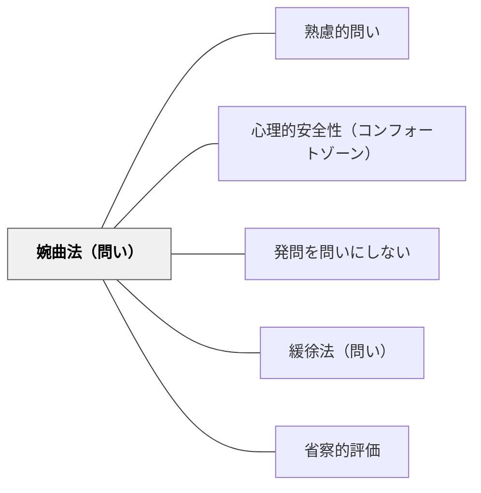

# 婉曲法（問い）

> 露骨にネガティブな表現をオブラートに包んだ問い

## 背景（Context）
婉曲法（ユーフェミズム）は、直接的に言うと不快・不適切・過激に聞こえる事柄を、間接的・柔らかな表現で言い換える修辞技法である。問いに婉曲表現を用いることで、批判・否定・失敗・葛藤などの繊細なテーマを安全に取り上げることができる。心理的安全性の低い場や、感情的に負荷の高いテーマを扱う授業で特に有効である。

## 問題（Problem）
ネガティブなテーマや批判的な問いを直接的に投げかけると、学習者が防衛的になるか、あるいは発言を控えてしまうことがある。「なぜ失敗したのか？」という問いは、責任追及のように受け取られやすい。ファシリテーターが問いの表現に無自覚でいると、意図せず心理的安全を損なってしまう。

## 力のかたち（Forces）
- 問いの正直さ vs 心理的安全
- 批判の明確化 vs 関係性の維持
- ネガティブな経験への直視 vs 間接的な接近
- 問いの深さ vs 学習者の受容可能性

## 解決（Solution）
「うまくいかなかった部分はどこでしょう？」（→「なぜ失敗したのか？」の婉曲）、「もう少し工夫できたとしたら、どのあたり？」（→「どこが悪かったか？」の婉曲）のように、批判や否定を間接的に問う。表現を柔らかくしつつも、問いの意図（改善・反省・批判的思考）は保持することが重要である。

## 結果（Consequences）
- 心理的安全が高まり、ネガティブな経験や意見が語りやすくなる
- 批判的思考が防衛反応なく促される
- 感情的に負荷の高いテーマを扱う場の雰囲気が和らぐ

## 関連パタン
- [[パタン/熟慮的問い]] — 親パタン
- [[パタン/心理的安全性（コンフォートゾーン）]] — 婉曲表現が心理的安全を生む学習環境の設計
- [[パタン/発問を問いにしない]] — 問いの表現を変えて防衛反応をなくす関連手法
- [[パタン/緩徐法（問い）]] — 二重否定で留保を許容する兄弟パタン
- [[パタン/省察的評価]] — 失敗・改善を問う場面で婉曲法が安全な自己評価を促す

## クラスター図

## Actionable Insight

- 「なぜ失敗したのか？」の代わりに「うまくいかなかった部分はどこでしょう？」と婉曲に問う——心理的安全が高まりネガティブな経験が語りやすくなる
- 「どこが悪かったか？」の代わりに「もう少し工夫できたとしたら、どのあたり？」と問う——批判的思考が防衛反応なく促される
- 感情的に負荷の高いテーマを扱う授業で意図的に婉曲表現を選ぶ——問いの表現を変えるだけで場の雰囲気が和らぐ

## 出典
- [[文献/熟慮的問いのパターンリスト（動画記録）]]
