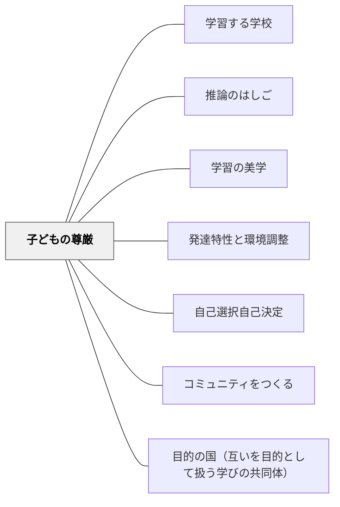

# 子どもの尊厳

> 学校には選択がある——クライアントを作るか、市民を作るか。違いは、子どもの欠陥リストを見るか、才能リストを見るかにある。

## [Pattern Connection]

*Schools That Learn*（Senge et al.）「Seeing the Learner」章より。Tim Lucas の「Anna の話」、Trudy Creede の言葉、Candee Basford の「We Dance Together」、John McKnight の欠陥→才能の転換が中心。

- **既存パタンとの関連**：[[パタン/発達特性と環境調整]] が「環境を変える」視点を持つのに対し、本パタンは「子どもをどう見るか」というより根本的な問いを扱う。[[パタン/学習する学校]] のメンタル・モデル・ディシプリンの具体的な適用。
- **補強された点**：「欠陥から才能へ」という転換は、特別支援教育だけでなく、すべての子どもへの関わりに適用できる普遍的なパタンである。
- **他のパタンへの波及**：[[パタン/学習の美学]] の「美的瞬間」は子どもの尊厳が守られた瞬間と重なる。[[パタン/推論のはしご]] で「この子には無理だ」という推論を降りることが、尊厳を守る実践になる。

**カント（1785）道徳形而上学の基礎づけ統合：**

- **哲学的基盤の追加**：McKnight の「欠陥から才能へ」という実践的洞察に、カントの Würde（尊厳）概念が哲学的根拠を与える。カントによれば、理性的存在者（人間）は価格（Preis）ではなく尊厳（Würde）を持つ——すべての価格を超越し、いかなる等価物も認めない内的価値。「欠陥リスト」で子どもの価値を測ることは、尊厳を価格に換算する誤りである
- **人格の定式との接続**：カントの「人格の定式」（「人間性を常に同時に目的として扱い、けっして単に手段として扱うな」）は、「クライアントではなく市民を作る」というMcKnightの言葉の哲学的表現。子どもを「学校評価の手段」として扱うことへの根本的批判になる
- **補強された点**：「尊厳」概念は能力・行動・成績によって変化しない——これが「欠陥リスト」への対抗原理として働く。特別支援の文脈でも、どんな状態にある子どもも尊厳において等しい
- **波及するパタン**：[[パタン/目的の国（互いを目的として扱う学びの共同体）]] — 教室全体を「全員が目的として扱われる」目的の国として設計することが、子どもの尊厳の構造的保護になる

---

## 背景（Context）

学校のシステムは、子どもを「何ができないか」「どの基準を下回っているか」というレンズで見ることに設計されている——診断名、標準化テストの点数、達成規準との乖離。

このレンズは支援の根拠にはなるが、それだけが子どもへのまなざしになると、子どもは自分を「欠陥のある存在」として経験し始める。教師も無意識に「この子には何ができないか」を先に考えるようになる。

John McKnightは問い直す：「欠陥を見ると、支援のためのサービスが生まれる。その子はサービスの受け手（クライアント）になる。才能・贈り物・可能性を見ると、共同体の一員（市民）が生まれる。」

## 問題（Problem）

教師が子どもへの見方を「欠陥リスト」で持つとき、その見方自体が現実を作り出す。「この子には難しい」という前提が、その子がチャレンジできる機会を減らす。「何をサポートするか」という問いが先に立つと、「何ができるか・何をしたいか」という問いが後回しになる。

子どもは大人の期待を感知する。尊厳が守られた空間でのみ、本来の力が育つ。

## 力のかたち（Forces）

- 診断的なシステムは「問題の特定」に最適化されており、才能の発見には向いていない
- 教師が「欠陥リスト」を持つとき、無意識に機会を狭めてしまう（自己成就予言）
- しかし「才能を見る」は意識的な訓練なしには難しい——欠陥は見えやすく、才能は見えにくい
- 尊厳の侵害は一瞬で起き、その影響は長く続く
- 尊厳の保護は意識的な設計なしには起きない

## 解決（Solution）

**子どもを「欠陥のリスト」でなく「才能・可能性・贈り物のリスト」として見るまなざしを、日常の実践に意図的に組み込む。**

---

### Anna の話——尊厳が傷つく瞬間（Tim Lucas）

あるワークショップでティム・ルーカスが参加者に「必要ない紙は返してください」と言ったとき、一人の参加者がびりびりに破って返した。その瞬間、部屋に緊張が走った。

後でTrudy Creede（特別支援教育者）がティムに言った：

> 「それはただ、その子の尊厳の問題なんだよ、ティム（It is just about their dignity, Tim）。」

教室で毎日、こうした「尊厳の傷つく瞬間」が起きている——子どもが笑われるとき、答えを否定されるとき、「あなたには難しい」と判断されるとき。この傷は見えにくく、記録されず、蓄積する。

---

### Katie Basford の話——欠陥から才能へ（Candee Basford）

ダウン症の娘Katieを持つアーティスト・コンサルタントのCandee Basford。

医療・教育システムはKatieを「欠陥のリスト」で見た。言語発達の遅れ、認知の限界、就労の困難——専門家は「介護施設や作業所」に向けた目標を設定した。

Candeeは問い直した。Katieをコミュニティの普通の学校に入れた。そこでKatieは友達を作り、友達もKatieから学んだ。

> 「彼女は個人として学ぶのではなく、他の人と一緒にいるときに最もよく学ぶ。彼女の可能性は関係の中にある。」

Katieはやがて高校を卒業し、コミュニティカレッジで解剖学・微生物学・芸術を履修し3.0のGPAを取得した。

Candeeが「もし私が踊れば、あなたの夢にどう役立つの？」と尋ねたとき、Katieは答えた：

> 「それは私も踊れるって教えてくれる。あなたが踊ったら、私たちは一緒に踊れる（We dance together）。」

**学校の選択**：Candeeは言う——「学校にはクライアントを作るか、市民を作るかの選択がある。市民を作る学校は、関係を築くこと・友達になることを大切にする。」

---

### Raphael の話——期待が可能性を開く

Hamlet のシミュレーション授業で、14歳のRaphaelが授業後に言った：

> 「脳が弾けた（My brain popped open）。」

それまで「難しい生徒」と見られていたRaphaelは、自分が問いを持てる・深く考えられると経験したとき、初めてそれが可能になった。尊厳が守られ、期待が与えられたとき、可能性が現れた。

---

### 日本版での応用：欠陥から才能へのシフト

| 欠陥レンズ（Deficit lens） | 才能レンズ（Gifts lens） |
|---|---|
| 「読むのが遅い」 | 「じっくり考えながら読む」 |
| 「指示通りにできない」 | 「自分なりの方法を探している」 |
| 「集中できない」 | 「複数のことに同時に気づいている」 |
| 「友達と違うことをしたがる」 | 「独自の視点を持っている」 |

**特別支援学級での実践**：年度初めに「この子の才能リスト」を5つ書き出す。保護者にも「お子さんが得意なこと・好きなこと・誇れること」を5つ聞く——診断名や課題よりも先に。

---

## 結果（Consequences）

- 教師のまなざしが変わると、子どもへの接し方が変わり、子どもの自己認識が変わる
- 才能を見るレンズは、支援計画を「できることを増やす設計」へと変える
- 保護者との関係も変わる——「問題の報告」から「才能の共有」へ
- ただし、才能レンズは「課題を無視する」ことではない——課題は課題として見ながら、それを「欠陥」としてではなく「これから伸びる領域」として見る

## 関連パタン

- [[パタン/学習する学校]] — メンタル・モデル・ディシプリンの学校への具体的適用
- [[パタン/推論のはしご]] — 「この子には無理だ」という推論を降りる実践ツール
- [[パタン/学習の美学]] — 尊厳が守られた瞬間が美的な学びの瞬間になる
- [[パタン/発達特性と環境調整]] — 特性を「欠陥」としてでなく「特性」として環境を設計する
- [[パタン/自己選択自己決定]] — 才能レンズは子どもへの選択の権限付与と連動する
- [[パタン/コミュニティをつくる]] — 市民を作る学校はコミュニティとして機能する
- [[パタン/目的の国（互いを目的として扱う学びの共同体）]] — 尊厳の構造的保護としての目的の国設計。カント的基盤を共有する

## クラスター図

## Actionable Insight

- 今担当している子ども一人を選び、「欠陥リスト」と「才能リスト」を並べて書いてみる——どちらが長いか、どちらが書きやすいか、それ自体が自分のメンタル・モデルを教えてくれる
- 「この子に何ができないか」という問いを「この子は何が得意か・何に夢中になれるか」に変えてみる——答えを見つけるには観察が必要で、その観察が関係を深める
- 保護者面談の最初の質問を「最近困っていることは？」から「最近お子さんが誇らしかった場面は？」に変えてみる——保護者との関係が変わる

## 出典

Senge, P., Cambron-McCabe, N., Lucas, T., Smith, B., Dutton, J., & Kleiner, A. (2000/2012). *Schools That Learn* (Updated and Revised ed.). Crown Business. Chapter: "Seeing the Learner"

Basford, C. (2005). *We Dance Together: A Painted Essay About My Education with Katie*. Candee Basford. http://www.wedancetogether.com

McKnight, J. (as cited in Basford, 2005). Asset-Based Community Development Institute, Northwestern University. http://www.abcdinstitute.org/

> 「それはただ、その子の尊厳の問題なんだよ、ティム。」——Trudy Creede

> 「欠陥に目を向けると『クライアント』が生まれる。才能・贈り物に目を向けると『市民』が生まれる。」——John McKnight

[[文献/Schools That Learn（Senge et al.）]]
