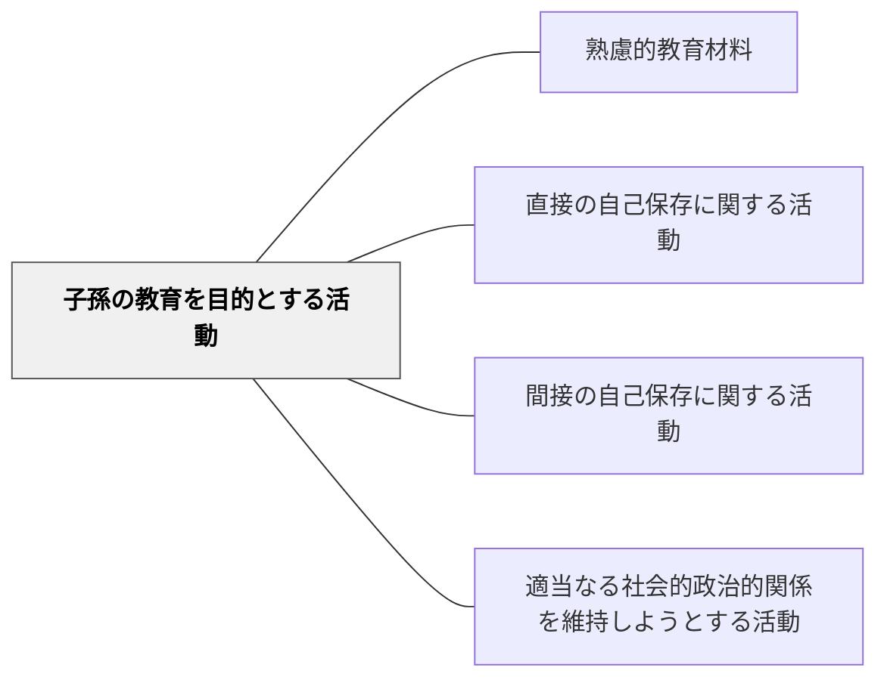

# 子孫の教育を目的とする活動

> 次の世代を育てるための知識——育児・教育そのものが重要な学習内容。

## 背景（Context）

ハーバート・スペンサーの活動分類の第三項目。育児法・子育て・教育学など、次世代を育てることを目的とした活動に関する知識。家庭科・道徳・養護・教職課程などの教育内容がここに含まれる。

## 問題（Problem）

子育て・養育に関する知識が「家庭の問題」として学校教育から切り離されてきた。

## 力のかたち（Forces）

- 育児・養育の知識は全ての人に関わる普遍的な価値
- 家庭科・保健での扱いはあるが体系化が難しい

## 解決（Solution）

**育児・子育て・次世代の養育に関する知識を家庭科・道徳・保健などで意識的に教育材料として位置づける。**

## 結果（Consequences）

- 次世代育成の意識が早期から育つ
- 子育ての知識が生活に生きる

## 関連パタン

- [[パタン/熟慮的教材教具]] — 親パタン
- [[パタン/直接の自己保存に関する活動]] — スペンサーの第一活動カテゴリ（身体的自己保護の知識）
- [[パタン/間接の自己保存に関する活動]] — スペンサーの第二活動カテゴリ（生計を立てる知識）
- [[パタン/適当なる社会的政治的関係を維持しようとする活動]] — スペンサーの第四活動カテゴリ（市民的知識）

## クラスター図

## Actionable Insight

- 家庭科・保健・道徳の授業で「子どもの育ちに必要なこと」を一問立てて考えさせる——育児・養育が「自分にも関わる普遍的なテーマ」であることへの気づきが学習の切実性を高める
- 「あなたが将来子どもを育てるとしたら、一番大切にしたいことは何か」を1文書かせる——次世代育成への意識が早期に芽生え、学習の意味が現実につながる
- 子どもの発達に関するケーススタディや写真・映像を1つ導入に使う——具体的な子どもの姿が教科内容への感情的関与を生む

## 出典

- ハーバート・スペンサー（知識の分類）
- [[文献/熟慮的教育材料のパターンリスト（動画記録）]]
