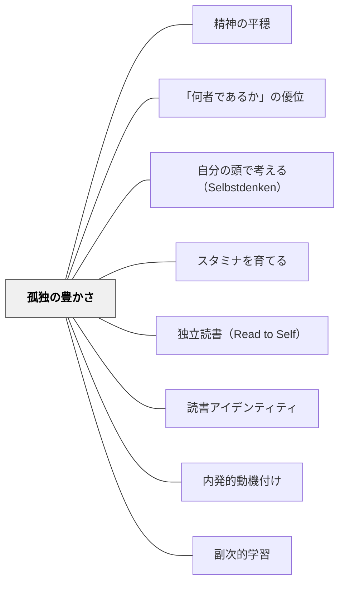

# 孤独の豊かさ

> 孤独を愛さない者は、自由を愛さない。なぜなら、人はひとりでいるときだけ、自由だからだ。——ショーペンハウアー（1851）

---

## Pattern Connection

**ショーペンハウアー（1851/2013）「幸福について」統合（2026-05-31）：**

本パタンはショーペンハウアーの精神的豊かさ論から生まれた。「才知あふれる人物はまったく独りぼっちでも、みずからの思索や想像ですばらしく楽しめるが、鈍物は社交や芝居と絶え間なく気分転換しても、退屈をはねのけることができない」——一人でいられる力は精神的豊かさの証明だ。

- **既存パタンとの関連**：[[パタン/スタミナを育てる]] が「独立して学習を続ける体力」を論じるなら、孤独の豊かさは「一人でいることへの内的充実」という動機的・存在論的次元を加える。スタミナは持続力だが、孤独の豊かさはその動機の源泉
- **補強された点**：[[パタン/自分の頭で考える（Selbstdenken）]] の「まず自分で考える時間」は、孤独の豊かさとして享受できるとき初めて深く機能する。孤独が苦痛なとき、一人で考える時間は「耐えるもの」になる。孤独が豊かなとき、一人で考える時間は「楽しむもの」になる
- **修正・拡張された点**：「孤独」はしばしば「つながりの欠如」として否定的に捉えられるが、ショーペンハウアーはこれを「精神的豊かさの条件」として積極的に再評価する。この視点は特別支援学級の子どもが一人でいることへのスティグマへの対抗軸になる
- **他のパタンへの波及**：[[パタン/精神の平穏]] — 孤独を楽しめる状態は精神の平穏の実践形態；[[パタン/「何者であるか」の優位]] — 「何者であるか」が充実しているとき孤独は豊かになる

---

## 背景（Context）

学校は本質的に集団の場だ。常に他者と一緒にいることが前提とされ、一人でいることは「孤立」「友達がいない」というネガティブな文脈で解釈されがちだ。

しかしショーペンハウアーは1851年に鋭く対比した。「才知あふれる人物はまったく独りぼっちでも、みずからの思索や想像ですばらしく楽しめる」——一人でいる時間は貧困でなく豊かさの場になりうる。その人が内側に何を持っているかが、孤独を苦痛にもするし豊かさにもする。

## 問題（Problem）

一人でいる時間が「退屈・孤立・不安」として経験される子どもは、内的充実なしに外部刺激に依存する。

スマートフォン・YouTube・ゲーム——これらへの過度な依存は、ショーペンハウアーが言う「空虚な内面を持つ人が社交で退屈を紛らわせようとする」の現代版だ。一人でいる時間に「することがない」「退屈だ」と感じるのは、内側の豊かさ（思索・想像・探究への関心）が育っていないサインかもしれない。

独立読書・自由研究・問いを書く時間——学校でつくる「一人の時間」が苦痛なとき、それは孤独の豊かさが育っていない問いかけだ。

## 力のかたち（Forces）

- 集団での活動は社会的な刺激と関係性を与えるが、一人の時間なしには深い思索が育ちにくい
- 孤独の豊かさは自然に育つのではなく、「一人で楽しめるもの」（本・問い・制作・思索）との出会いによって育てられる
- 外部刺激（社交・エンターテインメント）は入手しやすく即時的——内的充実は育てるのに時間がかかる
- 孤独を楽しめる子どもは、一人でいても不安にならず、自分のペースで深く学べる
- 特別支援の文脈：一人でいることを好む気質・特性（内向性・自閉スペクトラム傾向）を「問題」でなく「孤独の豊かさのための気質」として理解し直すことができる

## 解決（Solution）

**一人でいる時間を「内側の豊かさと出会う時間」として意図的に位置づける。孤独が苦痛でなく充実した時間になるように、「一人で楽しめるもの」との出会いを設計する。**

---

### 実践①：独立読書を「孤独の豊かさ」として位置づける

「独立読書」の時間を「一人でいられる力の鍛錬」として意図的に語る。

「この20分、誰とも話さず自分の世界に入る。それが豊かさだ」——一人でいることを「楽しむべきもの」として文化的に位置づけることで、独立読書の質が変わる。

静かに本を読んでいる子どもの姿を「孤立」でなく「内的世界に浸っている豊かさ」として教師が見る。その見方が子どもに伝わる（[[パタン/副次的学習]]）。

---

### 実践②：「一人で楽しめるもの」を見つける手伝い

本・問い・スケッチ・数学の問題・詩を書くこと——「これがあれば一人でも楽しい」という対象を持つことが、孤独の豊かさの基盤になる。

読書カンファリング・ブック・チャットは、子どもと「一人で楽しめる本」との出会いを設計するプロセスだ。「あなたにはこの本が合いそう」という個別の推薦が、孤独の豊かさの種を植える。

---

### 実践③：「一人の時間」を否定しない文化

休み時間に一人で読書している子、一人で問いを書いている子——これを「友達がいない」と解釈しない文化をつくる。「一人でいることを選んでいる」場合は、その選択を尊重する。

特別支援の文脈：一人でいることを好む子どもに「孤独の豊かさ」という概念を共有し、「あなたが一人でいたいのは、一人でいることを楽しめるからかもしれない」という肯定的な解釈を提供する。

---

## 自己教育での適用例

岩井が朝の数学研究・このWikiの執筆・本を読む時間に感じる「一人でいることの充実」はショーペンハウアーが言う孤独の豊かさそのものだ。誰とも話さなくても、内側で「思索や想像がすばらしく楽しめる」状態——これを意識的に守り、育てることが自己教育の中心の一つになっている。

---

## 結果（Consequences）

- 独立読書・自由研究・自由書き時間が「苦痛な静寂」でなく「充実した孤独」として経験されるようになる
- 外部刺激（ゲーム・SNS・社交）への依存が相対化され、「一人でいる力」が育つ
- 一人でいることを好む気質の子どもが、自分の特性を肯定的に理解できるようになる
- ただし、孤独の豊かさは「つながり・協働」の価値を否定しない——孤独と社交の往復が豊かさを生む

## 関連パタン

- [[パタン/精神の平穏]] — 孤独の豊かさが育つとき精神の平穏も深まる
- [[パタン/「何者であるか」の優位]] — 「何者であるか」の充実が孤独の豊かさの源泉
- [[パタン/自分の頭で考える（Selbstdenken）]] — 孤独の中で思索する実践
- [[パタン/スタミナを育てる]] — 一人で学び続ける持続力の育成
- [[パタン/独立読書（Read to Self）]] — 孤独の豊かさを育てる日常的な実践の場
- [[パタン/読書アイデンティティ]] — 「自分は読む人間だ」という自己像が孤独の豊かさを支える
- [[パタン/内発的動機付け]] — 内側からの動機があるとき孤独は豊かになる
- [[パタン/副次的学習]] — 教師が孤独の豊かさを体現することが子どもに伝わる
- [[文献/幸福について（ショーペンハウアー）]] — 本パタンの一次資料

---

## クラスター図

## Actionable Insight

- **「独立読書の20分」を孤独の豊かさとして語る**：授業の前に「これから20分、自分だけの世界に入る。一人でいることを楽しもう」と一言伝える。この言語化が「苦痛な静寂」を「充実した孤独」に変える
- **一人でいる子どもを「心配そうに見ない」**：休み時間に一人でいる子どもを観察するとき、「大丈夫かな」ではなく「何をしているのかな」という関心の向け方に変える——これだけで子どもへの見方が変わる
- **自分だけの「一人で楽しめるもの」を1つ持つ**：教師自身が「一人でいてもこれがあれば楽しい」という活動を1つ持つ。それが孤独の豊かさの体現になる

---

## 出典

ショーペンハウアー、鈴木芳子（訳）（2013）『幸福について』光文社古典新訳文庫（原著 Schopenhauer, A. (1851). Aphorismen zur Lebensweisheit. In Parerga und Paralipomena.）

> 「才知あふれる人物はまったく独りぼっちでも、みずからの思索や想像ですばらしく楽しめるが、鈍物は社交や芝居、遠出やダンスパーティーと絶え間なく気分転換しても、地獄の責め苦のごとき退屈をはねのけることができない」——ショーペンハウアー（1851/2013）
