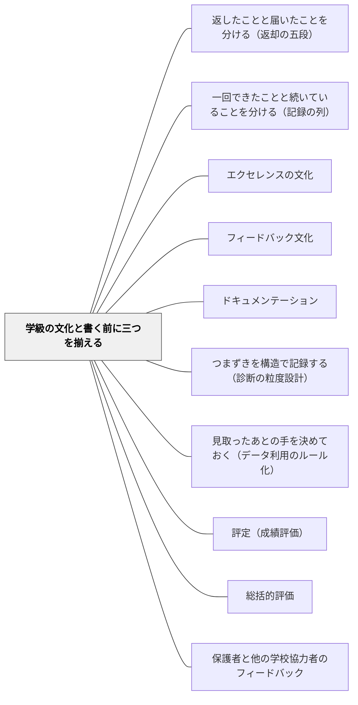

# 学級の文化と書く前に三つを揃える

> 「このクラスには、こういう文化が育ってきました」と書いてよい。どの意味で言っているかを名指し、誰の記録が何件あるかを添え、最後に残る跳びが自分の判断だと知っているならば。

## [Pattern Connection]

本パタンは岩井（2026）『圏論的教育記述の公理化ノート 第2巻』第III部・第8章の**教室語版**であり、**理論の正は書籍にある**（定義・記号はこの Wiki に置かない）。ここに書くのは、教室で使える形に開いた判断の手順だけである。

このWikiには「文化を育てる」側のパタンがすでに厚くある——[[パタン/エクセレンスの文化]]、[[パタン/フィードバック文化]]、[[パタン/ドキュメンテーション]]。本パタンはその隣に、**「育った」と書いてよいかを判断する側**を置く。文化をつくる仕事と、文化があると公に書く仕事は、別の技術を要する。前者は環境と働きかけの設計であり、後者は**手元の記録と、公開される一文とのあいだの距離を測る**仕事である。

[[概念/証拠不足と不成立の区別]] が「一人の子について、証拠不足と不成立を分ける」ことを扱ったのに対し、本パタンはそれを**学級の水準**で受ける。「観察が薄かった子の空白は、学びの空白ではなく観察の空白かもしれない」という同じ原則が、学級全体を主語にした一文の前で、もう一段強く効いてくる。

## 背景（Context）

学期末・年度末、教師の机の上には記録が広がっている。D児のノートには、繰り上がりの計算の日に自分で式を見直した跡があり、数週間後の繰り下がりの練習でも、同じように立ち止まって直した跡がある。C児については、返却の直後には最終的な答えだけが残っていて、そこにどんな試行錯誤があったのかは長いあいだ見えなかった。ある日、机上をもう少し注意深く見直すと、C児もまた、無言のうちにブロックを動かして答えを直していたことが分かった。

このとき、教師の口からこぼれかけるのは、次の一言である。

**「このクラスには、自己修正の文化が育ってきた」。**

そして、まさにこの一言を、制度は書式として求めてくる。要録・所見の「学級の実態」欄。通知表の所見。学級だよりの一文。校内研の報告。「本学級は、学び合いが根づいてきた」「自分の考えを見直す姿が見られるようになりました」——書かないわけにはいかない欄が、毎年、必ず来る。

手元にあるのは、記録である。書式が求めるのは、記録ではなく、**学級についての判断**である。そのあいだには、越えなければならない隔たりがある。

## 問題（Problem）

**何人かの子で確認できたことを「学級の文化」と書くとき、放っておくと二つの滑りが同時に起きる。そして読み手は、両方に読む。**

### 下への滑り——何人かを「みんな」と読み替える

D児とC児の二人の記録で自己修正が確認できたことは、**その二人についての証拠**であって、全員についての証拠ではない。「この学級の子はみな、自分の考えを見直せるようになった」は、それとは**別の主張**であり、それ自体の証拠を要する。二人の証人にただ乗りできるものではない。

ここが厄介なのは、二つの主張が**文面を一字も変えずに入れ替わる**ことである。「この学級には、自分の考えを見直す姿が育ってきました」——この一文は、何人かの記録に支えられた正確な主張としても読めるし、全員についての主張としても読める。書いた側は前者のつもりでも、読み手は後者に読む。

### 上への滑り——学級を一つの人格として扱う

記録がどれだけ厚くなっても、それは「学級という一つの人格が、何かを身につけた」ことではない。学級は、一人ひとりの記録を**束ねずに並べた**ものであって、集団の心ではない。「学級が体得した」「学級が一つになった」「本学級の体質」といった言い方は、記録の側からは一歩も支えられていない。

滑りの入口は、いつも同じところにある。**誰の記録が根拠なのかという情報を落とした瞬間**、主語のない「学級全体」が現れ、読み手はそこに勝手に主語を補う。下（みんな）へも、上（学級そのもの）へも、補い方は読み手の自由になる。読み手が誤読しているのではない。人間の読みが、そう働くのである。

そして、この癖は、暴いても消えない。一度「何人かは、みんなではない」と学んでも、次の一文の前で、また滑る。水中の棒が屈折して見えることを知っても、棒は屈折して見え続ける。

問いはこうなる——**では、何を揃えていれば「文化がある」と書いてよいのか。**

## 力のかたち（Forces）

- **「跳ぶな」という原則 vs 飛び越えを要求する書式**——記録から能力へ、何人かから全員へ、記録の厚みから学級の人格へ。制度は、まさにその飛び越えを書式として要求してくる。**この衝突は解決されない。** 本パタンにできるのは、それを初めてはっきり名指しできるようにすることだけである
- **保護者に伝えたいこと vs 記録で言えること**——「よい姿が育っています」と伝えたい。それは嘘ではない。だが、手元の記録が実際に支えている範囲は、伝えたい範囲より狭い
- **「まだ言えない」と書けない書式**——要録にも学級だよりにも、「未記録です」と書く欄はない。空欄で出すこともできない
- **励ましたい気持ち vs 正確さ**——良い姿を書くことは、子どもと保護者への励ましになる。正確に書こうとするほど、文は痩せ、冷たく見える
- **五点セットを毎回揃える手間 vs 学期末の時間のなさ**——いちばん忙しい時期に、いちばん丁寧な手続きが要る
- **観察の薄い子ほど記録が少なく、記録が少ないほど見なくなる**——静かな子、手のかからない子、表出の手段が限られている子ほど記録が薄い。薄いから話題に上らず、上らないから見られない。この循環は、放っておくと必ず強まる
- **書く側の誠実さ vs 読み手には見分けがつかないこと**——手元に裏づけのある一文と、印象だけで書いた一文は、読み手にはまったく同じに見える

## 解決（Solution）

**「文化がある」と書いてよい。ただし、書く前に三つを揃える。**

これは禁止ではない。理論の側は、この主張を**禁じていない。保証しないだけ**である。実践の側で「この学級には文化がある」と言うことは、正当でありうる。ただし、それが正当であるためには、次の三つが揃っていなければならない。

### ① 定義の名指し

**どの意味での「文化」かを名指しし、「この定義のもとで」を文に残す。**

「文化」という語は、そのままでは何も特定しない。だから、自分の目的のために、自分で定義を立ててよい。「この学級で自己修正の文化があるとは、〈返却のあとに、指示されずに自分の式や文を直す姿が、複数の子の記録に、複数の場面で残っていること〉を言う」——このように、自分が何を指してその語を使っているかを、書く。

そして、名指しから外さない。**「文化がある」ではなく、「この定義のもとで、文化がある」と言う。**

### ② 記録側の裏づけ

**その定義のもとで、どの主張がどこまで立っているかを添える。**

「自己修正の記録は、D児2件・C児1件で確認。共同で見直した記録は、まだ未記録。学級の共有ルーブリックは、二度改訂された」——このように、**正直に並べる**。立っているものと、立っていないものを、同じ調子で書く。

### ③ 飛躍の自覚

**定義と記録を揃えても、最後に残る跳びは判断である、と知っていること。**

記録の側でどれだけ丁寧に列を伸ばしても、そこから「学級にこういう文化がある」へは、どうしても飛躍がある。距離がある。その飛躍と距離を認識したうえで、それでも決断し、判断していくのが教師の仕事である。手続きは、この飛躍を**埋めない**。埋めないかわりに、**飛躍がどこにあるかを、書く本人に見えるようにする**。

同じ「安定して育ってきました」という一文でも、飛躍を飛躍として引き受けて書かれたものと、飛躍が起きたことにすら気づかずに書かれたものは、**質が違う**。

> 飛躍と距離それ自体は、埋まらない。だが、どれだけ見晴らしのよい場所から跳ぶかは、変わる。

### 二つの注意

**注意1：定義は証拠を製造しない。** どれだけ都合のよい定義を立てても、立っていない主張が立つわけではない。「一人でもそういう姿があれば文化がある」というようなゆるすぎる定義は、主張を空にする。**定義には値段がある。** ゆるくすればするほど、その一文が読み手に運ぶ情報は減る。

**注意2：定義があっても、滑りは消えない。** 「この定義のもとで文化がある」と書けたとしても、何人かを「みんな」と読み替える滑りも、学級を人格と取り違える滑りも、同じように起きる。**定義は、滑りを止める堤防ではない。** 堤防になるのは、**誰の記録かを保存すること**と、**「何人か」と「みんな」を指さし分けること**である。

---

### 影の理論——公開文書で名前を伏せることは、原則に反しない

ここに、実務でいちばん効く一手がある。

公開文書——とりわけ保護者に向けた学級だよりでは、個々の子の名前を伏せて「このクラスでは、自分の考えを見直す姿が見られるようになりました」と書くことが、**むしろ正しい**。名前を出すことはできない。

すると、「誰の記録かを保存せよ」という原則と、公開文書の要請は、矛盾するのだろうか。

**しない。**

> **公開文は、誰の記録かが分かる手元の記録の、影としてなら書いてよい。**

原則が禁じているのは、誰の記録かを消した主張を、**それだけで単独に出すこと**である。手元に「D児2件・C児1件」という裏づけが実際に立っているかぎり、学級だよりの「見られるようになりました」は、その**影**である。影であるかぎり、正当である。

だが、手元に何もないまま、印象だけで「見られるようになりました」と書けば、それは影ではなく、**根のない主張**である。

そして——

> **読み手には、影と根なしの区別はつかない。区別がつくのは、書いた教師だけである。**

だからこそ、書く前に、手元を確かめねばならない。学級だよりの一文を書く三十秒の前に、記録を見る三分を置く。それが、この原則の全部である。

---

### 受け手別の書き分け——変えているのは規則ではなく、情報の置き場所

同じ原則が、受け手によって「伏せよ」と「出せ」の両方の顔をする。変えているのは規則ではない。変えているのは、**誰の記録かという情報を、どこに置くか**である。

| 受け手 | 誰の記録かを | 書き方 | 正当さの条件 |
|---|---|---|---|
| **学級だより**（保護者へ） | 手元に置く・文には出さない | 影を出す。「〜の姿が見られるようになりました」 | 手元に帰属つきの裏づけが**実際に立っている**こと |
| **校内研**（同僚へ） | 出す。出すべきである | 分布を示す。下の五点セットで報告する | 五点が揃って初めて「完全な報告」になる |
| **要録・所見**（制度へ） | 手元に置く | 飛躍を自覚して跳ぶ | 逃げ場がない。だからこそ跳ぶ前の見晴らしがいちばん要る |

### 校内研の五点セット

同僚に向けた報告は、次の**五点が揃って初めて完全**になる。

1. **いつの期間を見たか**（窓）
2. **どういう体制で見たか**（どの場面・どの資料を中心に見たか）
3. **誰に何件立っているか**（分布。合計だけを出さない）
4. **見取りの範囲**（観察が薄かった子については、**未記録であって、無かったのではない**）
5. **次に誰を見るか**（観察の宿題）

例——

> 今学期、返却直後の授業時間とノートを中心に観察した範囲で、自己修正の記録はD児2件・C児1件、合わせて数件でした。観察が薄かった児童については、未記録であって、無かったのではありません。来学期は、まだ記録のない児童の観察の窓を作ります。

この五点のうち、落ちやすいのは④である。そして④を落とすと、報告は最も危険な取り違えを起こす——**観察体制についての主張を、子どもについての主張と取り違える。** 「あの子には0件でした」は、あの子についての事実ではなく、**こちらの見取りについての事実**である。

---

### 具体例1：要録の「学級の実態」欄を書く場面

三月。「本学級は、互いの考えを聞き合い、学び合う姿勢が育ってきた」と書きかけて、手を止める。

**書く前の三分。** ノートの束と、机間指導のメモと、単元末の振り返り用紙を出す。「聞き合い」に当たる記録を探す。実際に残っていたのは、ペアで説明し合う場面で相手の言い方を取り入れて自分の説明を直した記録が三人分、単元末の振り返りに「〇〇さんの言い方が分かりやすかった」と書いた子が七人分だった。逆に、記録が一件もない子が五人いた。

書き直した一文はこうなる。

> 学期を通じて、相手の説明を取り入れて自分の説明を作り直す姿が、複数の児童に見られるようになった。単元末の振り返りにも、友達の考えを引いて書く記述が増えている。一方、話し合いの場面での見取りが十分でなかった児童もおり、次年度への申し送りとして観察の場面を残す。

長さはほとんど変わらない。変わったのは、**「複数の児童に」と書いたこと**（全員とは書いていない）と、**見取りの薄さを自分の側の課題として一行残したこと**である。この一行は、次の担任への申し送りになる。

---

### 具体例2：学級だよりの一文

「自分の考えを見直す姿が見られるようになりました」と書きたい。

**書いてよい。** ただし、書く前に手元を見る。「見直した記録、誰にある？」——D児のノートに2件、C児の机上の観察で1件。あった。ならばこの一文は影である。

もし探して何も出てこなかったら——書き方を変える。「〜が見られるようになりました」ではなく、**その場で実際に起きたことを書く**。「先週の算数では、答えを出したあとに『でも』と言って式を書き直す子が何人かいました」。これなら、記録の範囲を出ていない。

読み手（保護者）にとって、後者のほうがむしろ具体的で、情景が浮かぶ。**正確に書こうとすることは、痩せた文を書くことではない。抽象度を一段下げることである。**

---

### 具体例3：校内研の報告

「本学級では自己調整の力が育ってきています」——この一文だけで報告を締めると、聞いた同僚は「学級全体が」と受け取る。そして、この報告からは**次に何をすればよいかが一つも出てこない**。

五点セットで言い直す。「今学期、返却直後の時間とノートを中心に見た範囲で、自分から式を直した記録はD児2件・C児1件です。ノートに過程が残らない子については、そもそも見取れていません。来学期は、消しゴムを使わずに横に書き直す約束を試して、過程が残る場面を作ります」。

言えることは減った。だが、**この報告からは、同僚が明日試せることが出てくる**。減ったのは主張の大きさで、増えたのは使える情報である。

---

### 具体例4：通知表の所見

所見は個人宛だから、学級の話ではない——とはならない。「学級で学び合いが進む中で、〇〇さんも自分の考えを進んで発表するようになりました」という書き方は、**学級についての主張を背景に置いて、個人の記述を支えている**。背景の主張が根なしなら、支えも根なしになる。

所見で書くべきは、**その子について実際に残っている記録**である。「話し合いの場面で、友達の意見を聞いてから自分の考えを言い直す姿がありました」。いつ・どの場面かが自分の中で言えるなら、書いてよい。言えないなら、書かない。

そして、記録の薄い子の所見を書く番になったとき——そこで手が止まることは、**その子についての情報ではなく、自分の見取りについての情報**である。三月にそれに気づくのでは遅い。だから具体例6の手続きを、学期の途中に置く。

---

### 具体例5：「学び合いが根づいてきた」と言いたくなる場面

十一月ごろ、学級が落ち着き、子どもたちが自然に教え合うようになる。教師は「根づいてきた」と感じる。この感覚は、たいてい正しい。**問題は、感覚が正しいことと、それを公の文書に書けることが別だ、ということである。**

このとき役に立つのは、感覚を疑うことではなく、**感覚に名前をつけて記録を探しに行くこと**である。「根づいてきた、と自分が感じたのは、具体的にどの場面を見たときか」。二つ三つ、場面が挙がる。挙がったら、それをメモに残す。挙がらなければ、それは「まだ探していない」ということであって、「無い」ということではない。

感覚は、記録を探すための**当たり**として使う。判定として使わない。

---

### 具体例6：いちばん記録の薄い子を、学期末に見に行く手続き

学期末の一週間前、記録を名前順ではなく、**件数の少ない順**に並べ替える。いちばん下の三人の名前を書き出す。

そして、その三人について、**次の一週間の観察の窓を一つだけ決める**。「A児は、算数の練習の時間に机の横に立って三分見る」「B児は、ノートではなく口頭でどう考えたか一度聞く」「E児は、グループの話し合いを一回だけ録音の代わりにメモする」。

これは、その子の評価を上げるための手続きではない。**その子について、まだ何も言えないという状態を、自分で作り出さないための手続き**である。

そして、ここが本パタンのいちばん静かな核心になる。学級について立てられる主張は、記録がいちばん厚い子ではなく、**いちばん薄い子をどれだけ見たかで決まる**。C児の記録は、教師がもう一度机上を注意深く見直したから立った。見直さなければ、立たなかった。

---

### 結び——記録を集約して第一に返ってくるのは、判決ではなく、観察の宿題である

学期末に記録を集めて読むと、何が返ってくるか。

返ってくるのは、子どもへの判定でも、学級への判決でもない。返ってくるのは、**観察の宿題**である。「別の場面での2件目を観察できる窓を作れ」。「ノートに過程が残る場面を作れ」。「まだ記録のない子の窓を作れ」。

「宿題」という語を使うのは、この語に向きがあるからである。返す側は、ずっと教師だった。ここでは、教師が、記録から**返される側**に立つ。

成績表も要録も、書かねばならない。それは変わらない。だが、記録を集めるという仕事が第一に差し出すのは、**判決を下すための材料ではなく、次にどこを見ればよいかの手がかり**である。

そして、この本のいちばん正直な教えは、こうである。

> **「このクラスには自己修正の文化がある」と言えるかどうかは、いちばん見取りの薄かった子を、どれだけ厚く見たかに懸かっている。**

判決を急ぐ前に、もう一度、いちばん薄いところを見に行くこと。

## 結果（Consequences）

**利点**

- **書けなくなるのではなく、書けるようになる**——「これは言い過ぎかもしれない」という漠然とした不安が、「何が揃っていないか」という具体的な項目に変わる。三つ揃えば、迷わず書ける
- **公開文書に自信の根拠が持てる**——学級だよりの一文の後ろに、手元の裏づけがある状態で出せる。保護者から具体的に問われても、答えられる
- **校内研の報告が、共有できる情報になる**——五点セットで報告すると、聞いた同僚が明日試せることが出てくる。主張の大きさは減るが、使える情報は増える
- **記録の薄い子が可視化される**——「誰に何件」という形で並べると、記録のない子が**空欄として見える**。合計だけを見ていると、この空欄は永遠に現れない
- **翌年度への申し送りになる**——「見取れていない範囲」を書き残すことは、次の担任への最も実用的な引き継ぎになる。「できない子」の申し送りではなく、「まだ見えていない窓」の申し送りである
- **制度との緊張を、名指しできる**——要録の書式に感じてきた居心地の悪さが、「制度は跳ぶなと言われた飛び越えを書式で要求している」という言葉を得る。解決はしないが、名前がつくだけで扱いが変わる

**注意点・リスク**

- **この衝突は解決されない**——本パタンは、制度が要求する飛び越えを消さない。跳ぶ前の見晴らしをよくするだけである。「これで完全に正確に書ける」とは考えないこと
- **手続きが儀式になる**——五点セットを形式的に唱えるだけで、実際には記録を見ていない、という状態はありうる。三点セットの②（記録側の裏づけ）を実際に紙の上に並べたかどうかが、儀式か否かの分かれ目である
- **正確さが冷たさになる**——「複数の児童に」「観察の範囲では」という言い回しを重ねすぎると、読む保護者には他人行儀に映る。**具体例2の方針**（抽象度を一段下げて情景を書く）のほうが、正確でしかも温かい
- **薄い子を「見に行く」ことが監視になりうる**——記録を増やすために特定の子を注視することは、その子にとって圧になりうる。窓は短く（三分）、目的は「その子を測る」ではなく「自分の見取りの空白を埋める」であることを、自分の中で保つ
- **定義を立てることが、独りよがりの正当化になる**——自分に都合のよい定義を立てて「この定義のもとでは文化がある」と書くことは、形式的には三点セットを満たす。**注意1（定義には値段がある）**を落とすと、この手続きは正当化の道具になる
- **記録の重さが指導を歪める**——「記録に残る姿」を作るために活動を設計しはじめると、目的と手段が入れ替わる。記録は判断を監査可能にするためのものであって、記録のために授業をするのではない
- **学級を超えて足し合わせない**——二つの学級でそれぞれ数人の記録が立ったことを足して「本校には〜の文化がある」と言うと、数百人規模の主張が、実際にはごく少数の記録に支えられている状態になる。学年・学校の水準へ持ち上げるときは、**滑りが段重ねになる**

## 関連パタン

- [[文献/圏論的教育記述の公理化ノート 第2巻（岩井）]] — 本パタンの出典。**理論の正はこの書籍にある**（定義・記号はこのWikiに置かない）
- [[パタン/返したことと届いたことを分ける（返却の五段）]] — 同じ本の第I部の教室語版。返却の数日を扱う。受け手ごとに記録を分けるという発想が、本パタンの「受け手別の書き分け」の源流にある
- [[パタン/一回できたことと続いていることを分ける（記録の列）]] — 同じ本の第II部の教室語版。一人の子の記録の列を扱う。本パタンはそれを学級の水準へ持ち上げたときに何が新たに危険になるかを扱う
- [[概念/証拠不足と不成立の区別]] — 「未記録は、無かったことではない」を一人の子の水準で確定した概念。本パタンの五点セット④は、その学級版である
- [[パタン/エクセレンスの文化]] — 文化を**育てる**側のパタン。本パタンは「育ったと**書いてよいか**」の側を担う。二つは対になる
- [[パタン/フィードバック文化]] — 同上。文化を作る働きかけと、文化があると公に主張することは、別の技術を要する
- [[パタン/ドキュメンテーション]] — 影の裏づけになる手元の記録をどう残すか。誰の記録かを保存した形で残っていなければ、影は書けない
- [[パタン/つまずきを構造で記録する（診断の粒度設計）]] — 記録の粒度の設計。合計ではなく「誰に何件」で残す実務的な作り方
- [[パタン/見取ったあとの手を決めておく（データ利用のルール化）]] — 観察の宿題を、実際の手立てへつなぐ。「次に誰を見るか」を決めたあと、見たら何をするかを先に決めておく
- [[パタン/評定（成績評価）]] — 成績表が要求する飛躍（記録から能力へ）の側。本パタンは学級の水準での同じ飛躍を扱う
- [[パタン/総括的評価]] — 学期末・年度末の集約の場。本パタンは、その集約の第一の産出が判決ではなく観察の宿題であることを示す
- [[概念/妥当性（スコアの意味についての評価判断）]] — 記録が何を意味するかの解釈が、観察の範囲に相対的であるという論点で接続する
- [[概念/帰結的妥当性（評価がもたらす結果まで問う）]] — 公開文書が読み手に何を起こすかを問う点で、影の理論と直接つながる
- [[パタン/保護者と他の学校協力者のフィードバック]] — 学級だよりの受け手。伝えたいことと記録で言えることの落差が、最も現れる関係
- [[文献/圏論的教育記述の公理化ノート 第1巻（岩井）]] — 前巻。「同じ活動」「同じ理解」「みんなで」を分けた手つきが、本パタンの二つの滑りの分離の原型になっている

## クラスター図

## Actionable Insight

**要録・所見の「学級の実態」欄を書く前のチェックリスト（三分）**

- **書きたい一文を、先に鉛筆で書き出す**——「本学級は〜」の一文をまず書く。直すのはそのあとでよい
- **その一文のキーワードに当たる記録を、実際に探す**——「学び合い」「見直す」「粘り強く」。名前と件数が挙がるまで探す。挙がらなければ、その語は使わない
- **「みな」「全員」「学級が」を含む表現を、指で押さえる**——「複数の児童に」「〜する姿が見られる場面があった」に置き換える。全員について書きたいなら、全員分の記録が要る
- **記録が一件もない子の人数を数える**——数えたら、「見取りが十分でなかった場面がある」旨を一行残す。これが翌年度への申し送りになる

**学級だよりに「〜の姿が見られるようになりました」と書く前（三十秒）**

- **「誰の記録？」と自分に一度だけ聞く**——名前が二つ以上浮かべば、書いてよい（影である）。浮かばなければ、書かない
- **浮かばなかったときは、抽象度を一段下げる**——「〜の姿が見られるようになりました」ではなく、「先週の算数では、〜という場面がありました」。実際に起きたことを書けば、記録の範囲を出ない

**校内研の報告の雛形（そのまま埋める）**

> 今学期（　　月〜　　月）、（　　　　　　の場面・資料）を中心に観察した範囲で、（　　　　　　）の記録は（　　児　　件・　　児　　件）です。合わせて（　　）件。観察が薄かった児童については、未記録であって、無かったのではありません。来学期は、（　　　　　　）の観察の窓を作ります。

- **④の一文（未記録であって、無かったのではない）を、必ず声に出して読む**——これを落とすと、報告は「見取れていない」を「無い」と言い換えたものになる

**学期末の一週間前にやること（十分）**

- **記録を、名前順ではなく件数の少ない順に並べ替える**——名簿順で見ているかぎり、薄い子は永遠に見えない
- **いちばん下の三人について、次の一週間の観察の窓を一つずつ決める**——「算数の練習中に三分横に立つ」「どう考えたか一度だけ口頭で聞く」。窓は短く、一つだけ
- **「文化がある」と書きたいときは、その三人を見に行ってから書く**——書く前にできる、いちばん効く一手である

**「文化がある」と書く直前の最終確認（三つ）**

- **① どの意味で言っているかを、自分の言葉で一文にできるか**
- **② その意味で、誰に何件立っているかを言えるか。立っていないものも言えるか**
- **③ 最後に残る跳びが、自分の判断であると分かっているか**——三つ揃えば、書いてよい

## 出典

岩井輝久（2026）『圏論的教育記述の公理化ノート 第2巻——返却・持続・文化に、異なる住所を与える』第6章・第7章・第8章・終章。

> 形式は判断を自動化しない。ただ、判断の場所を監査可能にする。（第8章）

> 飛躍と距離それ自体は、埋まらない。だが、どれだけ見晴らしのよい場所から跳ぶかは、変わる。（第8章）

> 「文化がある」と言ってよい。定義を名指しし、記録の裏づけを添え、残りが自分の判断だと知っているならば。理論はその三つが揃っているかを見えるようにする——判断を代行はしない。（第8章）

> 読み手には、影と根なしの区別はつかない。区別がつくのは、書いた教師だけである。（第8章）

> 集約の第一の実践的産出は、次に何を・誰について観察すべきかであって、子どもや学級への判決ではない。（第8章）

> 「このクラスには自己修正の文化がある」と言えるかどうかは、いちばん見取りの薄かった子を、どれだけ厚く見たかに懸かっている。（第8章）

> 人間は、まだ無いことについて推論して、誤解していく。（終章）

> 理論が席を空けたことは、実践者から言葉を奪うことではなく、実践者に、自分の言葉の責任を返すことである。（終章）

- 前巻：[[文献/圏論的教育記述の公理化ノート 第1巻（岩井）]]
- 数式ゼロで読む入口：[[文献/教育の見方が変わる十一の問い（岩井）]]
