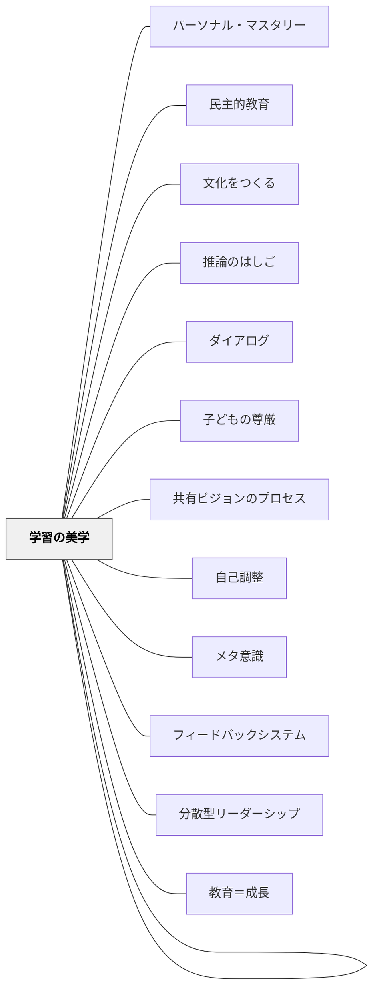

# 学習する学校

> すべての構成員が継続的に、自分たちが本当に求める結果を生み出す力を高めていく学校。— Senge et al.（2000/2012）

---

## Pattern Connection

### Dewey（1916）——民主主義的学校の哲学的根拠

**補強された点**：Sengeが「工業化モデルの学校からの脱却」を現代的な組織論から論じるのに対し、Dewey（1916）は100年以上前に同じ問題を教育哲学として根拠づけている。「工業化モデルの5仮定」（Senge）への批判は、Deweyの教育哲学に深い先行例を持つ。

**民主主義＝共同生活の様式**

> "A democracy is more than a form of government; it is primarily a mode of associated living, of conjoint communicated experience."（Dewey, 1916, Ch.7）

Deweyにとって民主主義は政体でなく「共同生活の様式」。その本質は2条件にある：
1. **共有される関心の数と多様性が大きい**——多様なバックグラウンドをもつ人々が同じ問いに向かう
2. **社会集団間の相互作用が自由で十全**——サイロを越えた対話と影響の流れがある

Sengeの「チーム学習（ダイアログ）」と「共有ビジョン」は、まさにこの2条件を組織内に実現しようとする実践ツールである。

**学校＝縮小された民主的コミュニティ**

Deweyは学校を「miniature community（縮小されたコミュニティ）」として設計することを求める：
- 学校内の学びが学外生活と連続していること
- 多様な関心をもつ人々が共同活動の中で相互に学ぶ場
- "The very process of living together educates."（Ch.1）

これはSengeの「生きたシステムとしての学校」（機械でなく有機体）と直接対応する。

**工業化モデル批判の重なり**

| Sengeの5仮定批判 | Deweyの対応批判 |
|---|---|
| 「学校は人をふるいにかける」 | 「準備としての教育」批判——今を犠牲にして将来に備える発想 |
| 「学習は個人的・競争的」 | 民主主義的学校は「共同活動（joint activity）」を通じて学ぶ |
| 「学校は真実を伝える」 | 「知識は伝達されるのでなく、経験の中で構築される」 |
| 「知識の転移が教育の仕事」 | 「教師と学習者の教科内容は根本的に異なる」（知識の3段階） |
| 「専門家が管理する」 | 「目的は内側から育つ——外から押し付けられた目的は知性を制限する」 |

**他のパタンへの波及**：[[パタン/教育＝成長]] の「成長すること自体が目的」は、「5つのディシプリン」が指向する「学習能力の継続的高まり」と哲学的に同型。[[パタン/反省的思考の5段階]] の「困惑から検証まで」は、Sengeの「仮説を立て検証する（Barry Richmondの6番目のスキル）」に対応する。

---

### Senge et al.（2000/2012）全文再統合（2026-05-19）

*Schools That Learn*（Crown Currency, 2000/2012）は、Sengeの『第5のディシプリン』を学校という具体的なコンテキストに展開したフィールドブックである。工業化モデルの学校（規格化・均質化・分断）から学習組織としての学校へ。

- **既存パタンとの関連**：[[パタン/文化をつくる]] が扱う「コミュニティ・当たり前・習慣」の形成と直結する。5つのディシプリンは、文化づくりの具体的なメカニズムとして機能する。
- **補強された点**：「文化をつくる」がコミュニティ設計の原則を扱うのに対し、本パタンは組織全体の学習能力を高める構造的フレームを提供する。個人・チーム・組織の3層を同時に扱う。
- **接続した概念**：[[パタン/自己調整]] ← 個人の熟達（Personal Mastery）。[[パタン/メタ意識]] ← メンタル・モデル（Mental Models）。[[パタン/聴き合う文化]] ← チーム学習（Team Learning）。
- **追加された接続**：「生きたシステムとしての学校」「工業化モデルの5仮定」「氷山モデル」「Barry Richmondの8スキル」「Orange Grove事例」を本文に追記。
- **他のパタンへの波及**：[[パタン/推論のはしご]]・[[パタン/ダイアログ]]・[[パタン/子どもの尊厳]]・[[パタン/学習の美学]]・[[パタン/共有ビジョンのプロセス]] に展開。

---

## 背景（Context）

20世紀の学校は工業化モデルで設計された——子どもを「原材料」として受け取り、学年という「工程」を経て、「規格品」を出荷する工場。このモデルは効率的な知識伝達に最適化されていたが、変化への適応・創造・協働には向いていない。

Sengeらは工業化時代が植えつけた5つの前提を問い直すことを求める：
1. **人をふるい分けるために学校はある** — 一部の子どもだけが知的だという前提
2. **学習は本質的に個人的・競争的** — 協働がむしろ深い学習を生む
3. **学校は「真実」を伝える** — 学習者は知識を構築する存在であって、空の容器ではない
4. **知識の転移が教育の仕事** — 意味の構築プロセスを無視している
5. **専門家が学校を管理する** — 本当の改善は関与するすべての人の学習から生まれる

ピーター・センゲは1990年代にシステム思考をベースとした「学習する組織（Learning Organization）」の概念を提唱した。*Schools That Learn*（2000）は、その概念を学校に適用した実践書である。

**生きたシステムとしての学校**：バックミンスター・フラーは人間の手を「型どられた統合体（patterned integrity）」と表現した。学校も機械ではなく生きたシステムであり、部品の取り替えでは変わらない——変化は文化・関係・メンタル・モデルのネットワーク全体に働きかけるときに起きる。

## 問題（Problem）

学校の問題の多くは、個々の教師・子ども・管理職の問題として語られる。しかし実際には、繰り返し現れる問題の多くは構造的なものだ——個人を交替させても問題は続く。また、教師が孤立して働き、学校全体として学ばない構造では、どれほど優秀な教師がいても組織としての改善が起きない。

## 力のかたち（Forces）

- 変化する社会に対応するためには、教師が学び続ける組織が必要
- しかし日本の学校は多忙で、学習する時間・空間・文化が育ちにくい
- 上からのビジョン（管理職発）は形式化しやすく、真の動機づけにならない
- 短期的な成果への圧力が長期的な学習能力の構築を阻む

## 解決（Solution）

**5つのディシプリンを、個人・チーム・組織の三層で同時に実践する。**

学習する学校の核心は、5つのディシプリンが相互に支え合う体系をつくることだ。

### 5つのディシプリン

**① 個人の熟達（Personal Mastery）**

ビジョン（自分が本当に望む状態）と現実（今の状態）の間のギャップを「創造的緊張（Creative Tension）」として活用する。不安の緊張ではなく、学習を引き起こすエネルギーとして。

→ 教師が「理想の授業像」を持ち、現在の実践との差を誠実に見つめる日々の構えが、学校全体の学習を支える基盤になる。

**② メンタル・モデル（Mental Models）**

私たちはすべて、見えない仮定・前提・信念（メンタル・モデル）を持ちながら行動している。それを表面化し、検討することが、本当の意味での学習を可能にする。→ [[パタン/推論のはしご]]

**③ 共有ビジョン（Shared Vision）**

外から与えられた「学校のビジョン」は遵守されるだけだ。全員が自分の問いから出発し、共に育てるビジョンだけが、人を内発的に動かす。問いから始める参加型のプロセスが共有ビジョンを生む。

**④ チーム学習（Team Learning）**

ダイアログ（対話）と議論（Discussion）を使い分ける。集合知は競い合う議論でなく、仮定を宙吊りにするダイアログから生まれる。→ [[パタン/ダイアログ]]

**⑤ システム思考（Systems Thinking）**

他の4つのディシプリンを統合する第5のディシプリン。問題を個人ではなく構造として見る。因果ループ・システム・アーキタイプを使って、繰り返す問題のパターンを可視化する。

### 氷山モデル（The Iceberg）

問題への反応レベルを4層で表す思考ツール。下の層ほど深い変化を生む。

```
水面上 ─── イベント（Events） ← 「何が起きたか」——事後対応
    ─────── パターン・傾向（Patterns/Trends） ← 「何度も起きているか」——先取り対応
    ─────── システム構造（Systemic Structures） ← 「何がそれを生み出しているか」——設計
水面下 ─── メンタル・モデル（Mental Models） ← 「何がその構造を支えているか」——変容
```

多くの学校改善がイベント層で止まる（「また問題が起きた、対処しよう」）。メンタル・モデル層まで降りると本質的な変化が始まる。

### システム思考の教室への導入：Orange Grove の事例

1988年、アリゾナ州タクソンのOrange Grove Middle School。Frank DrapeとMark Swansonが、アリゾナ州立公園の鹿個体数管理シミュレーションを8年生に行った。

JoeとBillyが行動の時間推移（BOT: Behavior Over Time）グラフを前に対立する：「ハンターを増やせばいい」vs「問題の原因をグラフで探ろう」。教師は答えを与えず、子どもたちがグラフを描くことで「遅れ（delay）」という概念に気づいていく。Raphaelという生徒は後に言った：「脳が弾けた（My brain popped open）」。

**Barry Richmondの8つのシステム思考スキル**（STELLAソフトウェア開発者）：

1. 高高度思考 — システム全体を鳥の目で見る
2. システムが原因 — 問題の原因を個人でなく構造の中に見る
3. 動的思考 — 時間の流れの中でのパターンを見る
4. 操作的思考 — 実際に何がどう動いているかを見る
5. 閉ループ思考 — 原因と結果が循環していることを見る
6. 科学的思考 — 仮説を立て検証する
7. 共感的思考 — 他の人・ものの視点から見る
8. 汎用的思考 — 具体から抽象的なパターンへ

### システム・アーキタイプの活用

学校で繰り返す問題は、多くの場合同じアーキタイプに当てはまる。

| アーキタイプ | 学校での典型例 | 構造的介入 |
|---|---|---|
| 失敗する解決策（Fixes That Fail） | テスト対策強化→不安増大→理解低下→さらなる対策 | テスト不安を生む構造を変える |
| 問題のすり替え（Shifting the Burden） | 問題行動への外的対処→自己調整力が育たない→さらに外的管理 | 自己調整の力をつける根本介入 |
| 共有地の悲劇（Tragedy of the Commons） | 教師の孤立→共有知識の非蓄積→組織学習の停滞 | 学習コミュニティの仕組み化 |

## 結果（Consequences）

- 個々の教師の優秀さでなく、組織全体の学習能力が学校の力になる
- 問題の繰り返しが減り、根本的な構造変化が起きる
- 子どもも「学習する学校の文化」の中で、学び方を身につけていく
- 保護者・地域も学校の学びのコミュニティに参画するようになる

## 関連パタン
- [[パタン/パーソナル・マスタリー]]
- [[パタン/学習のための評価（A4L）]]
- [[パタン/民主的教育]]

- [[パタン/文化をつくる]] — 親パタン（学習文化をつくる）
- [[パタン/推論のはしご]] — メンタル・モデル・ディシプリンの実践ツール
- [[パタン/ダイアログ]] — チーム学習のコアプラクティス
- [[パタン/子どもの尊厳]] — 子どもを「欠陥」でなく「才能」として見る転換
- [[パタン/学習の美学]] — 美的瞬間と不条理な瞬間の感受性
- [[パタン/共有ビジョンのプロセス]] — 参加型ビジョン生成の実践
- [[パタン/自己調整]] — 個人の熟達との接続
- [[パタン/メタ意識]] — メンタル・モデルの構え
- [[パタン/フィードバックシステム]] — システム思考の循環構造
- [[パタン/分散型リーダーシップ]] — コミュニティ設計の原則
- [[実践/学習する学校をつくる]] — 実践ガイド
- [[パタン/教育＝成長]] — 成長すること自体が目的という哲学（Dewey）
- [[パタン/反省的思考の5段階]] — システム思考の「仮説→検証」スキルと対応（Dewey）
- [[パタン/チーム学習（Team Learning）]] — 5つのディシプリン第4。チームとして考える能力そのものを育てる実践

## クラスター図



## Actionable Insight

- 職員会議の最初15分を「この問題の背景にある構造は何か」という問いに使う——症状への対処でなく構造を見る習慣が、繰り返す問題を根本から変える
- 「理想の自分のクラス像」を1枚の紙に書いて、今の現状と並べてみる——創造的緊張を「不安」ではなく「学習への原動力」として感じる体験が個人の熟達の始まり
- 学年会議で「今年繰り返している問題」を一つ選び、因果ループを5分で描いてみる——「誰が悪いか」から「構造がどうなっているか」へ視点が移ると、解決の可能性が広がる
- 繰り返している問題を「氷山」に当てはめてみる——「イベント」から「パターン」→「構造」→「メンタル・モデル」まで降りると、何が根本にあるかが見えてくる
- ある子についての自分の判断を「推論のはしご」に当てはめてみる——「私はどのデータを選んでいるか、選んでいないデータは何か」を問うと、固定した見方がほぐれ始める

## 出典

Senge, P., Cambron-McCabe, N., Lucas, T., Smith, B., Dutton, J., & Kleiner, A. (2000/2012). *Schools That Learn: A Fifth Discipline Fieldbook for Educators, Parents, and Everyone Who Cares About Education* (Updated and Revised ed.). Crown Currency. → [[文献/Schools That Learn（Senge et al.）]]

Senge, P. (1990/2006). *The Fifth Discipline: The Art & Practice of the Learning Organization*. Doubleday. （邦訳：守部信之訳（1995）『最強組織の法則』徳間書店）
