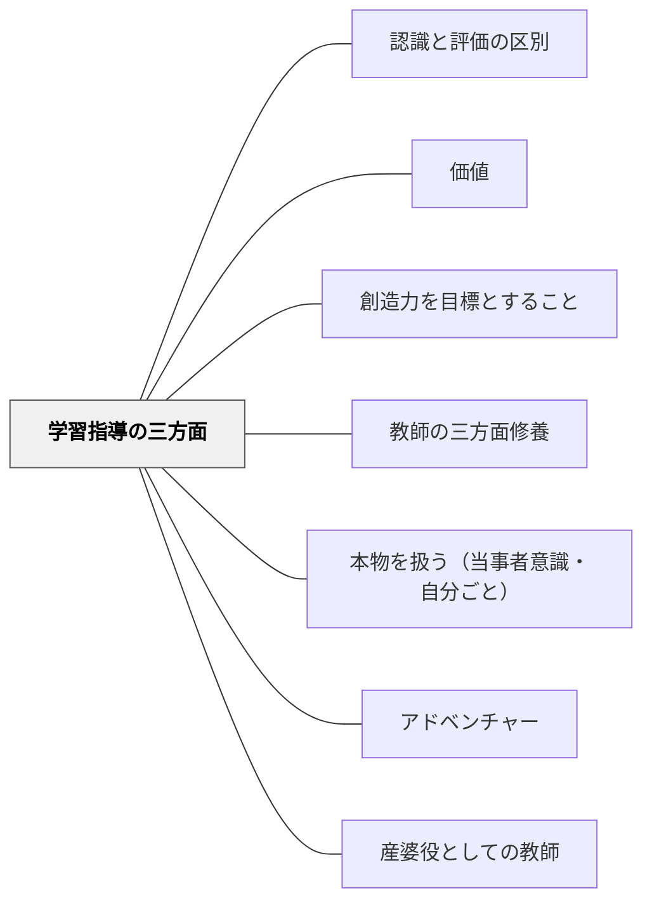

# 学習指導の三方面

> 学習は認識だけではない——認識し、評価し、価値を創造する三つの作用が揃って初めて完全な学習になる。——牧口常三郎（趣意）

## Pattern Connection

### 牧口常三郎（1930）——学習指導の三作用

牧口は *創価教育学体系 第4巻* において、学習（そして教授）に必ず含まれるべき三つの作用を定式化した。

| 作用 | 内容 | 問い |
|---|---|---|
| **認識作用** | 事実・概念・法則・構造を正確に把握する | 「それは何か・どうなっているか」 |
| **評価作用** | 価値（利・善・美）を判断し意味を捉える | 「それは役に立つか・良いか・美しいか」 |
| **創価作用** | 新しい価値を生み出す・応用する・発明する | 「それを使って何か新しいことができるか」 |

**従来の教育の問題**：知識の詰め込みを中心とした教育は「認識作用」のみを重視し、評価作用・創価作用を軽視または無視してきた。その結果「何を知っているか」は問われても「その知識で何ができるか・どんな価値を生み出せるか」は問われない学習が続いた。

**牧口の主張**：真の教授は三方面を意識的に設計しなければならない。さらに教師の指導法の研究においても、この三作用の順序と統合を考慮すべきであり、牧口はこれを「評価・認識・創価の三作用の組み合わせを、帰納・演繹の両作用に結び付けて新たに五段教導法として提唱を試みん」と述べた（第4巻 第七編 第六節）。

**「創価」の語源**：牧口の造語「創価」は「価値を創造する（Create Value）」の意。*創価教育学体系* の書名はこの三作用の第三段階を核心理念とすることを示している。

**既存パタンとの関連**
- [[パタン/認識と評価の区別]] — 認識作用と評価作用が別個の作用であることの根拠はこのパタンにある
- [[パタン/教師の三方面修養]] — 教師の修養（教材知識・教授法・人格）の三方面と学習の三作用は対応する構造を持つ
- **他のパタンへの波及**：[[パタン/価値]]（「利・善・美」三価値は創価作用の内容を構成する）・[[パタン/創造力を目標とすること]]（「離」の段階 = 創価作用の実現）

---

## 背景（Context）

授業設計の際、「この授業で何を学ばせるか」を考えるとき、多くの場合「何を知らせるか（認識）」で終わることが多い。ブルームの分類学では「知識・理解・応用・分析・評価・創造」の六段階が示されているが、日常の授業設計ではどの認知レベルに向けているかを意識しないまま進みがちである。牧口常三郎は1930年代にすでに「認識・評価・創価」の三方面を並行して指導すべきと論じた。

## 問題（Problem）

「知識を教えること（認識指導）」のみを授業の目的とすると、学習者は学んだ知識の価値（意味・用途・美しさ）を把握できず、さらにその知識を使って新しい何かを創造する力が育たない。「役に立たない学校の勉強」「テストに出るから覚える」という外発的動機への依存が生まれる背景に、評価作用・創価作用の軽視がある。

## 力のかたち（Forces）

- 認識は評価・創価の基盤——正確な認識なしに適切な評価も創造もできない
- 評価は動機をつくる——「この知識は価値がある」と実感することが学習継続の燃料になる
- 創価は学習の達成点——「自分が何か新しいものを作った・見つけた」という体験が最も深い学習
- 三作用を別々に行うと学習が断片化する——認識→評価→創価のサイクルとして設計することが必要
- 認識重視に偏りすぎると「正解を覚えるための学習」が強化される

## 解決（Solution）

**学習指導を設計するとき、三作用（認識・評価・創価）を意識的に含む。どの作用に今向き合っているかを教師も学習者も意識できるようにする。**

| 授業段階 | 三方面の作用 | 実践的な問いかけ |
|---|---|---|
| 導入・探究 | 認識作用 | 「これは何だろう・どうなっているの？」「何が見える？」 |
| 考察・対話 | 評価作用 | 「これは役に立つ？なぜ？」「どれが一番大切だと思う？」 |
| 応用・創造 | 創価作用 | 「これを使って何ができる？」「自分で○○を作ってみよう」 |

---

**具体例1：算数の三角形の学習**

| 段階 | 活動 | 作用 |
|---|---|---|
| ①認識 | 様々な三角形を観察し、「3本の直線で囲まれた図形」と定義する | 認識作用 |
| ②評価 | 「三角形の強さ（構造的安定性）はどんな場面で役立つか」を考える | 評価作用 |
| ③創価 | 三角形の性質を使った橋・建物のモデルを自分で設計してみる | 創価作用 |

**具体例2：国語の俳句学習**

| 段階 | 活動 | 作用 |
|---|---|---|
| ①認識 | 俳句の構造（五・七・五）と季語の役割を把握する | 認識作用 |
| ②評価 | 有名な俳句を読んで「何がよいか・どんな情景が浮かぶか」を対話する | 評価作用 |
| ③創価 | 自分の経験から俳句を一句詠む | 創価作用 |

**具体例3：社会科の地域学習**

| 段階 | 活動 | 作用 |
|---|---|---|
| ①認識 | 地域の産業・地形・歴史的事実を調べる | 認識作用 |
| ②評価 | 「この地域の強みは何か・課題は何か」を考える | 評価作用 |
| ③創価 | 地域の課題を解決するアイデアを提案する・観光マップを作る | 創価作用 |

## 結果（Consequences）

- 学習者が「知識を使って何かできる」という有能感（自己効力感）を持ちやすくなる
- 「なぜ学ぶか」の答えが「テストのため」ではなく「価値を生み出すため」に変わる
- 教師が「何を教えたか」から「何ができるようになったか」へと意識を移せる
- 創価作用の達成（何かを作った・発明した）が内発的動機の最も強い燃料になる
- 認識だけに終わる授業を見直すきっかけになる

## 関連パタン

- [[パタン/認識と評価の区別]] — 認識作用と評価作用を区別して順序づけることの根拠
- [[パタン/価値]] — 牧口の価値論（利・善・美）が創価作用の対象を規定する
- [[パタン/創造力を目標とすること]] — 創価作用の最高形が創造力の育成
- [[パタン/教師の三方面修養]] — 教師自身が三方面で成長することが、学習者の三方面指導の前提
- [[パタン/本物を扱う（当事者意識・自分ごと）]] — 本物の文脈が評価作用・創価作用を引き出す
- [[パタン/アドベンチャー]] — 創価作用の場づくり（挑戦・冒険の学習設計）
- [[パタン/産婆役としての教師]] — 三作用のうち特に創価作用を産婆役が支える

## クラスター図

## Actionable Insight

- 今週の授業を一つ選んで、「①認識（何を知らせたか）②評価（価値や意味を考えさせたか）③創価（何かを作らせたか・応用させたか）」の三方面でチェックする——どれかが欠けていれば次の授業で補う
- 毎回の授業のめあて（学習目標）を「三方面のどれか」で書く練習をする——「〜を知る」だけでなく「〜を使って○○できる」「〜の価値を考える」という表現を加える
- 単元末の活動を「創価作用の場」として設計する——何かを作る・提案する・発表するという活動を単元の締めに意識的に置く

## 出典
- [[文献/創価教育学体系 4（牧口常三郎）]]

牧口常三郎（1930/2017）『創価教育学体系 第4巻（教育方法論・教材論・教育技術論）』聖教新聞社（電子版）

> 「余は評価、認識、創価の三作用の組み合わせを、帰納・演繹の両作用に結び付けて新たに五段教導法として提唱を試みんとする。」——牧口常三郎（第4巻 第七編 第六節）
