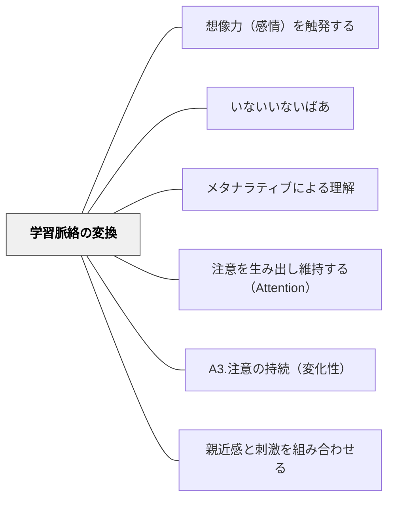

# 学習脈絡の変換

> 変化のある繰り返しで、学習者の注意と意欲を持続させる

## 背景（Context）

同じ内容を同じ形式で繰り返し提示し続けると、学習者の注意は急速に低下する。一方で、まったく新しい文脈や形式に毎回切り替えると、学習者は前の学びとの連続性を見失う。

## 問題（Problem）

単調さは飽きを生み、学習への意欲を失わせる。しかし変化だけを追い求めると、知識の定着や深化が妨げられる。注意・意欲を持続させながら、学習の累積的な深まりをいかに実現するか。

## 力のかたち（Forces）

- 人間の注意は「新奇性」に引きつけられ、慣れによって減衰する
- 繰り返しは定着に不可欠だが、文脈の変化がなければ飽きを招く
- 「変化のある繰り返し」は、既知の安心感と新奇性の刺激を両立させる
- 脈絡（コンテクスト）の変換は、同じ知識を複数の角度から照らし出す効果もある

## 解決（Solution）

同一の概念・スキル・知識を、異なる文脈・形式・活動の形で繰り返し提示する。たとえば、同じ数学的概念を物語の中で扱い、次に図解し、次にゲームとして実践し、最後に現実問題へ応用するという流れをつくる。

脈絡を変えるたびに「前に学んだことと同じ構造がここにもある」という気づきを促すことで、変化の中に連続性を感じさせる。

## 結果（Consequences）

学習者の注意と意欲が授業全体を通じて持続しやすくなる。同一概念が複数の文脈で理解されることで、知識の転移可能性も高まる。ただし、変換の頻度や幅が適切でないと、混乱や表面的な理解にとどまるリスクがある。

## 関連パタン

- [[パタン/想像力（感情）を触発する]]
- [[パタン/いないいないばあ]]
- [[パタン/メタナラティブによる理解]]
- [[パタン/注意を生み出し維持する（Attention）]]
- [[パタン/A3.注意の持続（変化性）]]
- [[パタン/親近感と刺激を組み合わせる]]

## クラスター図

## Actionable Insight

- 同じ概念を「物語→図解→実践問題」の3形式で順に提示する——文脈を変えるたびに「これは前に学んだことと同じ構造だ」と気づかせることで転移が深まる
- 文脈を切り替えるたびに「これは先ほど学んだ〇〇と同じしくみですね」と橋渡しを一言入れる——変化の中に連続性を感じさせることで学習の累積的な深まりが生まれる
- 同一の活動を15〜20分以上続けないよう授業設計する——適切な文脈の変換が注意と意欲を授業全体で持続させる

## 出典

キアラン・イーガン（2010）『想像力を触発する教育――認知的道具を活かした授業づくり』北大路書房
