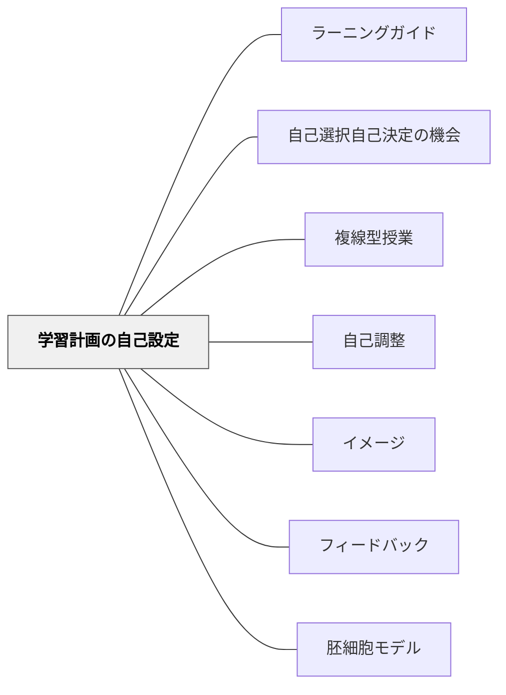

# 学習計画の自己設定

> 「いつ・何を・どのように学ぶか」を子供自身が決める経験が、自律した学び手を育てる。

## 背景（Context）

学校の時間割・授業の進め方はほぼ教師が決める。子供は「次に何をすべきか」を常に教師から指示されることに慣れてしまう。大人になってからも、誰かに指示されなければ学べない人間になる危険がある。

## 問題（Problem）

自分で「いつ・何を・どのように学ぶか」を決めた経験がない子供は、自由な時間を与えられると途方に暮れる。自律的な学び手を育てると言いながら、実際の授業では自律の練習が一切行われていない。

## 力のかたち（Forces）

- 計画を立てる力は、経験してみないと育たない
- 最初から完全に自由にすると不安・混乱が生じる
- 計画→実行→振り返りのサイクルを回す仕組みが必要
- 教師は管理から伴走・支援へと役割を変える必要がある

## 解決（Solution）

単元計画（またはいくつかの教科の学習内容）を子供に事前に提示し、**「いつ・何を・どのように学ぶか」を子供が計画を立てて学ぶ時間を設ける**。

**山吹小学校のYST（山吹セレクトタイム）：**
- 複数教科の単元をまとめて子供に提示
- 子供が週・日単位の学習計画を立てる
- 教師は個別に寄り添い、必要な支援を行う

**天童中部小学校のマイプラン学習：**
- 各学期1回、複数教科を組み合わせて実施
- 学習の手引きをもとに子供が計画を立てる
- さらに発展したフリースタイルプロジェクトへつながる

**フリースタイルプロジェクト（天童中部小学校）：**
- 個人総合として年間通じて一つの問いを追究
- 子供の多様性を前提に「学び続ける子供」を育てる
- 段階的に自由度を高めた先にある実践（通常授業→子供主導授業→マイプラン→フリースタイル）

## 結果（Consequences）

- 「計画を立てて動く」という自律的な学び方が育つ
- 自分のペースや得意な方法に気づく機会になる
- 教師は個別に深く関わる時間が生まれる
- 最初は計画通りに進まないことも多い——それ自体が学び（計画の修正・振り返り）

## 段階的な導入

1. まず通常の授業で「今日は何から始める？」の小さな選択から
2. 1コマの中で順番・方法を選べる時間を設ける
3. 単元の中で一定の裁量を渡す（マイプラン学習）
4. 複数教科・長期スパンでの自己設定（YST的な形式）
5. 個人の問いを年間追究する（フリースタイル的な形式）

## 関連パタン
- [[パタン/ラーニングガイド]]
- [[パタン/自己選択自己決定の機会]]

- [[パタン/複線型授業]] — 1コマ内での自己設定バージョン
- [[パタン/自己調整]] — 計画・モニタリング・評価のサイクル
- [[パタン/イメージ]] — ゴールのイメージが計画の出発点
- [[パタン/フィードバック]] — 計画の振り返りと修正
- [[パタン/胚細胞モデル]] — 活動の背景にある原理を理解することで計画が立てやすくなる
- [[概念/個別最適な学びと協働的な学び]]

## クラスター図

## Actionable Insight

- 今週の授業の最初の5分を「今日は何から始めるか」を自分で決める時間にする——小さな自己設定から始めて計画力を段階的に育てる
- 単元の最初に「今日から○時間でこれを学びます」という一覧を渡し、順番は自分で決めていいと伝える——計画経験の最小版として授業内自由度を1つ持たせる
- 週末に「来週やりたいこと・やるべきこと」を3行書かせる——計画→振り返りのサイクルが自律的な学び手の最初の一歩になる

## 出典

文科省「みるみる」実践編③名古屋市立山吹小学校（YST）、実践編⑦天童市立天童中部小学校（フリースタイルプロジェクト）（2026-04-29 vault収録）
