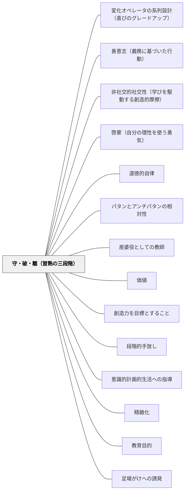

# 守・破・離（習熟の三段階）

> 一流儀を守り、広く諸流に破り、自ら新奇巧妙を発明して離れる——これが技術の極意であり、学びの普遍的原理である。—— 牧口常三郎

## Pattern Connection

### 牧口常三郎（1931）——守・破・離はヘルバルト三段教授と同じ原理

*創価教育学体系 第2巻* の本文中で、牧口は守・破・離の説明に続けてこう記している：

> 「直観、思慮、応用という三段教授、将ヘルバルト派の五段教授の原理も精神に於て殆ど[同じ]」

守・破・離は武道・棋道の習熟原理として生まれたが、牧口は「精神において」ヘルバルトの教授論と同じであると明示した。これは守・破・離が**普遍的な教授原理**であることの傍証になる。

**段階の対応**

| 守・破・離 | ヘルバルト三段教授 | 内容 |
|---|---|---|
| **守**（型を固く受け取る） | **直観**（Anschauung） | 素材と直接接触し、ありのままを受け取る段階 |
| **破**（広く諸流に学び統合する） | **思慮**（Besinnung） | 受け取ったものを比較・関連付け・深める段階 |
| **離**（新奇巧妙を自ら発明する） | **応用**（Anwendung） | 内面化した知識・技術を新しい場面で使う段階 |

ヘルバルト派の五段教授（明瞭・連合・系統・方法）は「思慮」段階をさらに細分化したものであり、骨格は同じ三層構造である。

**この接続が持つ意味**

守・破・離を「武道の格言」として扱うのではなく、19世紀の体系的教授学と同じ原理として位置づけることで、授業設計への応用に根拠が生まれる：
- 「直観」＝新しい素材を直接体験させる（守）
- 「思慮」＝体験を比較・関連付ける（破）
- 「応用」＝自分の文脈で使ってみる（離）

- **他のパタンへの波及**：[[パタン/多方興味]]（ヘルバルト由来の興味論と守・破・離が同じ教授学の文脈に属する）・[[パタン/先行オーガナイザー]]（直観段階での全体像提示が守の定着を助ける）

### 牧口常三郎（1931）——熟練教師の養成と徒弟制度

牧口は *創価教育学体系 第3巻* において、守・破・離の原理を**教師の養成**にも適用した記述を残している。

教師は「熟練を必要とする技術者」であり、「芸術と同格の複雑さ」を持つ専門職である。ゆえに教師の養成には「優秀な師匠の下での数年の実践的修練」、すなわち**徒弟制度（apprenticeship model）**が必要だと論じた。

守・破・離と師範教育の対応：

| 段階 | 師範教育での意味 |
|---|---|
| **守**（型を固く守る） | 優秀な師範教師のもとで、特定の教授方法・スタイルを徹底的に模倣・練習する |
| **破**（広く諸流に学ぶ） | 複数の先輩教師・理論・実践記録から多様な方法を習得し統合する |
| **離**（自ら発明する） | 自分の学級・児童の実態に応じた独自の指導スタイルを創造する |

また牧口は師範教育に必要な三方面として「教材知識の学修・教授方法の修練・師範人格の修養」を同時並行で行うことを強調した。これは守・破・離の各段階が知識・技術・人格の三方面を統合しながら進むことに対応する。

**修正点**：守・破・離は「学習者の習熟モデル」だけでなく、「教師自身の職業的成長モデル」としても機能する。教師の学びも守（先輩に学ぶ）→破（多様な方法を統合）→離（独自のスタイルを創造）という三段階を経る。

- **他のパタンへの波及**：[[パタン/産婆役としての教師]] — 「離」の段階の教師が「産婆役」になれる

### 牧口常三郎（1930）——教育技術の四段階：無意識から超意識的熟練へ

牧口は *創価教育学体系 第4巻*（教育技術論）において、守・破・離の習熟段階を**技術習得の内面的プロセス**としてさらに精密に記述した。

**教育技術の四段階**

| 段階 | 内容 | 守・破・離との対応 |
|---|---|---|
| **第一段：無意識的労働** | 技術があることを意識せず、ただ経験だけで動く | 守の前段階 |
| **第二段：試行錯誤** | 何かを工夫しようとするが体系的な方法なし。失敗を重ねながら少しずつ改善する | 守の段階 |
| **第三段：意識的技術練習** | 「これはこういう原理だ」と自覚しながら練習する段階。方法論が意識に上る | 破の段階 |
| **第四段：超意識的熟練** | 技術が完全に体に内面化され、意識しなくても自然に出てくる。「考えよりも手が先に動く」状態 | 離の段階 |

第四段階を牧口は「技術家にとって頭脳より手腕が先に進んでいる状態」と説明する。熟練した職人・芸術家はいちいち「どうするか」を考えない——技術が人格と一体化している。

**学問と技術の統合**

牧口は「法則を知ることと、その法則を実際に使えることは別である」という問いを立て、両者の統合が必要だと論じた：

> 「方法の学問的考察なしに、コツコツ技術の練習だけをしたなら、非常なる時間と労力との徒費を要する」

学問（理論）と技術（実践）を切り離すと、どちらも半人前になる。この原理は守・破・離の「守：型を守る（実践）」→「破：理論的に広げる」→「離：統合した人格になる」という構造に対応している。

**教育道（信・行・学）の三要素**

牧口は第4巻 第七編で「教育道」という概念を提唱した。守・破・離の「離」の段階（超意識的熟練）は単なる技術習得では達成されず、三つの要素の統一体として実現する：

| 要素 | 内容 |
|---|---|
| **信（信仰・信念）** | 教育の目的・価値への確信。「何のためにやるか」の基盤 |
| **行（実習・熟練）** | 授業実践・技術練習の継続。守・破・離の実践層 |
| **学（学術・理論）** | 教育学の知識・原理の理解。破の段階で広げる理論基盤 |

- **他のパタンへの波及**：[[パタン/教師の三方面修養]]（教育道の信・行・学 = 師範教育の人格・方法・教材の三方面と対応する）・[[パタン/内発的動機づけ]]（第四段階の超意識的熟練は内発的動機なしに達せられない）

### カント（1790）判断力批判——天才と規則の緊張：守・破・離の哲学的根拠

カントは *判断力批判*（1790）第46〜50節で「天才（Genie）」論を展開した。天才とは「自然が芸術に規則を与えるための才能」であり、学習によって習得できるものではなく内なる自然から生まれる。この議論は守・破・離の三段階に哲学的根拠を与える。

**天才の四要件**

| 要件 | 内容 | 守・破・離との対応 |
|---|---|---|
| **独創性（Originalität）** | 先行する規則に従わず、内なる自然から規則を生み出す | 「離」の本質——外から与えられた規則を超える |
| **模範性（Exemplarität）** | 天才の産物は後続の学習者にとって模範・規範となる | 「守」の起点——模範作品から学ぶ段階が成立する |
| **説明不能性（Unerklärlichkeit）** | 天才は自分がどのように創造したかを説明できない——科学的に教示不可能 | 「離」が教授不可能な段階である理由の根拠 |
| **自然への帰属** | 天才の才能は努力による習得ではなく天与の自然的素質 | 「離」の境地を誰もが同じ道筋で達せられるわけではない |

**「機械的なものと精神の緊張」——守なき離は蒸発する**

カントは「美しい芸術においても、あらゆる機械的なものが必要である。それは魂（Geist）が保持され、現れることができる身体（Körper）として機能する」と論じる。守（規則・技術・型の徹底習得）がなければ精神（天才的独創性）は「身体を持たず蒸発する（verdunstet）」——すなわち離の境地に達するためにこそ守が不可欠である。

**模作 vs 模倣——守の正しい形**

カントは模倣に二種類を区別する：

- **模作（Nachahmung）**：先行者の作品を機械的にそのままコピーする——学習の停滞を招く「守」の誤った形
- **模倣（Nachfolge）**：先行者の作品を規範として受け取り、そこから自分の内なる原理を発展させる——守から破への正しい移行

天才の作品が持つ模範性は、後続者が「模作」ではなく「模倣」を通じて、やがて自らも内なる規則を発見できるように働く。守・破・離は、優れた師（模範）→ 創造的な模倣（守→破）→ 内なる自然からの創造（離）という連鎖として哲学的に裏付けられる。

**守・破・離の哲学的構造**

| 段階 | カント的解釈 |
|---|---|
| **守** | 天才の模範作品を「模作」でなく「模倣」として受け取る——機械的習熟が精神の身体を作る |
| **破** | 複数の模範から共通する内的原理を抽出する——「感性的理念（ästhetische Idee）」の多様な例を経験する |
| **離** | 内なる自然（天才）が覚醒し、自ら規則を生成する——説明はできないが模範として他者に伝わる産物が生まれる |

**§50 天才と趣味の緊張——「離」が模範になるために**

カントは §50 で、天才と趣味（Geschmack / 審美的判断力）が協働しなければ美しい芸術は成立しないと論じる：

- **天才なき趣味**：産物は「正確で洗練されているが空虚（leer）」——形式の整合性はあるが独創性がなく、生きた模範にならない
- **趣味なき天才**：産物は「豊かで独創的だが野性的（ungebändig）」——アイデアの豊かさはあるが伝わらず、継承不可能な孤立した表現になる

| 組み合わせ | 結果 | 守・破・離での位置 |
|---|---|---|
| 天才のみ（趣味なし） | 野性的・伝わらない・継承不可能 | 「離」が孤立する失敗形 |
| 趣味のみ（天才なし） | 空虚・正確だが生きていない | 「守」止まりの失敗形 |
| 天才＋趣味の協働 | 豊かで伝わる模範 | 「離」が次世代の「守」の起点になる |

「守」で趣味（審美的判断力）を磨くことは、将来の「離」の産物が模範として継承されるための準備でもある。「離」は天才だけでは完結しない——趣味による評価・洗練があって初めて他者に伝わり、次世代の模範になる。

- **接続するパタン**：[[パタン/美的美術的価値の創造]] — 天才論の「美しい芸術には機械的なものが必要」は美的価値の創造が技術と精神の統合を要することへの哲学的補強。[[文献/判断力批判（上）（カント、中山元訳）]] — 出典

---

## 背景（Context）

剣道・碁・その他の芸の修業には「守・破・離」という三段階の習熟原理がある。牧口常三郎は創価教育学体系第2巻（価値論）において、この原理を教育一般に適用できる普遍的な習熟モデルとして提示した。一つの型を身につける段階から、複数の流派を統合し、さらに自ら新しい技術や知識を発明する段階まで、あらゆる技術習得と知的創造にこの三段階が認められると論じた。

## 問題（Problem）

学習者は初学の段階で「自由な発想」を求められたり、逆に一師一流への服従だけを強いられたりすることで、真の習熟と独創性の両立が難しくなる。基礎を固めないまま自由を求めても独創にはならず、基礎のみに終始すると創造に至らない。どの段階にいるかを誤認することで、指導も学習も停滞する。

## 力のかたち（Forces）

- 技術習得には一定の模倣・反復期間が不可欠（守）
- 一つの型だけでは視野が狭まり応用が効かない（破）
- 独創性は模倣の延長線上ではなく、模倣を超えた先にある（離）
- 段階を飛ばすと基礎が崩れるか、型から出られなくなるかのどちらかに陥る

## 解決（Solution）

**守・破・離の三段階を意識して学習を設計し、学習者の段階に応じた指導を行う。**

| 段階 | 内容 | 指導の重点 |
|---|---|---|
| **守（しゅ）** | 一流儀・一師の教えを固く守り、その型を確実に身につける | 正確な模倣の承認・基礎の徹底・型の内面化 |
| **破（は）** | 一流儀を守った土台の上で、広く諸流・他の視点に学び、自己の能力を拡張する | 比較・統合・多様な文脈での応用促進 |
| **離（り）** | 型から自由になり、自ら新奇巧妙なる技術・知識・方法を発明・創造する | 独創性の承認・新たな問いの発見・逸脱の奨励 |

牧口は剣道・碁の修業を例に挙げながら、この三段階が科学・技術・芸術・教育のあらゆる分野に普遍的に適用できると示す。とりわけ「離」の段階——自ら発明・発見できる状態——こそが真の習熟（独創性）であり、教育はこの境地を目標にしなければならないと論じた。

---

**「守」の実践例（小学校）**：
- 九九の丸暗記・筆順通りの漢字練習・決まった解法の繰り返し
- 正確な模倣を褒める：「教科書通りにできた」を成功体験として積み上げる

**「破」の実践例（小学校）**：
- 「他の解き方を探してみよう」「別の文章でも同じ書き方を試してみよう」
- 守で身につけた型を基盤に、他の文脈・方法と比べる

**「離」の実践例（小学校）**：
- 「自分だけの方法で問題を解いてみよう」「今日習ったことを使って新しい問いを立てよう」
- 型を超えた試みを評価する：「それは先生も知らない方法だ」

## 結果（Consequences）

- 教師が学習者の段階を誤認しなくなり、適切な指導ができる
- 「守」の段階での模倣が批判されず、むしろ必要なステップとして奨励される
- 「離」の段階での型からの逸脱が独創性として評価される
- 学習の到達点が「新しい価値の創造者」として明確になる

## 関連パタン
- [[パタン/変化オペレータの系列設計（喜びのグレードアップ）]] — マクロな習熟弧（守・破・離、単元・学年をまたぐ）と、ミクロな変化設計（変化オペレータ、1単元・1系列内）の分業。④質的変化は「破」、⑤複合は「離」の入口に対応する
- [[パタン/善意志（義務に基づいた行動）]]
- [[パタン/非社交的社交性（学びを駆動する創造的摩擦）]]
- [[パタン/啓蒙（自分の理性を使う勇気）]]
- [[パタン/道徳的自律]]
- [[パタン/パタンとアンチパタンの相対性]]
- [[パタン/産婆役としての教師]]

- [[パタン/価値]] — 価値創造が教育の目的；守・破・離は価値創造への道
- [[パタン/創造力を目標とすること]] — 「離」の段階が「創造力」の実質
- [[パタン/段階的手放し]] — 守から離への移行は段階的な足場外しと対応
- [[パタン/意識的計画的生活への指導]] — 無意識から意識化への移行は守から破への移行と対応
- [[パタン/精緻化]] — 破・離の段階で既有知識が深く結びつく
- [[パタン/教育目的]] — 独創性ある価値創造者の育成が教育の目的
- [[パタン/足場がけへの誘発]] — 守の段階での適切な足場が離への発展を支える
- [[パタン/教師の三方面修養]] — 教師の習熟は守・破・離を教育道（信・行・学）として進む
- [[パタン/美的美術的価値の創造]] — 天才論の「機械的なものと精神の統合」が美的価値創造の根拠と対応
- [[文献/判断力批判（上）（カント、中山元訳）]] — 天才論・模作vs模倣・機械的なものと精神の哲学的根拠
- [[パタン/書きかえまねっこ（段階的足場の選択制）]] — 「守→破」を作文指導で制度化した実践形態（書きかえまねっこコース→オリジナルコース）
- [[メタパタン/足場は消えるために組む（フェードアウト）]] — 型は破られ離れられるために授ける——撤去原理の古典的定式化

## クラスター図

## Actionable Insight

- 今教えている内容が「守・破・離」のどの段階向けかを問う——「守」の段階の子に「離」を求めても独創にはならない
- 「守」の段階では正確な模倣を褒める——「先生の通りにできた」「教科書の解き方を完全に理解した」を成功として認める
- 単元の振り返りで「今日は守・破・離のどこを歩いたか」を子どもに尋ねる——自分の学びの段階を自覚することが次のステップへの意欲になる

## 出典
- [[文献/創価教育学体系 4（牧口常三郎）]]
- [[文献/創価教育学体系 3（牧口常三郎）]]

- 牧口常三郎（1931）『創価教育学体系 第2巻（価値論）』聖教新聞社（聖教文庫版, 2010）
- [[文献/創価教育学体系 2（牧口常三郎）]]
