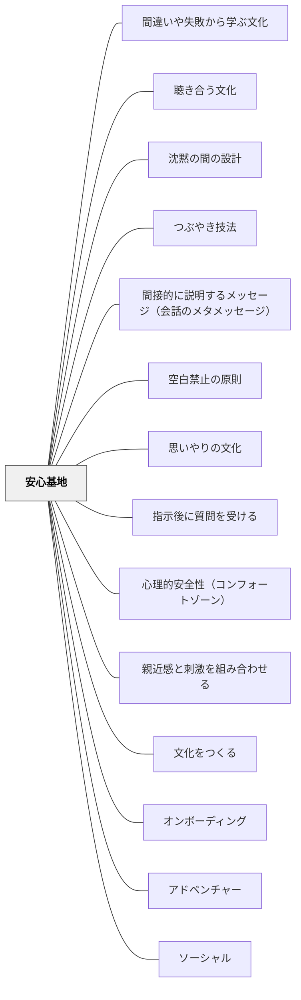

# 安心基地

## 背景（Context）

[[パタン/オンボーディング]] として、学習の土台に乗せたい。しかし、どれだけ内容をわかりやすくしても、「この場所・この人といると怖い」「失敗したら笑われる」「わからないと言えない」という状態では、学習者は心を開いて参加できない。

## 問題（Problem）

心理的に「安全でない」と感じている学習者は、認知的リソースの多くを「この場でどう振る舞うか」「どうすれば傷つかないか」の監視に使ってしまう。学習の内容に向けるエネルギーが残らず、「土台に乗る」以前の段階で止まってしまう。

## 力のかたち（Forces）

- 学習には必然的に「わからない」「間違える」「不確かさ」が伴う
- 失敗や間違いが批判・評価の対象になる環境では、挑戦は起きにくい
- 人は「安心できる基地（Secure Base）」があってこそ、外の世界を探索できる（ボウルビィのアタッチメント理論）
- 安心を作りすぎると「挑戦しなくていい」という安逸につながることもある

## 解決（Solution）

**教師・クラスメート・空間・ルーティンが「ここは安全だ」と感じさせる「安心基地」として機能するよう、関係性と環境を意識的につくる。**

安心基地は「甘やかし」でも「規律なし」でもない。「何があっても存在を否定されない」という信頼の基盤がある場所で、人はより高い挑戦ができる。

**実践例：**
- 「間違いは学びのきっかけ」というメッセージを言葉だけでなく教師の反応で示す（間違えた発言を丁寧に「それはどこからきた考え？」と問い返す）
- 授業開始時に小さな対話（「昨日どうだった？」）を挿むことで、個人として認識されていることを伝える
- 「わからない」が言える空気をつくる（教師自身が「先生もわからないな」と言う場面をつくる）
- グループ活動でのルール：「意見を否定するのではなく、別の意見を追加する」
- 学習環境を整え（座席・採光・温度）、身体的にも「ここは落ち着く」と感じる空間にする

## 結果（Consequences）

- 学習者が「失敗してもここは安全」という信頼のもとで、挑戦や自己開示をしやすくなる
- 「わからない」「もう一度やりたい」「これはちがうと思う」という言葉が出やすくなる
- 安心基地があることで、[[パタン/アドベンチャー]]（冒険・挑戦）が可能になる

安心基地は「一度作れば終わり」ではなく、日常の小さなやりとりの積み重ねによって維持されるもの。教師の反応の一貫性が特に重要。

## クラスター図

## Actionable Insight

- 授業開始時に「昨日どうだった？」「今日の気分は？」という小さな個人への声かけを1日1人実践する——個人として認識されていることを伝えることが安心基地の構成要素
- 「先生もわからない」「先生も間違えた」を意識的に1回言う——教師自身の脆弱性の開示が最も強力な安心基地の構築になる
- 間違えた発言を「それはどこから来た考え？」と丁寧に問い返す——批判しないことが一貫して示されることで安心の基地が育つ

## 関連パタン
- [[学級経営/学級経営で使えるパタン]]
- [[パタン/間違いや失敗から学ぶ文化]]
- [[パタン/聴き合う文化]]
- [[パタン/沈黙の間の設計]]
- [[パタン/つぶやき技法]]
- [[パタン/間接的に説明するメッセージ（会話のメタメッセージ）]]
- [[パタン/空白禁止の原則]]
- [[パタン/思いやりの文化]]
- [[パタン/指示後に質問を受ける]]
- [[パタン/心理的安全性（コンフォートゾーン）]]
- [[パタン/親近感と刺激を組み合わせる]]
- [[パタン/文化をつくる]]

- [[パタン/オンボーディング]] — 学習に参加するための心理的土台の上位パタン
- [[パタン/アドベンチャー]] — 安心基地があってこそ冒険（挑戦）が可能になる
- [[パタン/ソーシャル]] — 学習共同体の中での安全・信頼関係
- [[パタン/適切な行動に注目する]] — 望ましい行動を肯定することが安心を育てる
- [[パタン/余白をつくる]] — 余白には安心基地があることが前提
- [[パタン/問い返しのデザイン]] — 批判なく問い返すことが安心を維持する
- [[パタン/35プラス1]] — 教師自身がチームの一員として参加する姿勢が、心理的安全の下地をつくる（小倉勝登）
- [[パタン/三行日記]] — 毎日の往復書簡が「見てもらえている」感覚として安心基地を構築する

## 出典

- [[文献/社会科教師の授業・学級づくり「仕掛け学」（小倉勝登）]]
