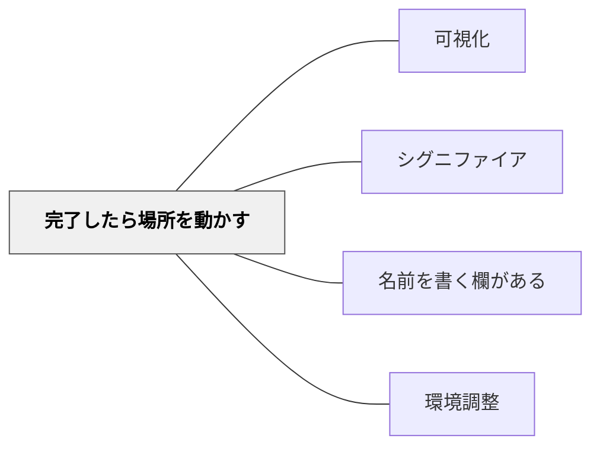

> 終わったものを別の場所へ移動することで、完了・未完了・残りの状態を一目で見えるようにする。

## 背景（Context）

教室や学校行事では、複数の子どもたちが同時に異なる段階の作業を進めていることがある。作業が終わったものと終わっていないものが同じ空間に混在すると、教師も子どもも「何が終わっていて、何が残っているか」を把握しにくくなる。この問題は、チェックリストや声かけで管理しようとしても限界がある。

## 問題（Problem）

完了したものと未完了のものが同じ場所にあると、残りのタスクが見えにくい。教師が状況を把握するために子どもへの確認や声かけが増え、子どもも自分がどこまで終わったか・何が残っているかを自分で判断しにくくなる。

## 力のかたち（Forces）

- 「移動する」という一手間を加えることで、状態が自動的に可視化される
- 記号（丸印・チェック）を使った可視化と異なり、読む必要がなく直感的に分かる
- 移動先の場所が明確でないと、この仕組みは機能しない
- 移動できるものとできないものがある（物理的な制約）

## 解決（Solution）

**完了したら、そのものを別の決まった場所へ移動する。**

「終わったらここに置く」という場所を事前に決めておく。完了したものはそこへ、未完了のものは元の場所に残る。これによって、移動先を見れば完了分が、元の場所を見れば残りが一目で分かる。

記号を書いたり、名前を呼んで確認したりしなくても、**物の位置そのものが状態を語る**。

## 実践例

**宿泊学習の荷造りと清掃**

部屋を出る前に荷造りと清掃の2段階がある。「荷造りが終わったら荷物を廊下に出す」というルールを設けるだけで状態が可視化される。

- 廊下に荷物がある → その子の荷造りは完了
- 部屋の中に荷物がある → まだ終わっていない
- 荷物を出した後の部屋 → ゴミや忘れ物だけが残り、清掃すべき対象が一目で分かる

担任が廊下を見れば誰が終わったかを把握でき、部屋を見れば何が残っているかを把握できる。子どもも自分で判断して動ける。

## 結果（Consequences）

- 完了・未完了の状態が自動的に可視化され、教師の確認コストが下がる
- 子どもが自分の状態を自分で判断して次の行動に移りやすくなる
- 残りのタスク（ゴミ・忘れ物など）が見えやすくなる
- 「場所」という物理的な仕組みなので、文字が読めない子・確認が苦手な子にも機能する

## 関連パタン

- [[パタン/可視化]] — 親パタン。位置による可視化はシンボルを使わない可視化の一形態
- [[パタン/シグニファイア]] — 場所そのものが「ここに置く＝完了」というシグニファイアとして機能する
- [[パタン/名前を書く欄がある]] — 所有を明示して状態管理をシンプルにする同系統のパタン
- [[パタン/環境調整]] — 物理環境を設計して行動を支援する

## クラスター図

## Actionable Insight

- 宿泊学習の荷造りで「終わったら荷物を廊下に出す」ルールを設ける——記号もチェックも不要で、廊下と部屋の状態を見るだけで全員の進捗が分かる
- 配り物・提出物など、「終わったらここに置く」トレーを教室に用意する——完了したものが積み上がっていくことで残りが一目で分かる
- 授業中の作業カードやプリントを「取り組み中の場所」と「終わった場所」に分けて置かせる——自分の状態を自分で管理できる子どもが増える

## 出典

- 岩井輝久（実践記録・2026年 宿泊学習）
