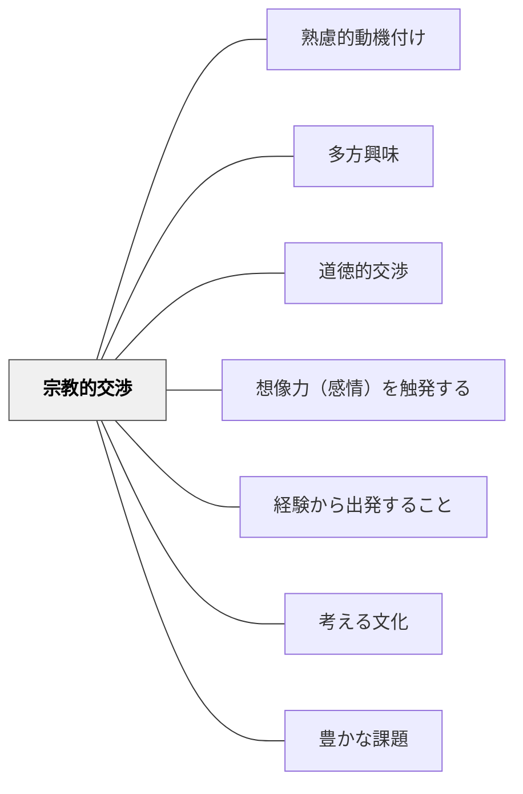

# 宗教的交渉

> 「なぜ生きるのか」という根本的な問いへの探究が、深い学びの動機になる。

## 背景（Context）
ヘルバルトの多方興味論および牧口常三郎の教育理論における「宗教的交渉」。宗教・霊的なもの・超越的な問い・生死や意味への関心から生まれる動機を指す。「なぜ生きるのか」「死とは何か」「宇宙の果ては何か」という根本的・形而上学的な問いへの探究も含む。

## 問題（Problem）
現代の教育では「宗教」は扱いにくいトピックとされ、生死・意味・超越などの根本的な問いが学習から排除されやすい。しかし、こうした問いへの関心が、人間の学習の最も深い動機の一つであることは否定できない。

## 力のかたち（Forces）
- 生死・意味・超越への問いは人間の根源的な関心事である
- 宗教的・精神的な問いは価値中立的に扱うことが難しい
- 多様な宗教的・文化的背景を持つ学習者への配慮が必要
- 哲学・文学・科学も「究極の問い」として接続できる

## 解決（Solution）
**生死・意味・宇宙・存在への根本的な問いを学習の文脈に組み込み、宗教的・哲学的探究への関心を学習の動機として尊重する。**

特定の宗教を推奨するのではなく、「究極の問い」を哲学的・文学的・科学的に探究する場を作る。「死とは何か」「なぜ学ぶのか」「人間とは何か」などの問いを授業に持ち込む。多様な宗教・文化の智慧に敬意を持って接する。

## 結果（Consequences）
- 学習者が「学ぶことの意味」を自分なりに見出す契機になる
- 文化・宗教の多様性への理解と敬意が育まれる
- 根本的な問いへの耐性・哲学的思考力が養われる

## クラスター図

## Actionable Insight

- 学期に1回「なぜ学ぶのか」「良い人生とは何か」といった根本的な問いを授業に持ち込む——究極の問いへの探究が学習の意味を自分で見出す契機となる
- 宗教・哲学・文化の智慧を「信じるべきもの」ではなく「考えるための素材」として扱う——多様な見方を尊重しながら探究する姿勢が哲学的思考力と文化的敬意を育てる
- 「宇宙の果ては何か」「死とは何か」という根本的な問いを文学・理科・道徳と結びつける——教科の枠を超えた究極の問いへの接続が学習者の深い関与を引き出す

## 出典

- 一つの教育のパタン・ランゲージ（岩井輝久）

## 関連パタン
- [[パタン/熟慮的動機付け]] — 親パタン
- [[パタン/多方興味]] — 上位パタン
- [[パタン/道徳的交渉]] — 価値・善悪への問いと連動
- [[パタン/想像力（感情）を触発する]] — 畏敬の念・驚きを動機にするパタン
- [[パタン/経験から出発すること]] — 宗教的・精神的体験を学びの起点にする
- [[パタン/考える文化]] — 根源的な問いへの思考を促す「考える文化」
- [[パタン/豊かな課題]] — 精神的価値を核にした豊かな課題
