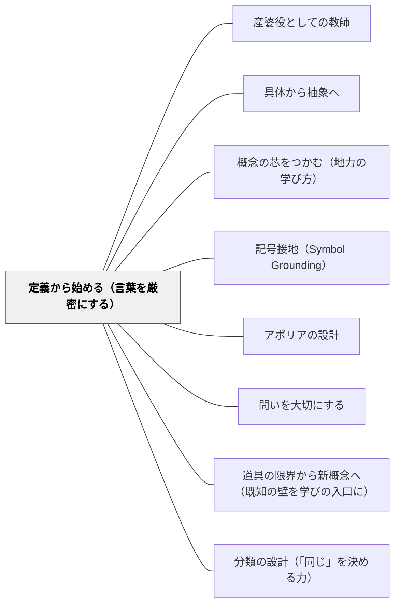

# 定義から始める（言葉を厳密にする）

> 「言葉にしないのはずるい」——その一言が、曖昧な理解を誠実な問いに変える。

## [Pattern Connection]

### 結城浩（2013）数学ガールの秘密ノート——「言葉への誠実さ」としての定義

結城浩の『数学ガールの秘密ノート／式とグラフ』第4章で、比例の定義をめぐる対話が展開される。

ユーリは「yがxに比例する」と言うが、それがどういう意味かを問われると「バーンっと大きくなるイメージ」という感覚的な説明にとどまる。僕（語り手）はこう返す：

> 「数学はそれじゃだめだよ。言葉にしないくせに『そういう意味だったのっ』と言うのは、ずるいよね。議論するからには、しっかり言葉にしなくちゃ」

この指摘は批判ではなく「一緒に厳密にしよう」という招待として機能している。その後二人は「比例の三条件チェックリスト」を作り上げる：

| 条件 | 確認すること |
|---|---|
| 式 | y = ax という形で表せるか（a ≠ 0） |
| グラフの種類 | 直線か |
| グラフの通過点 | 原点を通るか |

このチェックリストの構築プロセスが「定義とは何か」の体験そのものになっている。

**既存パタンとの関連：**
- [[パタン/産婆役としての教師]]：定義を「教える」のではなく「一緒に確かめる」という対話の構えと重なる
- [[パタン/具体から抽象へ]]：具体例（y = 2x, y = -2x, xy = 6）を使って定義の境界を確かめる

**補強された点：**
定義の厳密化は「難しいことを習う前の準備」ではなく、「議論するための最低限の誠実さ」として位置づけられる。「言葉にしないのはずるい」という表現は、厳密さを威圧でなく倫理として提示する。

**修正・拡張された点：**
数学の定義を「暗記すべき命題」として扱う授業設計に対して、「一緒に言葉を作っていく」という設計が有効であることが示される。定義は与えられるものではなく、対話の中で必要が生まれて確定していくものである。

**他のパタンへの波及：**
- [[パタン/概念の芯をつかむ（地力の学び方）]]：芯をつかむためには、まず「何をとらえているか」を言葉にする必要がある
- [[パタン/記号接地（Symbol Grounding）]]：定義は記号（y ∝ x）を身体的・感覚的に接地させる行為でもある

---

### 伊藤由佳理（2020）美しい数学入門——同値関係の三条件という「定義の型」

伊藤由佳理の『美しい数学入門』第1章は、数学的な定義の最も基本的な型として「同値関係の三条件」を示す。これは「何が同じか」を厳密に決めるための条件セットであり、「定義から始める」という姿勢の数学的体現である。

**同値関係の三条件——定義の必要条件：**

「数学では、皆が共通して使えるルールを定義と呼ぶ」——伊藤（2020）

| 条件 | 名前 | 内容 |
|---|---|---|
| a ∼ a | 反射律 | 自分自身とは「同じ」 |
| a ∼ b ならば b ∼ a | 対称律 | 「同じ」は双方向 |
| a ∼ b かつ b ∼ c ならば a ∼ c | 推移律 | 「同じ」は連鎖する |

この三条件は「定義の誠実さ」の数学的形式化である。結城（2013）の「言葉にしないのはずるい」という倫理的要請が、伊藤（2020）では「三条件をすべて確認してから分類する」という操作的手続きとして現れる。

**「好きな人で班分け」——定義の不誠実さの教育的例：**

「Aさんは Bさんを好きだと思っている」という関係は対称律と推移律を満たさないため、有効な分類基準にならない。「小学校で先生が『好きな人どうしで班を作りましょう！』という。そうするとうまく班分けできず、悲喜こもごもの状態になってしまう。実は数学的に『分類』できない条件だからなのである」——伊藤（2020）

これは「定義を曖昧なままにすること」が「悲喜こもごもの状態」——つまり傷つく子どもを生む——という教育的実害を示す例である。

**補強された点**：「定義から始める」ことの重要性が、「言語的誠実さ（結城）」に加えて「三条件という操作的な確認手順（伊藤）」として強化される。「この定義は三条件を満たすか？」という問いは、比例・平行・等しいなどあらゆる数学概念に適用できる。

**他のパタンへの波及**：[[パタン/分類の設計（「同じ」を決める力）]]（本統合の新規パタン）；[[文献/美しい数学入門（伊藤由佳理）]]

---

### 数学ガールの秘密ノート・丸い三角関数（結城浩, 2014）——「名前の束縛」と「定義と値の区別」

本書は「定義から始める」の二つの具体的な失敗例と修復を示す。

**1. 「三角関数は円関数」——名前が実態を歪める場合の再定義：**

テトラ（第5章）:「《三角関数》といわれると、あたしはどうしても《三角形》を思い浮かべてしまうんですけど——確かに三角形は出てくるんですけど——《円》を思い浮かべるのが重要なんですね！」

語り手:「うん、その通りだよ。**《三角関数は円関数》といってもいいくらいだと思うな。**だって、三角関数は、角度θから、円周上にある点のx座標（cos θ）とu座標（sin θ）を生み出すんだからね」

「三角関数」という名前が「三角形」を連想させ、「単位円が本質だ」という理解を妨げる。この場合の修復は「再定義（別名を与える）」——「三角関数は円関数だ」という名前の更新が概念の束縛を解く。

**2. 円周率の「定義」と「値」の区別：**

語り手（第4章）:「数学をやるときは、いつも定義を確認するのが大事なんだよ。どんな意味かわからないまま言葉を使っててもしょうがないだろ？」
「《円周÷直径》を円周率という」

「3.14…」は定義ではなく値である。「定義：円周÷直径」「値：3.14159…」という区別が「定義とは何か」を最も身近な形で示す具体例として機能する。

**補強された点**:
- 結城（2013）の「言葉にしないのはずるい」が「一緒に言葉を作る誠実さ」としての定義を示すとすれば、結城（2014）は「名前が実態を歪める場合」の修復として再定義を示す。定義の二つの役割——「言葉の共有基盤を作る」と「名前の束縛から自由になる」——が揃う。
- 伊藤（2020）の「三条件という定義の型」と並べると: 結城（2013）→誠実さとしての定義、伊藤（2020）→操作的確認としての定義、結城（2014）→名前の束縛を解く再定義、という三つの役割が見える。

→ [[文献/数学ガールの秘密ノート・丸い三角関数（結城浩）]]

---

### 新装版 数学読本 1（松坂和夫, 1989）——「取りきめとして受け入れ、後から問い直す」形式論理の導入

第4章4.4節「集合・命題・条件」で、松坂は命題「p→q（pならばq）」の真理表を導入するとき、p が偽のとき p→q が真になるという「直観に反する」結果に読者が戸惑うことを正直に認める。

> 「この表によれば、命題pが偽である場合には、命題qの真偽には関係なく、p→qは真です。これは要するに、そういう『取りきめ』で、読者は少し不思議に思うかも知れませんが、これが論理にとって『自然な』約束なのです」

「雨の日の原稿」というたとえ話（「雨が降れば家で原稿を書く」という約束が偽になるのは「雨が降っているにもかかわらず書かない場合だけ」）で直観的な説明を試みながら、最後に：

> 「読者がこの真理表を1つの『取りきめ』としてすなおに受け入れてくださることを希望します」——松坂（1989）

**「定義を取りきめとして受け入れる」という教育設計：**

これは結城（2013）の「言葉にしないのはずるい（倫理としての定義）」、伊藤（2020）の「三条件を確認する（操作としての定義）」、結城（2014）の「名前の束縛を解く（修復としての定義）」に続く、定義に対する第四の態度——「とりあえず約束として受け入れ、後から意味を問い直す」という暫定的な受容のスタンス。

デカルト（1637）の「暫定的道徳」——確実な答えが出るまで待たず今日の最善で行動する——と同型の構造を持つ。完全な理解を先行させてから進むのではなく、「約束として受け入れて進みながら、後から意味を問い直す」という動的なプロセス。

**四書の「定義」への四つのスタンス一覧：**

| | 出典 | 定義への態度 | キーフレーズ |
|---|---|---|---|
| 誠実さとしての定義 | 結城（2013）式とグラフ | 言葉にしない議論はずるい | 「言葉にしないのはずるい」 |
| 操作としての定義 | 伊藤（2020）美しい数学入門 | 三条件で確認する操作的手続き | 「同値関係の三条件」 |
| 修復としての定義 | 結城（2014）丸い三角関数 | 名前の束縛を解く再定義 | 「三角関数は円関数」 |
| 暫定的受容としての定義 | 松坂（1989）数学読本 1 | とりあえず取りきめとして受け入れる | 「取りきめとして受け入れてください」 |

**「命題と条件と真理集合」——集合と論理の橋：**

同節で、条件の真理集合（"条件 p の真理集合 P = {x | p(x)}"）という概念により、論理（命題・条件）と集合論が同一の対象を記述する二つの言語であることが示される。「定義から始める」ことで、命題と集合という一見別々の概念が統一的に見える。

**補強された点**：
- 「取りきめとして受け入れる」という態度は、「まず定義を決めて議論する」スタンスの動的バージョン。静的な「まず定義せよ」に加えて、「暫定的に受け入れ、後から意味を問い直す」という時間軸が加わる。
- 四つの定義のスタンスが揃うことで、「定義から始める」パタンが単一の行為でなく、文脈に応じて選択できる複数の実践であることが見えてくる。

→ [[文献/新装版 数学読本 1（松坂和夫）]]

---

## 背景（Context）

算数・数学の授業で「分かった」という言葉が出ても、その「分かった」が何を指しているか曖昧なことがある。「比例ってどういう意味？」と聞くと「xが増えるとyも増える」「グラフが右上がりの直線」「なんとなくそれっぽい」という答えが混在する。感覚的な理解は学習の重要な出発点だが、それだけでは議論の共通基盤にならない。

## 問題（Problem）

感覚的な理解を言葉にしないまま学習を進めると、概念が曖昧なまま固定してしまう。教師が用語を正しく定義しても学習者が「自分の感覚の確認作業」として聞くだけで終わると、定義は暗記の対象になる。議論の途中で「そういう意味だったの」という行き違いが繰り返され、学習者自身が何を理解しているか分からなくなる。

## 力のかたち（Forces）

- 感覚的理解（「バーンっと大きくなる」）は入口として大切だが、そこにとどまると議論ができない
- 定義を早く提示しすぎると、学習者は暗記するが「何の問いへの答えか」を知らないまま終わる
- 定義を遅く提示しすぎると、会話の中で言葉が滑り「話がかみ合わない」まま終わる
- 「きちんと言葉にする」ことは数学特有の要求に見えるが、あらゆる議論の前提条件でもある

## 解決（Solution）

**「一緒に言葉にしていく」過程を設計する。感覚的な表現を否定せず、「その言葉でどこまで議論できるか」を確かめながら、より厳密な言葉に向かっていく。**

**1. 感覚的な表現を発表させてから境界例を出す：**
「比例ってどういうこと？」→ 「xが2倍になるとyも2倍になる」という答えを引き出す。次に境界例（y = 2x + 1 はどうか？）を投げかけ、「その定義だと含まれてしまう」ことを確かめる。

**2. チェックリストを学習者と一緒に作る：**
「この式は比例と言えるか？」を複数の式（y = 3x, y = -2x, y = 5, xy = 6）で確かめながら、「比例と言えるための条件」を帰納的に整理する。教師が条件を先に言わず、学習者が境界を探していく中で条件が浮かび上がるようにする。

**3. 「言葉にしないのはずるい」という文化を育てる：**
「分かった気がする」と「言葉で説明できる」を区別し、どちらも価値があるが役割が違うことを伝える。自分の感覚を言語化しようとする態度を学習活動の中で繰り返し評価する。

---

**具体例1：算数「比例」の導入（4年）**

「yがxに比例するってどういうこと？」という問いを学習の始めに出す。「増えていく」「同じ割合で増える」「グラフが直線になる」という答えを黒板に集める。次に「y = 2xとy = 2x + 3は同じ？違う？」を問い、条件を絞っていく。最後に「自分たちが作った定義でこの問題は解けるか？」を確認する。

**具体例2：恒等式の確認（6年・中学）**

「(a+b)(a-b) = a²-b² は本当に成り立つか？」を問う。「なんとなくそう思う」という答えに「じゃあ確かめてみよう」と返し、a=3, b=2 を代入して確認する（5×1=5 vs 9-4=5）。「いくつ試せば確かめたことになるか」「文字で証明するとは何か」という問いへ向かっていく。

**具体例3：国語「物語の登場人物」の定義（小学校）**

「主人公ってどういう人？」→「いちばん活躍している人」「いちばんページに出てくる人」「タイトルになっている人」という感覚的な答えが出る。「では、この本の主人公は誰？」という具体的な問いで境界例を探し、「私たちが使う『主人公』という言葉の定義を確かめよう」という対話に入る。

## 結果（Consequences）

- 学習者が「分かる」と「言葉で説明できる」の違いを自覚するようになる
- 定義を「暗記するもの」ではなく「自分たちが作ったルール」として持てる
- 議論の前提が共有されるため、グループ活動での「話がかみ合わない」が減る
- 境界例・反例に自分から気づこうとする態度が育つ
- 「それって定義的にどういうこと？」という問いが学習者の間から自然に出るようになる

## 関連パタン

- [[パタン/産婆役としての教師]] — 定義を「与える」でなく「一緒に作る」対話の構えの実践形態
- [[パタン/具体から抽象へ]] — 具体例の境界確かめ→共通条件の言語化というプロセス
- [[パタン/概念の芯をつかむ（地力の学び方）]] — 芯をつかむための前提として定義の厳密化がある
- [[パタン/記号接地（Symbol Grounding）]] — 定義は記号を身体経験に接地させる行為
- [[パタン/アポリアの設計]] — 境界例を使って「その定義では足りない」という困惑を設計する
- [[パタン/問いを大切にする]] — 「それはどういう意味か」という問いを評価する文化
- [[パタン/道具の限界から新概念へ（既知の壁を学びの入口に）]] — 感覚的定義の限界が厳密な定義の入口になる
- [[文献/数学ガールの秘密ノート式とグラフ（結城浩）]] — 本パタンの出典
- [[パタン/分類の設計（「同じ」を決める力）]] — 同値関係の三条件は「定義の厳密化」の最も体系的な形

## クラスター図

## Actionable Insight

- 単元の冒頭で「今日学ぶ言葉（概念）はどういう意味だと思う？」と聞き、学習者の感覚的な答えを黒板に書いてから授業を始めてみる。
- 「○○の定義を3つの条件でチェックリストにしよう」という活動を1単元に1回取り入れてみる——学習者が条件を考えることが、定義を使う力につながる。
- 学習者が「なんとなく分かる」と言ったとき、「じゃあ言葉で言ってみて」と返し、言葉にする機会を毎日1回以上作る。

## 出典

結城浩（2013）『数学ガールの秘密ノート／式とグラフ』SBクリエイティブ

> 「数学はそれじゃだめだよ。言葉にしないくせに『そういう意味だったのっ』と言うのは、ずるいよね。議論するからには、しっかり言葉にしなくちゃ」——結城浩（2013）
