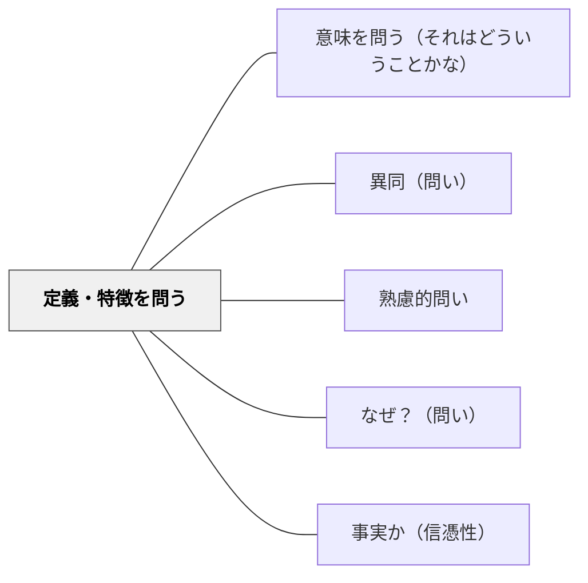

# 定義・特徴を問う

> 「〇〇とは何か？〇〇の特徴は？」と概念の本質・定義を問うことで、概念的理解の核心に迫る。

## 背景（Context）
言葉を使えていることと、その言葉の意味を深く理解していることは別物である。「民主主義とは何か」「酸化とは何か」のように、概念の定義や特徴を問う問いは、表面的な知識と本質的な理解の差を明らかにする。あらゆる学習の基盤には正確な概念理解がある。

## 問題（Problem）
学習者は用語を覚えていても、その定義を正確に説明できないことが多い。「なんとなく分かる」という感覚は、具体的な問いを立てられないまま進んでしまうことから生まれる。定義を問わずに応用問題に進むと、誤用・混同・過剰な一般化が生じやすい。

## 力のかたち（Forces）
- 定義を言語化することで、自分の理解の曖昧さが顕在化する
- 定義の吟味は、概念の境界線（何がそれに含まれ、何が含まれないか）を明確にする
- 「本質的な特徴は何か」という問いが分類・比較思考を促進する
- 定義を自分の言葉で言い直すことが深い理解の証になる

## 解決（Solution）
「〇〇とはどういう意味か？〇〇の必要条件・十分条件は何か？〇〇と〇〇の違いは？」と問いかける。例えば「速度と速さの違いは何か」「生物の定義には何が含まれるか」のように、区別が曖昧になりやすいペアを対比させることが有効である。辞書的定義だけでなく、自分なりの言葉での再定義を求めることで理解が深まる。

## 結果（Consequences）
- 概念の正確な理解が確立し、誤用が減る
- 概念間の関係（上位・下位・対立）が整理される
- 定義を問う習慣が、自律的な学習の基盤を作る

## 関連パタン
- [[パタン/意味を問う（それはどういうことかな）]]
- [[パタン/異同（問い）]]
- [[パタン/熟慮的問い]] — 親パタン
- [[パタン/なぜ？（問い）]] — 概念の意義・目的を深める問い
- [[パタン/事実か（信憑性）]] — 定義の正確さを検証する問い

## クラスター図

## Actionable Insight

- 新しい用語を教えた後に「この言葉を自分の言葉で説明してみて」と問いかける——自分の言葉での再定義が「なんとなく分かる」と「本当に理解している」の差を顕在化させる
- 「○○と△△の違いは何か？」と対比させることで概念の境界線を明確にする——区別が曖昧になりやすいペアの比較が定義の精度を上げる
- 辞書的定義を確認した後に「この定義の例外はある？」と問いかける——例外の探索が概念の適用範囲と本質的特徴への理解を深める

## 出典
- [[文献/熟慮的問いのパターンリスト（動画記録）]]
