# 実例を比べて分析する

> 良い作品と比較することで、言葉にできない「よさ」が見えてくる。

## 背景（Context）

達成規準を言葉だけで伝えても、学習者が「それはどんな状態か」をイメージできないことが多い。複数の実例を並べて比べることで、「良い・良くない」の差が体感的に理解され、達成規準が内面化される。

## 問題（Problem）

「良い文章を書きなさい」と言うだけでは、良い文章がどんなものか学習者にはわからない。規準の言語化だけでは、体験的な理解が追いつかない。

## 力のかたち（Forces）

- 比較は認知的に自然な学習方法
- 実例の質が分析の深さを左右する
- 比較・分析を通じて学習者が帰納的に規準を発見できる

## 解決（Solution）

**複数の実例（良い例・普通の例・改善が必要な例）を並べ、「何が違うか」を分析することで、達成規準を共同構築する。**

実践例：
- 二つの作文を並べ「どちらが良いか・なぜか」を話し合う
- 同じ課題の異なるレベルの実例3〜4点を比較する
- 本物の一流作品と自分の作品を比べる

→[[パタン/達成規準の共同構築]]の主要な方法。

## 結果（Consequences）

- 達成規準が「感覚」ではなく「言葉」になる
- 学習者が自分の作品を批評的に見られるようになる
- 「良い作品」のビジョンが共有される

## クラスター図

```mermaid
flowchart LR
    ne5ae9fe4be8be38292e6af94e381b9e381a6e58886e69e90e38199e3828b["実例を比べて分析する"]
    ne382b8e382b0e382bde383bce38391e382bae383ab["ジグソーパズル"]
    ne68a80e8a193e38284e382b9e382ade383abe381aee5ae9fe6bc94e38292e58886e69e90e38199e3828b["技術やスキルの実演を分析する"]
    ne5a49ae6a798e381abe683b3e5ae9ae38195e3828ce3828be5ada6e7bf92e381aee381ade38289e38184["多様に想定される学習のねらい"]
    ne38395e382a3e383bce38389e38390e38383e382af["フィードバック"]
    ne98194e68890e8a68fe6ba96e381aee585b1e5908ce6a78be7af89["達成規準の共同構築"]
    ne682aae38184e5ae9fe4be8be38292e7a4bae38199["悪い実例を示す"]
    ne69c80e5889de3818be38289e889afe38184e4be8be38292e8a68be381a6e58886e69e90e38199e3828b["最初から良い例を見て分析する"]
    ne4b880e6b581e3818be38289e5ada6e381b6["一流から学ぶ"]
    ne6af94e8bc83e381a7e6a682e5bfb5e38292e381a4e3818fe3828befbc88e4ba8be4be8be3839ae382a2e381aee8a8ade8a888efbc89["比較で概念をつくる（事例ペアの設計）"]
    ne8a995e4bea1e79a84e5b082e99680e680a7e38292e6b8a1e38199efbc88e382aee383abe38389e79fa5e8ad98e381aee38380e382a6e383b3e383ade383bce38389efbc89["評価的専門性を渡す（ギルド知識のダウンロード）"]
    ne7b7b4e3828ae4b88ae38192efbc88e6af94e8bc83e6a49ce8a88ee381aee585a8e4bd93e4baa4e6b581efbc89["練り上げ（比較検討の全体交流）"]
    ne59b9be381a4e381aee5958fe38184e381a7e4bd9ce59381e38292e588a4e696ade38199e3828b["四つの問いで作品を判断する"]
    ne8b3aae381aee5b985e3819ce38293e381b6e381abe587bae4bc9ae3828fe3819be3828befbc88e4bd9ce59381e381aee69d9fefbc89["質の幅ぜんぶに出会わせる（作品の束）"]
    ne8b3aae381aee6a0b9e68ba0e38292e8a68be38188e3828be38288e38186e381abe38199e3828befbc88e4bc9de38188e3828be38193e381a8e3818be38289e381aee884b1e58db4efbc89["質の根拠を見えるようにする（伝えることからの脱却）"]

    ne5ae9fe4be8be38292e6af94e381b9e381a6e58886e69e90e38199e3828b --- ne382b8e382b0e382bde383bce38391e382bae383ab
    ne5ae9fe4be8be38292e6af94e381b9e381a6e58886e69e90e38199e3828b --- ne68a80e8a193e38284e382b9e382ade383abe381aee5ae9fe6bc94e38292e58886e69e90e38199e3828b
    ne5ae9fe4be8be38292e6af94e381b9e381a6e58886e69e90e38199e3828b --- ne5a49ae6a798e381abe683b3e5ae9ae38195e3828ce3828be5ada6e7bf92e381aee381ade38289e38184
    ne5ae9fe4be8be38292e6af94e381b9e381a6e58886e69e90e38199e3828b --- ne38395e382a3e383bce38389e38390e38383e382af
    ne5ae9fe4be8be38292e6af94e381b9e381a6e58886e69e90e38199e3828b --- ne98194e68890e8a68fe6ba96e381aee585b1e5908ce6a78be7af89
    ne5ae9fe4be8be38292e6af94e381b9e381a6e58886e69e90e38199e3828b --- ne682aae38184e5ae9fe4be8be38292e7a4bae38199
    ne5ae9fe4be8be38292e6af94e381b9e381a6e58886e69e90e38199e3828b --- ne69c80e5889de3818be38289e889afe38184e4be8be38292e8a68be381a6e58886e69e90e38199e3828b
    ne5ae9fe4be8be38292e6af94e381b9e381a6e58886e69e90e38199e3828b --- ne4b880e6b581e3818be38289e5ada6e381b6
    ne5ae9fe4be8be38292e6af94e381b9e381a6e58886e69e90e38199e3828b --- ne6af94e8bc83e381a7e6a682e5bfb5e38292e381a4e3818fe3828befbc88e4ba8be4be8be3839ae382a2e381aee8a8ade8a888efbc89
    ne5ae9fe4be8be38292e6af94e381b9e381a6e58886e69e90e38199e3828b --- ne8a995e4bea1e79a84e5b082e99680e680a7e38292e6b8a1e38199efbc88e382aee383abe38389e79fa5e8ad98e381aee38380e382a6e383b3e383ade383bce38389efbc89
    ne5ae9fe4be8be38292e6af94e381b9e381a6e58886e69e90e38199e3828b --- ne7b7b4e3828ae4b88ae38192efbc88e6af94e8bc83e6a49ce8a88ee381aee585a8e4bd93e4baa4e6b581efbc89
    ne5ae9fe4be8be38292e6af94e381b9e381a6e58886e69e90e38199e3828b --- ne59b9be381a4e381aee5958fe38184e381a7e4bd9ce59381e38292e588a4e696ade38199e3828b
    ne5ae9fe4be8be38292e6af94e381b9e381a6e58886e69e90e38199e3828b --- ne8b3aae381aee5b985e3819ce38293e381b6e381abe587bae4bc9ae3828fe3819be3828befbc88e4bd9ce59381e381aee69d9fefbc89
    ne5ae9fe4be8be38292e6af94e381b9e381a6e58886e69e90e38199e3828b --- ne8b3aae381aee6a0b9e68ba0e38292e8a68be38188e3828be38288e38186e381abe38199e3828befbc88e4bc9de38188e3828be38193e381a8e3818be38289e381aee884b1e58db4efbc89

    classDef hub fill:#f0f0f0,stroke:#555,color:#000,font-weight:bold
    class ne5ae9fe4be8be38292e6af94e381b9e381a6e58886e69e90e38199e3828b hub
```

## Actionable Insight

- 単元の最初に「良い例・普通の例」2つを並べて「何が違うか」を学習者に問い、言語化させる——実例の比較分析から達成規準が自然に立ち上がる
- 自分の作品と「良い例」を並べて「どこが1点だけ違うか」を書かせる——比較が批評ではなく改善の情報として機能する
- 「これはどちらが良いか」を問う前に「どちらにどんな特徴があるか」を先に聞く——批判より観察から入ることで安全な分析の文化が育つ

## 出典

- 一つの教育のパタン・ランゲージ（岩井輝久）

## 関連パタン
- [[メタパタン/極限概念と極限クライテリア]] — 実例の比較からクライテリアが創生されるという本パタンの働きを、評価理論の最上位（極限クライテリア・鑑識眼の形成）に位置づけるメタパタン
- [[パタン/ジグソーパズル]]
- [[パタン/技術やスキルの実演を分析する]]
- [[パタン/多様に想定される学習のねらい]]

- [[パタン/フィードバック]] — 親パタン
- [[パタン/達成規準の共同構築]] — 比較分析によって規準を共同構築する
- [[パタン/悪い実例を示す]] — 悪例との比較
- [[パタン/最初から良い例を見て分析する]] — 良例との比較
- [[パタン/一流から学ぶ]] — 一流の作品を基準にする
- [[パタン/比較で概念をつくる（事例ペアの設計）]] — 完成作品の質を比べて達成規準を作る本パタンに対し、概念そのものを立ち上げる場面で本質特徴を抽出するための事例ペアを設計する
- [[パタン/評価的専門性を渡す（ギルド知識のダウンロード）]] — 実例の比較は、言語化されない質の概念を学習者へ渡す最も具体的な経路（Sadler, 1989）
- [[パタン/練り上げ（比較検討の全体交流）]] — 比較検討の一般形。練り上げはその授業様式としての実装
- [[パタン/四つの問いで作品を判断する]] — 比べた後に何を問うか。判断と根拠の言語化の順序を与える
- [[パタン/質の幅ぜんぶに出会わせる（作品の束）]] — 比べる素材の集め方。良い例だけでなく質の幅の全体を並べる
- [[パタン/質の根拠を見えるようにする（伝えることからの脱却）]] — 実例を比べさせることが、説明して伝えることの代わりになる理由

