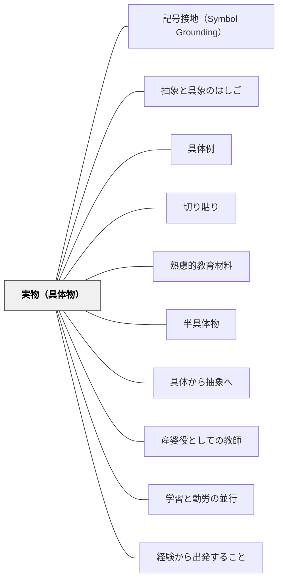

# 実物（具体物）

> 本物に触れることで、言葉や図には宿らない理解が生まれる。

## Pattern Connection

### ペスタロッチ（1801）ゲルトルート児童教育法——数・形・言語の三元素と実物の役割

ペスタロッチは本書で実物教授の哲学的根拠を「三元素」として体系化した：

- **三元素との接続**：「対象物のあらゆる外的特質の総和が、その輪郭の円形（形）と数の比例（数）において一体化され、言語を通じて私の意識となる」——実物を前にした子どもは必然的に「これはいくつか（数）」「どんな形か（形）」「何と呼ぶか（言語）」という三つの問いに向かう。実物はこの三方向からの認識の出発点として機能する。
- **近さの法則**：「あなたを常に取り囲んでいるものは、あなたの五感にとって近いので明瞭かつ明確にすることは容易である」——実物を使う理由は「近さ」にある。身近な実物が感覚と概念の距離を縮め、「混乱した見解」を「明確な概念」へと導く起点となる。
- **知識と技能の並行発展**：ペスタロッチは「知識（洞察）」だけでなく「技能（Können）」の形成を強調した。実物を見るだけでなく、実物を使って「行動し、できるようになる」経験が不可欠である。実物は知識の素材であると同時に、技能を育てる操作の対象である。
- **補強する点**：牧口が「第三段階」として「実物を教室に持ち込む」を超え「環境の中に連れ出す」へと発展させたのは、ペスタロッチ自身の「自然と学校の分離への批判」（本物の教育は自然が人類の形成を決定する形態に連鎖しなければならない）という思想と連続している。
- **波及するパタン**：[[パタン/感性と悟性の協働]] — 直観教授の哲学的構造；[[文献/ゲルトルート児童教育法（ペスタロッチ）]] — 本統合の出典

---

### 牧口常三郎（1931）——実物教授の歴史的位置づけと「第三段階」への発展

牧口は *創価教育学体系 第3巻* において、実物教授の歴史的な位置を明確にしつつ、その「先」を示した。

**ペスタロッチの真価**：牧口はペスタロッチを「経験と学究的真面目の両面を具足した」教育改革者として高く評価した。ペスタロッチが実物・標本・模型による教授を切り開いたことは「教師本務の第二段階」を実現した歴史的業績である。

**しかし「実物教授」は通過点である**：牧口は実物教授を重要と認めながら、それが教師の本務の**最終段階ではない**と論じた。第三段階の教師は「教室に実物を持ち込む」のではなく、「自然・社会環境の中に学習者を連れ出し、環境そのものを教材とする」役割に移行する。

**教室の外が最上の「実物」である**：

| 段階 | 実物の使い方 |
|---|---|
| 第二段階（ペスタロッチ） | 実物・標本・模型を教室に「持ち込む」 |
| 第三段階（産婆役） | 自然・社会・生活の場に学習者を「連れ出す」 |

つまり本パタン「実物（具体物）」は第二段階の実践として価値があり、[[パタン/学習と勤労の並行]] や [[パタン/産婆役としての教師]] は第三段階への発展として位置づけられる。

- **他のパタンへの波及**：[[パタン/産婆役としての教師]] — 実物教授の「次」を示す；[[パタン/本物を扱う（当事者意識・自分ごと）]] — 実物教授から「本物の社会参加」への拡張

---

## 背景（Context）

実物・本物・実標本・道具など、学習者が直接触れられる具体的な物を教育材料として使う。数の学習ではおはじき・ブロック、理科では実際の標本・植物、家庭科では実際の食材・道具がその例。具体から抽象へという学習の原則（ブルーナーのEIS理論など）において、具体物は最初の段階として不可欠。

## 問題（Problem）

抽象的な記号・言語だけで学習を進めると、概念と実物の対応が取れず、理解が形式的になる。

## 力のかたち（Forces）

- 直接体験・身体感覚が概念の理解を支える
- 具体物は低学年ほど重要だが高学年でも有効
- 本物の入手・管理にコストがかかる

## 解決（Solution）

**学習内容に対応した実物・具体物を用意し、直接触れる・操作する・観察する活動を設計する。**

## 結果（Consequences）

- 概念の理解が身体感覚と結びつき定着する
- 学習者の好奇心・探究心が高まる

## 関連パタン
- [[パタン/記号接地（Symbol Grounding）]]
- [[パタン/抽象と具象のはしご]]
- [[パタン/具体例]]
- [[パタン/切り貼り]]

- [[パタン/熟慮的教材教具]] — 親パタン
- [[パタン/半具体物]] — 具体と抽象の橋渡し
- [[パタン/具体から抽象へ]] — 学習の配列原則
- [[パタン/産婆役としての教師]] — 実物教授の「先」；環境の中で産婆役が機能する
- [[パタン/学習と勤労の並行]] — 「教室に持ち込む」を超え「生活の場に出る」へ
- [[パタン/経験から出発すること]] — 実物が直観を与え概念構成の基盤になる

## クラスター図

## Actionable Insight

- 単元の導入に「今日の学習に関連する実物（植物・道具・食材・標本など）」を1つ持ち込む——本物に触れることが言葉や図では生まれない身体感覚を通じた理解を生む
- 数・計算の学習では、ブロック・コイン・ものさしなどを使った操作活動から始める——具体から抽象への配列が概念の正確な形成を支える
- 実物を観察した後「この実物から気づいたことを1つ言おう」と問いかける——直接体験からの気づきが探究心と学習への感情的関与を高める

## 出典
- [[文献/創価教育学体系 3（牧口常三郎）]]
- [[文献/ゲルトルート児童教育法（ペスタロッチ）]]
- [[文献/熟慮的教育材料のパターンリスト（動画記録）]]
