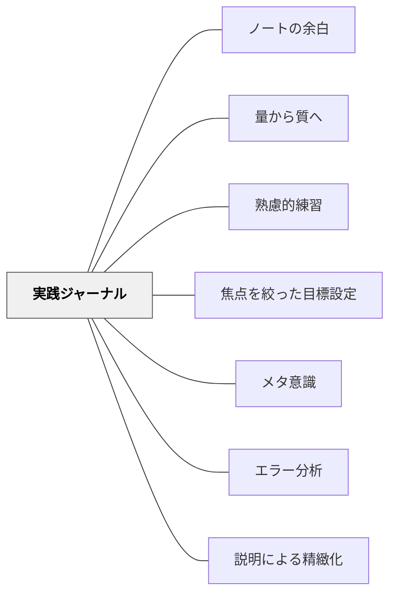

# 実践ジャーナル

## 背景（Context）

[[パタン/熟慮的練習]] として、意図的な目標と振り返りをもった練習をしたい。しかし記憶は曖昧で、「あのとき何をどう感じたか」「何をやってみたか」は時間が経つと薄れる。書き留めることで、実践の軌跡が「見える化」され、次の実践への足場になる。

## 問題（Problem）

実践後に振り返ろうとしても、具体的に何が起きたかを思い出せない。感覚的な「うまくいった・いかなかった」だけが残り、なぜそうなったか・次に何を変えるかを考えるための材料がない。記録がなければ、成長のパターンも失敗の傾向も見えてこない。

## 力のかたち（Forces）

- 書くことは記憶の整理だけでなく、思考の深化を促す（説明による精緻化）
- 書く時間の確保が難しい多忙な教育現場では、長大な記録は続かない
- 詳細すぎる記録は「義務」になり、継続のコストが高くなる
- 短くても定期的な記録の方が、長大な不定期記録より実践改善に有効

## 解決（Solution）

**実践の直後または当日中に、短い形式で「やってみたこと・起きたこと・次にやること」を書き留める習慣をつくる。**

形式は問わない。3行でも、箇条書きでも、走り書きでもよい。大切なのは「今日の焦点に対して何が起きたか」を言語化することであり、量ではない。

**実践例（記録の形式）：**

```
【今日の焦点】発問の後に5秒待つ
【やってみたこと】算数の振り返り場面で3回待った
【起きたこと】2回目でAが手を挙げた。いつも早い子が待ってくれた
【次にやること】国語でも同じことをやってみる。待ち方を変えてみる
```

- 付箋に書いて手帳に貼る
- スマホのメモアプリに音声入力する
- 同僚と「今日の一言振り返り」を共有する（口頭でも可）

## 結果（Consequences）

- 実践の流れが「経験の蓄積」から「意味のある学びの軌跡」に変わる
- 複数回の記録を読み返すと、自分の実践パターン・クセ・成長が見えてくる
- 他者と共有することで、実践知が「個人の宝」から「共同体の知」になる
- 「書くこと」自体が、その日の実践の意味づけと完了のプロセスになる

## クラスター図



## Actionable Insight

- 授業後の5分で「今日の焦点／やってみたこと／次にやること」を3行書く——実践ジャーナルの最小版がこの形式で、続けられる
- スマホのメモに音声入力でいい——授業後すぐに話しながら録音するだけで「書く負担」がほぼゼロになる
- 週1回、先週のジャーナルを1分間だけ読み返す——読み返すことで自分の実践パターンが見え、次の焦点が自然に決まる

## 出典

- 一つの教育のパタン・ランゲージ（岩井輝久）

## 関連パタン
- [[パタン/ノートの余白]]
- [[パタン/量から質へ]]

- [[パタン/熟慮的練習]] — 意図的な目標と振り返りをもった練習の上位パタン
- [[パタン/焦点を絞った目標設定]] — ジャーナルは焦点に対する記録として機能する
- [[パタン/メタ意識]] — ジャーナルを書くことがメタ意識を育てる
- [[パタン/エラー分析]] — 起きたことの分析がジャーナルの核心
- [[パタン/説明による精緻化]] — 書くことは自分への説明であり精緻化である
