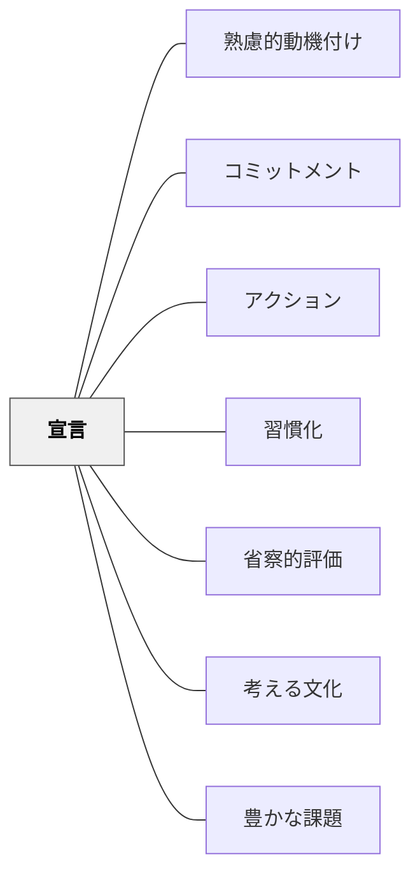

# 宣言

> 人前で言葉にすることが、行動への踏み台になる。

## 背景（Context）
SNSや仲間の前での宣言・公言が実行を後押しする。「やります」と声に出して言うことで、自分の中にコミットメントが生まれ、それを守ろうとする一貫性の動機が働く。コミットメントの一形態として、やる気を引き出す手段の一つ。

## 問題（Problem）
宣言することで気合は入るが、長続きしないことも多い。宣言の高揚感が消えると行動が途絶える「宣言だおれ」が起きやすい。また、宣言した内容が非現実的だと逆効果になることもある。

## 力のかたち（Forces）
- 一貫性の原理：人は自分の言ったことと行動を一致させようとする
- 社会的プレッシャー：他者への公言が「見られている」という意識を生む
- 宣言内容が曖昧だと行動に結びつきにくい
- 過剰な宣言は自己イメージを傷つけるリスクがある

## 解決（Solution）
**具体的で現実的な目標を、信頼できる他者に向けて宣言し、定期的な振り返りと組み合わせることで実行力を高める。**

「今週中に○○を終わらせる」のように具体的な期限と行動を宣言する。仲間・クラス・SNSなど適切な場で公言する。振り返り（チェックイン）をセットにすることで、宣言後のフォローアップも機能する。

## 結果（Consequences）
- 宣言した行動の実行率が上がる
- 振り返りなしでは長続きしないことが多い
- 繰り返し宣言と実行を重ねると自己効力感が高まる

## クラスター図

## Actionable Insight

- 授業の最初に「今日この授業で何を達成したいか」を1文ペアに向けて宣言させる——公言することで一貫性の動機が働き、学習への主体的関与が高まる
- 週の目標を「今週○○を○回する」という具体的な形で紙に書かせ教室に掲示する——曖昧な宣言より具体的な行動宣言が実行率を高める
- 宣言した目標の確認を翌授業の冒頭に必ず行う——振り返りがないと宣言だおれになる。フォローアップが宣言を習慣への橋渡しにする

## 出典

- 一つの教育のパタン・ランゲージ（岩井輝久）

## 関連パタン
- [[パタン/熟慮的動機付け]] — 親パタン
- [[パタン/コミットメント]] — 上位パタン
- [[パタン/アクション]] — 宣言と行動を組み合わせるパタン
- [[パタン/習慣化]] — 宣言を習慣へとつなぐパタン
- [[パタン/省察的評価]] — 宣言した内容を振り返ることが省察の入口になる
- [[パタン/考える文化]] — 宣言を公の場でできる「考える文化」の土台
- [[パタン/豊かな課題]] — 宣言が豊かな課題への取り組みを動機づける
