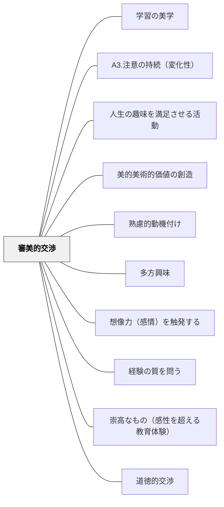

# 審美的交渉

> 美しいものへの感動が、深く学ぼうとする動機を呼び覚ます。

---

## [Pattern Connection]

**カント（1790）判断力批判統合：**

- **審美的動機の哲学的根拠**：カントは趣味判断の四契機を分析し、美への適意は「無関心的（interesselos）」であることを示す——快適さへの欲求でも道徳的義務でもなく、自由な適意として美しいものに引き寄せられる。これが審美的交渉の動機が強力である理由の哲学的説明：利害関係のない純粋な引き寄せが学習者の内発的関与を生む
- **共通感覚（sensus communis）の陶冶**：趣味判断は「これは美しい」と言うとき全員の同意を要求する——これは私的感覚の表明でなく共通感覚への訴えかけ。審美的交渉の「なぜ美しいか」を問い合う対話は、この共通感覚を育てる実践。教室での共同鑑賞は単なる感想共有ではなく、共有された感受性の陶冶
- **§42 自然美への直接的関心と道徳的素質**：カントは「自然の美しいものを愛する人は、少なくとも道徳的な善なる心構えに向かう素質があることを推測する理由がある」と論じる（§42）。本物の自然・本物の芸術への直接的な関心が道徳的素質と連動する。人工物の模倣（作り物の花や鳥の声）は、本物と知られた瞬間に関心が消える
- **崇高の審美的交渉**：美への感動（調和・快）に加えて、崇高への感動（圧倒・不快→快）も審美的交渉の重要な形式。「理解しきれない大きさ・力」との出会いが生む動機は、美との出会いとは異なる深さを持つ
- **接続するパタン**：[[パタン/崇高なもの（感性を超える教育体験）]] — 崇高が審美的交渉の第2形式。[[パタン/道徳的交渉]] — §59美は倫理性の象徴として審美的動機と道徳的動機が接続

---

## 背景（Context）
ヘルバルトの多方興味論および牧口常三郎の教育理論における「審美的交渉」。芸術・美・感性への関わりから生まれる動機を指す。美しいものへの鑑賞・表現・感動が学習への入り口となり、芸術的な観点が他の学習領域を豊かにすることもある。

## 問題（Problem）
「美しい」「感動する」という審美的な体験は、教育の中で軽視されやすい。効率・成果・テストの点数が重視される環境では、美的感覚の涵養が後回しになり、芸術・人文的な学びの動機が育ちにくい。

## 力のかたち（Forces）
- 美的体験は感情と深く結びついており、記憶に残りやすい
- 何を「美しい」と感じるかは文化・個人によって異なる
- 鑑賞と表現の両面からの関わりがある
- 審美的感覚は他の学習領域（科学・数学・文学）にも影響する

## 解決（Solution）
**芸術・音楽・文学・自然の美しさへの接触と表現の機会を学習に組み込み、美的感動を学習の動機として活用する。**

美術作品・音楽・詩・建築・自然風景など「美しいもの」への本物の体験を提供する。「これを美しいと感じるのはなぜ？」という問いが深い思考を生む。学習者自身が美を表現する機会も大切にする。

## 結果（Consequences）
- 感性の豊かさが学習の質を高める
- 芸術的・美的な視点が他の学習領域に転移する
- 感動体験が学習への長期的な愛着を生む

## クラスター図

## Actionable Insight

- 授業の導入に関連する絵画・音楽・詩を1つ提示し「どこに美しさを感じる？」と問う——審美的な問いが感情と認知を同時に動かし、学習への入り口を広げる
- 学習のまとめとして「今日学んだことを詩・絵・音楽のどれかで表現する」選択肢を1回設ける——審美的な表現が概念の深い内面化を促す
- 学習者が作った成果物に「美しく見せる工夫」を1つ加えさせる（レイアウト・色・見出しなど）——見た目を整える行為が内容への誇りと向き合いを生む

## 出典

- 一つの教育のパタン・ランゲージ（岩井輝久）

## 関連パタン
- [[パタン/学習の美学]]
- [[パタン/A3.注意の持続（変化性）]]
- [[パタン/人生の趣味を満足させる活動]]
- [[パタン/美的美術的価値の創造]]
- [[パタン/熟慮的動機付け]] — 親パタン
- [[パタン/多方興味]] — 上位パタン
- [[パタン/想像力（感情）を触発する]] — 感情・感動を動機に変えるパタン
- [[パタン/経験の質を問う]] — 美的体験の質を大切にするパタン
- [[パタン/崇高なもの（感性を超える教育体験）]] — 美（調和）に加えて崇高（圧倒）も審美的動機の形式
- [[パタン/道徳的交渉]] — §59美は倫理性の象徴。審美的交渉と道徳的交渉が連動する
- [[文献/判断力批判（上）（カント、中山元訳）]] — 趣味判断・共通感覚・§42自然美の哲学的根拠
