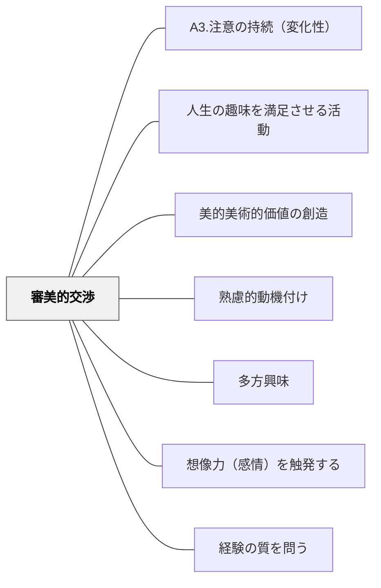

# 審美的交渉

> 美しいものへの感動が、深く学ぼうとする動機を呼び覚ます。

## 背景（Context）
ヘルバルトの多方興味論および牧口常三郎の教育理論における「審美的交渉」。芸術・美・感性への関わりから生まれる動機を指す。美しいものへの鑑賞・表現・感動が学習への入り口となり、芸術的な観点が他の学習領域を豊かにすることもある。

## 問題（Problem）
「美しい」「感動する」という審美的な体験は、教育の中で軽視されやすい。効率・成果・テストの点数が重視される環境では、美的感覚の涵養が後回しになり、芸術・人文的な学びの動機が育ちにくい。

## 力のかたち（Forces）
- 美的体験は感情と深く結びついており、記憶に残りやすい
- 何を「美しい」と感じるかは文化・個人によって異なる
- 鑑賞と表現の両面からの関わりがある
- 審美的感覚は他の学習領域（科学・数学・文学）にも影響する

## 解決（Solution）
**芸術・音楽・文学・自然の美しさへの接触と表現の機会を学習に組み込み、美的感動を学習の動機として活用する。**

美術作品・音楽・詩・建築・自然風景など「美しいもの」への本物の体験を提供する。「これを美しいと感じるのはなぜ？」という問いが深い思考を生む。学習者自身が美を表現する機会も大切にする。

## 結果（Consequences）
- 感性の豊かさが学習の質を高める
- 芸術的・美的な視点が他の学習領域に転移する
- 感動体験が学習への長期的な愛着を生む

## クラスター図

## Actionable Insight

- 授業の導入に関連する絵画・音楽・詩を1つ提示し「どこに美しさを感じる？」と問う——審美的な問いが感情と認知を同時に動かし、学習への入り口を広げる
- 学習のまとめとして「今日学んだことを詩・絵・音楽のどれかで表現する」選択肢を1回設ける——審美的な表現が概念の深い内面化を促す
- 学習者が作った成果物に「美しく見せる工夫」を1つ加えさせる（レイアウト・色・見出しなど）——見た目を整える行為が内容への誇りと向き合いを生む

## 出典

- 一つの教育のパタン・ランゲージ（岩井輝久）

## 関連パタン
- [[パタン/A3.注意の持続（変化性）]]
- [[パタン/人生の趣味を満足させる活動]]
- [[パタン/美的美術的価値の創造]]
- [[パタン/熟慮的動機付け]] — 親パタン
- [[パタン/多方興味]] — 上位パタン
- [[パタン/想像力（感情）を触発する]] — 感情・感動を動機に変えるパタン
- [[パタン/経験の質を問う]] — 美的体験の質を大切にするパタン
