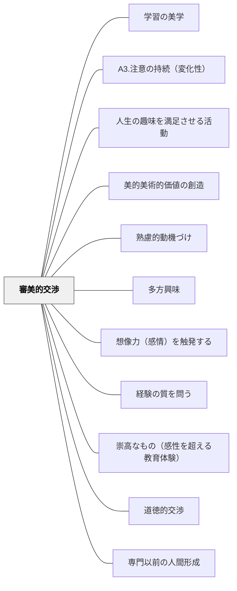

# 審美的交渉

> 美しいものへの感動が、深く学ぼうとする動機を呼び覚ます。

---

## [Pattern Connection]

**カント（1790）判断力批判統合：**

- **審美的動機の哲学的根拠**：カントは趣味判断の四契機を分析し、美への適意は「無関心的（interesselos）」であることを示す——快適さへの欲求でも道徳的義務でもなく、自由な適意として美しいものに引き寄せられる。これが審美的交渉の動機が強力である理由の哲学的説明：利害関係のない純粋な引き寄せが学習者の内発的関与を生む
- **共通感覚（sensus communis）の陶冶**：趣味判断は「これは美しい」と言うとき全員の同意を要求する——これは私的感覚の表明でなく共通感覚への訴えかけ。審美的交渉の「なぜ美しいか」を問い合う対話は、この共通感覚を育てる実践。教室での共同鑑賞は単なる感想共有ではなく、共有された感受性の陶冶
- **§42 自然美への直接的関心と道徳的素質**：カントは「自然の美しいものを愛する人は、少なくとも道徳的な善なる心構えに向かう素質があることを推測する理由がある」と論じる（§42）。本物の自然・本物の芸術への直接的な関心が道徳的素質と連動する。人工物の模倣（作り物の花や鳥の声）は、本物と知られた瞬間に関心が消える
- **崇高の審美的交渉**：美への感動（調和・快）に加えて、崇高への感動（圧倒・不快→快）も審美的交渉の重要な形式。「理解しきれない大きさ・力」との出会いが生む動機は、美との出会いとは異なる深さを持つ
- **接続するパタン**：[[パタン/崇高なもの（感性を超える教育体験）]] — 崇高が審美的交渉の第2形式。[[パタン/道徳的交渉]] — §59美は倫理性の象徴として審美的動機と道徳的動機が接続

---

**J.S. ミル（1867）大学教育について——「感情の陶冶」として正面から位置づける：**

- **審美的教育を「余暇・装飾」から「人格形成の第三の柱」へ**：ミルは知的教育・道徳的教育に加え、詩と芸術を通じた「感情の陶冶（aesthetic education）」を人格形成にとって不可欠な第三の教養として明確に位置づけた。「この分野は、人間性の完成にとってそれらと同様になくてはならないものです」。カントが「共通感覚の陶冶」として審美的経験を位置づけるなら、ミルはそれを「人格形成の柱」として社会的に要請する。
- **「詩は高尚な精神を人に吹き込む一大源泉」**：「このような高尚な精神を人に吹き込む一大源泉となるものは、詩であり、詩的・芸術的文学と呼ばれるものです」。詩は「魂を昂揚させると同様に魂を平静にし、高潔さのみならず穏やかな感情も養う」。これは審美的交渉の動機論を「学習へのモチベーション」から「人格の深み」へと格上げする。
- **「非利己的な側面に訴える」**：ミルは詩・芸術が「われわれの本性の非利己的な側面に訴え、行為を直接導くものではないが真剣に人生を考えさせる厳粛な感情を胸底深く刻み込む」と述べた。これはカントの「無関心的な適意（interesselos）」と同じ構造を、人格形成論として言い換えたものと読める。
- **「英国の過小評価」への批判**：ミルは英国の芸術軽視（商業的金銭主義と清教的禁欲主義が原因）を批判し、「ヨーロッパ大陸では芸術は高等な学問・科学と同等に位置する」と指摘した。これは審美的交渉を「オプション」として扱う現代日本の教育観への批判としてもそのまま読める。
- **補強するパタン**：[[パタン/専門以前の人間形成]] — 感情の陶冶が「人間形成の柱」として人格全体の設計に組み込まれる；[[概念/教養と人格形成]] — ミルの三層（知的・道徳的・美的）の美的層
- **波及するパタン**：[[文献/大学教育について（J.S.ミル）]] — 本統合の出典

---

**プラトン『国家』（前380年頃）——守護者の前教育：音楽と文芸が「魂の内奥」に先行する：**

- **音楽は「魂の内奥へと深くしみこむ」（第3巻）**：「リズムと調べというものは、何にもまして魂の内奥へと深くしみこんで行き、何にもまして力づよく魂をつかむものなのであって、人が正しく育てられる場合には、気品ある優美さをもたらしてその人を気品ある人間に形づくり」——審美的交渉が「趣味・好み・余暇」ではなく魂の形成そのものに属することの古代的根拠。カントの「共通感覚の陶冶」・ミルの「感情の陶冶」の起源がここにある
- **習慣が先、理性が後——審美的前教育の論理**：「しかるべき正しい教育を与えられた者は……まだ若くて、なぜそうなのかという理を把握することができないうちからね。やがてしかし、理が彼にやって来たときには……誰にもまして、その理と親近な間柄とし……ているためにすぐ識別できるから、最もそれを歓び迎えることになるだろう」——理性（ロゴス）の到達より前に、音楽・リズム・美的感受性が「理性を歓び迎える素地」を形成する。算数の概念を教える前に「数の美しさを感じる」体験、漢字を教える前に「文字の美しさに触れる」体験が、この前教育の小学校版
- **「美しい土地に住む」——環境による審美的形成（第3巻）**：「若者たちがいわば健康な土地に住むように……美しい作品からの影響が彼らの視覚や聴覚にやってきて働きかけ、こうして彼らを早く子供のころから、知らず知らずのうちに、美しい言葉に相似た人間……へと、導いて行くために」——意図的な強制でなく、美への自然な反応が「知らず知らずのうちに」魂を形成する。カントの「無関心的な適意（interesselos）」が教育的に機能する仕組みの説明でもある
- **悪しき模倣の排除——何に審美的交渉させるかの責任**：プラトンは卑劣な人物・醜い行動を描く詩・文芸を守護者教育から排除した。「何を美しいと感じさせるか」という対象の選択が、審美的交渉の「設計者としての教師」の責任として位置づく——良い文学・良い音楽・良い美術への意図的な曝露が教育設計の核心
- **接続するパタン**：[[パタン/ミメーシス（模倣による学び）]] — 美しいモデルへの自然な模倣が「知らず知らずのうちに」魂を形成する；[[パタン/環境調整]] — 「美しい土地に住む」は教室環境設計の古代的根拠
- **波及するパタン**：[[概念/魂の三区分]] — 音楽教育が気概の部分と欲望的部分に美的感受性を刻む；[[文献/国家（プラトン）]] — 本統合の出典

---

## 背景（Context）
ヘルバルトの多方興味論および牧口常三郎の教育理論における「審美的交渉」。芸術・美・感性への関わりから生まれる動機を指す。美しいものへの鑑賞・表現・感動が学習への入り口となり、芸術的な観点が他の学習領域を豊かにすることもある。

## 問題（Problem）
「美しい」「感動する」という審美的な体験は、教育の中で軽視されやすい。効率・成果・テストの点数が重視される環境では、美的感覚の涵養が後回しになり、芸術・人文的な学びの動機が育ちにくい。

## 力のかたち（Forces）
- 美的体験は感情と深く結びついており、記憶に残りやすい
- 何を「美しい」と感じるかは文化・個人によって異なる
- 鑑賞と表現の両面からの関わりがある
- 審美的感覚は他の学習領域（科学・数学・文学）にも影響する

## 解決（Solution）
**芸術・音楽・文学・自然の美しさへの接触と表現の機会を学習に組み込み、美的感動を学習の動機として活用する。**

美術作品・音楽・詩・建築・自然風景など「美しいもの」への本物の体験を提供する。「これを美しいと感じるのはなぜ？」という問いが深い思考を生む。学習者自身が美を表現する機会も大切にする。

## 結果（Consequences）
- 感性の豊かさが学習の質を高める
- 芸術的・美的な視点が他の学習領域に転移する
- 感動体験が学習への長期的な愛着を生む

## クラスター図

## Actionable Insight

- 授業の導入に関連する絵画・音楽・詩を1つ提示し「どこに美しさを感じる？」と問う——審美的な問いが感情と認知を同時に動かし、学習への入り口を広げる
- 学習のまとめとして「今日学んだことを詩・絵・音楽のどれかで表現する」選択肢を1回設ける——審美的な表現が概念の深い内面化を促す
- 学習者が作った成果物に「美しく見せる工夫」を1つ加えさせる（レイアウト・色・見出しなど）——見た目を整える行為が内容への誇りと向き合いを生む

## 出典

- 一つの教育のパタン・ランゲージ（岩井輝久）

## 関連パタン
- [[パタン/学習の美学]]
- [[パタン/A3.注意の持続（変化性）]]
- [[パタン/人生の趣味を満足させる活動]]
- [[パタン/美的美術的価値の創造]]
- [[パタン/熟慮的動機づけ]] — 親パタン
- [[パタン/多方興味]] — 上位パタン
- [[パタン/想像力（感情）を触発する]] — 感情・感動を動機に変えるパタン
- [[パタン/経験の質を問う]] — 美的体験の質を大切にするパタン
- [[パタン/崇高なもの（感性を超える教育体験）]] — 美（調和）に加えて崇高（圧倒）も審美的動機の形式
- [[パタン/道徳的交渉]] — §59美は倫理性の象徴。審美的交渉と道徳的交渉が連動する
- [[文献/判断力批判（上）（カント、中山元訳）]] — 趣味判断・共通感覚・§42自然美の哲学的根拠
- [[パタン/専門以前の人間形成]] — 感情の陶冶を人格形成の柱として設計する——ミル（1867）の教養論との接続
- [[文献/大学教育について（J.S.ミル）]] — 「感情の陶冶」・詩が高尚な精神を育む・英国の芸術過小評価批判
- [[文献/国家（プラトン）]] — 守護者の前教育・音楽が「魂の内奥」に先行する・「美しい土地に住む」の出典
- [[概念/魂の三区分]] — 音楽教育が気概の部分と欲望的部分に美的感受性を刻む構造論
