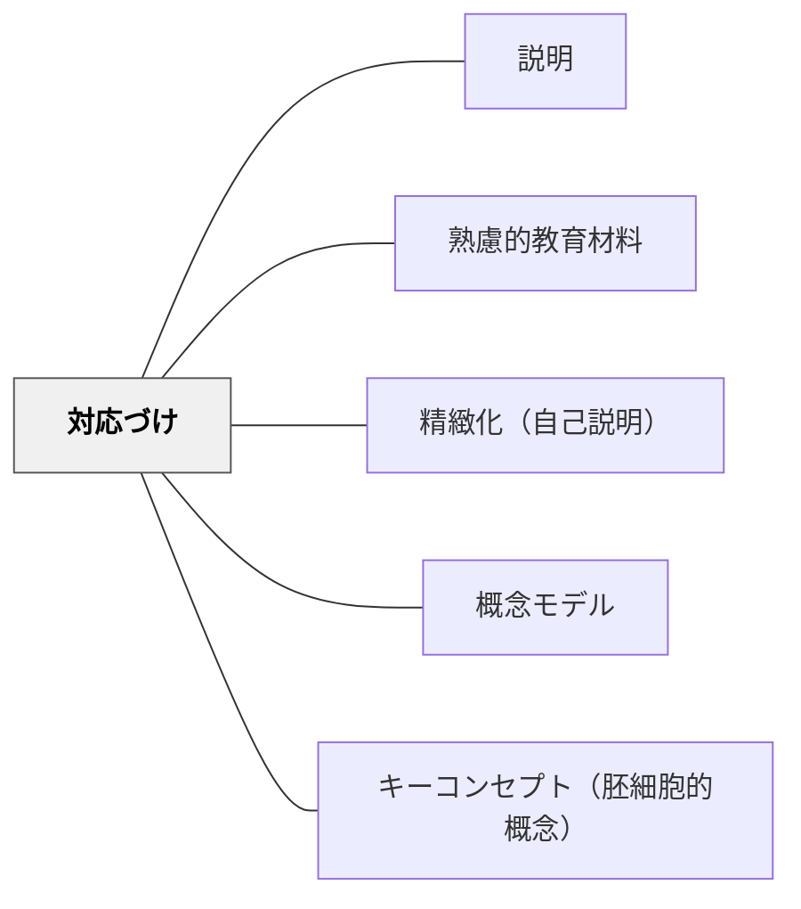

# 対応づけ

> 新しい知識・概念を学習者が既に持つ知識・経験と意識的に結びつける。

## 背景（Context）

オーズベルの有意味学習理論における「アンカリング（係留）」の概念。新情報は既有知識に「係留」されることで意味を持ち、記憶・理解が定着する。スキーマ理論でも、既存の枠組みへの組み込みが学習の鍵とされる。

## 問題（Problem）

新しい概念が既知の知識と切り離されたまま教えられると、孤立した知識として忘れられやすい。

## 力のかたち（Forces）

- 既有知識との対応づけが理解の起点になる
- 誤った対応づけ（誤概念）は学習を妨げることもある
- 学習者によって既有知識が異なるため、柔軟な対応づけが必要

## 解決（Solution）

**新しい概念・知識を教えるとき、学習者が既に知っていること・経験していることとの対応・類似・対比を明示的に示す。**

## 結果（Consequences）

- 新しい知識が既有知識に統合され理解が深まる
- 記憶の定着が向上する

## 関連パタン
- [[パタン/説明]]

- [[パタン/熟慮的教材教具]] — 親パタン
- [[パタン/精緻化（自己説明）]] — 対応づけを自己説明で強化
- [[パタン/概念モデル]] — 対応づけの可視化
- [[パタン/キーコンセプト（胚細胞的概念）]] — 核となる概念

## クラスター図

## Actionable Insight

- 新概念を教える前に「これに似た経験や知っていることはある？」と問いかけ既有知識を活性化させる——既有知識を引き出してから教えることで新情報が「係留」される
- 「電流の流れ」→「水の流れ」のように日常の比喩で新概念との橋渡しをする——馴染みのある概念への対応づけが抽象的な概念を一気に理解可能にする
- 「今日学んだことで、以前知っていたことが変わった部分は？」を振り返りに使う——既有知識の更新を言語化することが有意味学習の証拠になる

## 出典

- 鈴木克明（2002）『教材設計マニュアル――独学を支援するために』北大路書房
