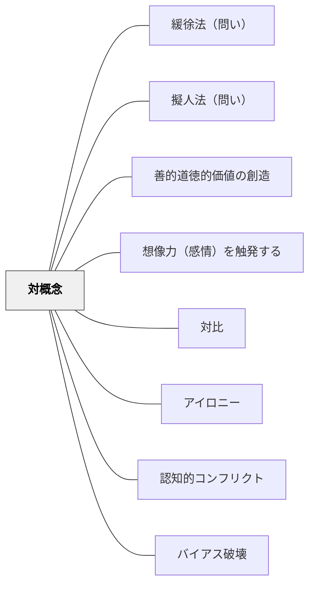

# 対概念

> 対になる概念セットで世界を把握し、思考を鋭くする

## 背景（Context）

子どもは早い段階から「良い・悪い」「大きい・小さい」「好き・嫌い」という対になる概念で世界を理解し始める。この認知的傾向を学習に活かすことができる。

## 問題（Problem）

概念を単独で教えても、その概念の「輪郭」が見えにくい。またある概念を批判的に問い直すための視点も必要だが、どう引き出すか。

## 力のかたち（Forces）

- 対概念（二項対立）は認知の基本構造であり、子どもが自然に使う思考パターン
- 善と悪、薬と毒、戦争と平和、自由と束縛など、対になる概念は感情的な重みを持つ
- 対概念は批判的思考の足場になる（「この主張の反対は何か」）
- 二項対立に単純化しすぎると現実の複雑さを見失う危険がある

## 解決（Solution）

授業において、学習内容に関わる「対になる概念ペア」を意図的に取り上げる。善悪・薬と毒・戦争と平和・自由と規律など、対置することで各概念の意味が際立つ。さらに「この概念の反対は何か」「グレーゾーンはあるか」と問うことで、単純な二項対立を超えた批判的思考へと発展させる。

## 結果（Consequences）

- 概念の輪郭が明確になり、深い理解につながる
- 批判的思考の素地が育つ
- 二項対立を絶対視する硬直した思考に陥らないよう、グラデーションへの気づきを促す必要がある

## 関連パタン
- [[パタン/緩徐法（問い）]]
- [[パタン/擬人法（問い）]]
- [[パタン/善的道徳的価値の創造]]

- [[パタン/想像力（感情）を触発する]]
- [[パタン/対比]]
- [[パタン/アイロニー]]
- [[パタン/認知的コンフリクト]]
- [[パタン/バイアス破壊]]

## クラスター図

## Actionable Insight

- 新しい概念を教えるとき「この反対の概念は何か？」を必ず問いかける——対概念を並べることで概念の輪郭が鮮明になり、定義より深い理解が生まれる
- 善悪・薬と毒・自由と束縛のような対概念ペアを授業の軸として設定する——感情的な重みを持つ対立が学習者の関与と批判的思考を同時に引き出す
- 「グレーゾーンはあるか？」と続けて問い、単純な二項対立を超えた思考へ発展させる——対立を足場にしながら複雑さへと思考を育てることが批判的感受性の核心

## 出典

キアラン・イーガン（2010）『想像力を触発する教育――認知的道具を活かした授業づくり』北大路書房
