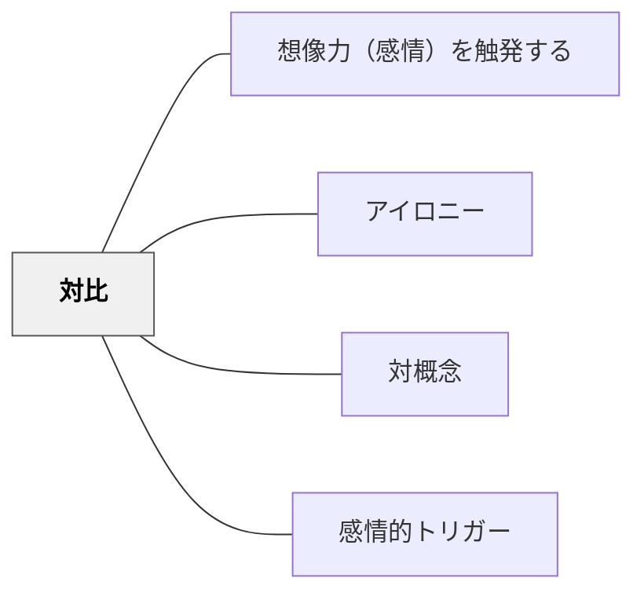

# 対比

> 正反対のものを並べることで、どちらの意味も際立つ

## 背景（Context）

学習者は、単独で提示された情報の「意味の重さ」を実感しにくい。比較対象があって初めて、ある事象の価値や深刻さが浮かび上がる。

## 問題（Problem）

学習内容を一方向から見せるだけでは、感情的な関与が生まれない。どうすれば、学習者が内容の意味を感情レベルで受け取れるようになるか。

## 力のかたち（Forces）

- 人間の認知は「差異」に敏感であり、対比は自動的に注意を引く
- 対比は概念の輪郭を鮮明にし、理解を助ける
- 感情的対比（喜びと悲しみ、戦争と平和）は感情移入を促す
- 対比の強さが大きいほど感情的インパクトも大きくなるが、文脈への配慮が必要

## 解決（Solution）

授業の中で意図的に「対比」を設計する。たとえば「ちびまる子ちゃん」の影送りのような日常の遊びの場面と、戦時中の場面を並べることで、平和の価値と戦争の悲惨さが際立つ。テキスト・映像・活動の中に「正反対のもの」を意図的に配置し、学習者が感情的なコントラストを体験できるようにする。

## 結果（Consequences）

- 抽象的な概念（平和、正義、自由など）を感情と結びつけて理解できる
- 学習者の中に「どちらが大切か」という価値的な問いが生まれる
- 一方の側面だけを強調しすぎると、単純な二項対立に陥る危険がある

## 関連パタン

- [[パタン/想像力（感情）を触発する]]
- [[パタン/アイロニー]]
- [[パタン/対概念]]
- [[パタン/感情的トリガー]]

## クラスター図

## Actionable Insight

- 学習内容に関連する「正反対の場面・状況」を2つ並べて提示する——差異への感度が人間の認知の基本構造であり、対比は自動的に注意と感情を引き出す
- 「この2つの違いから何が見えてくる？」と感情的コントラストを言語化させる——抽象的な概念（平和・正義・自由）が感情と結びついて初めて本当の理解になる
- 日常の豊かな場面と困難な場面を対置する授業設計を1単元に1つ取り入れる——コントラストの設計が学習者の中に「どちらが大切か」という価値的な問いを生む

## 出典

キアラン・イーガン（2010）『想像力を触発する教育――認知的道具を活かした授業づくり』北大路書房
