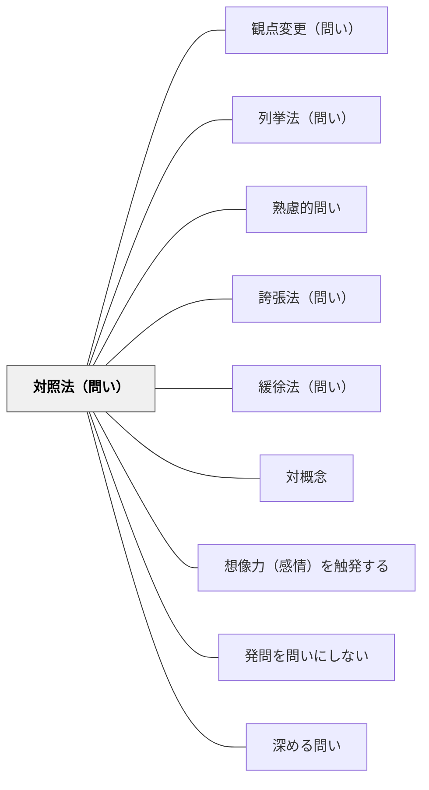

# 対照法（問い）

> 「〇〇か、それとも〇〇か？」と対をなす概念を並べて問いを際立たせる

## 背景（Context）
対照法（アンチテーゼ）は、対立する概念・立場・事例を並置することで、それぞれの意味を際立たせる修辞技法である。問いの形で用いると、学習者は二つの極の間で自分の考えを位置づけることを迫られ、思考が活性化される。二項対立の提示は単純化のリスクも伴うが、議論の焦点を作るうえで強力な手法である。

## 問題（Problem）
問いが一方向的であると、学習者は既存の枠組みの中でしか考えない。特定の前提を疑わせたいとき、「〇〇とは何か？」という単一方向の問いでは緊張感が生まれにくい。対比する概念を明示しなければ、問いの輪郭が曖昧になって議論が拡散してしまう。

## 力のかたち（Forces）
- 対立の明確化 vs 複雑さへの過度の単純化
- 議論の焦点化 vs 中間地点の無視
- 問いの鋭さ vs 学習者への圧迫感
- 二項対立の提示 vs 多元的な視点の育成

## 解決（Solution）
「自由か、それとも秩序か？」「競争か、それとも協力か？」のように、対立する概念の組み合わせを問いの軸として設定する。その際、どちらかが正解だという印象を与えず、「どちらの要素が今の状況に必要か」「どちらに重きを置くべきか」という問いの形にすることで、単純化を避けながら思考の緊張を生み出す。

## 結果（Consequences）
- 概念の輪郭が明確になり、議論の焦点が定まる
- 学習者が自分の立場を表明しやすくなる
- 対立する視点の共存について深く考えるきっかけになる

## 関連パタン
- [[パタン/観点変更（問い）]]
- [[パタン/列挙法（問い）]] — 並べることで強調する兄弟パタン
- [[パタン/熟慮的問い]] — 親パタン
- [[パタン/誇張法（問い）]] — スケールを大きくして印象を強める兄弟パタン
- [[パタン/緩徐法（問い）]] — 留保で断定を和らげる兄弟パタン
- [[パタン/対概念]] — 対照法は対概念を使った問いかけの実践形
- [[パタン/想像力（感情）を触発する]] — 修辞的問いが感情・想像力を動かす上位パタン
- [[パタン/発問を問いにしない]] — 修辞の形で問いの圧力を柔らげる関連手法
- [[パタン/深める問い]] — 修辞技法が表面的な応答を防ぎ思考を深める

## クラスター図

## Actionable Insight

- 「自由か、それとも秩序か？」のように対立する概念を問いの軸として設定する——概念の輪郭が明確になり、学習者が自分の立場を表明しやすくなる
- どちらかが正解だという印象を与えず「どちらに重きを置くべきか」という形で問う——単純化を避けながら思考の緊張を生み出す
- 対立する問いを提示した後、「中間地点はあるか？」という問いを続ける——二項対立を超えた多元的な視点への探究が生まれる

## 出典
- [[文献/熟慮的問いのパターンリスト（動画記録）]]
