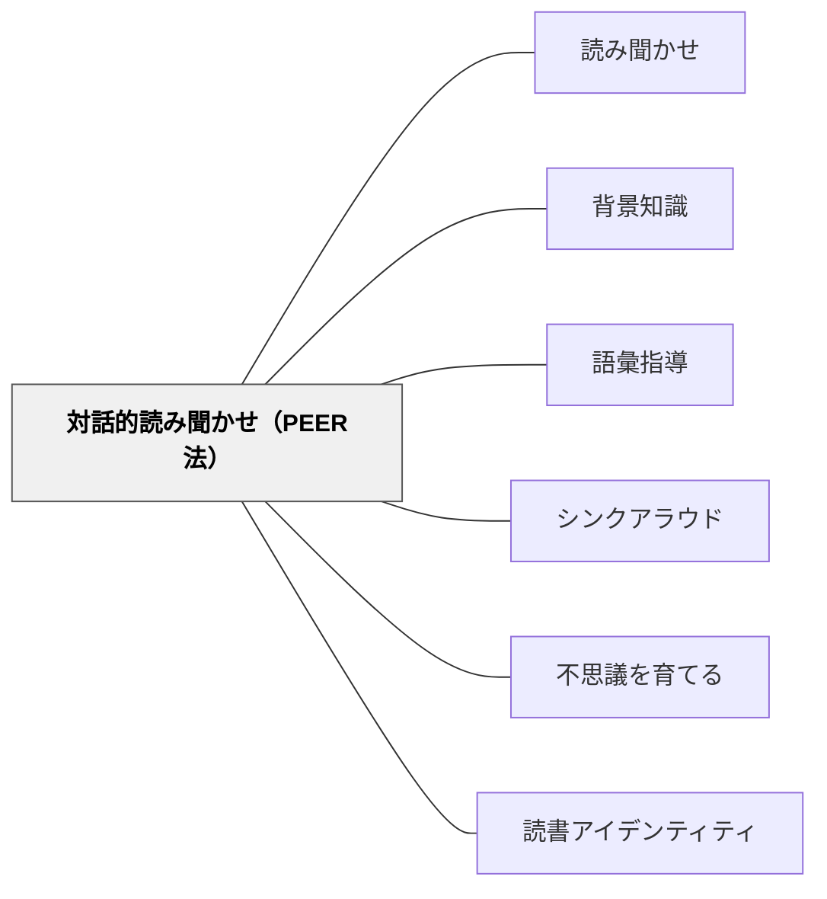

# 対話的読み聞かせ（PEER法）

> 通常の読み聞かせが「先生が読む・子が聴く」であるとすれば、対話的読み聞かせは「先生と子が一緒に本を作る」——子どもを受動的な聴衆から積極的な語り手へ変える技法だ。

本パタンは読み聞かせの具体的な進め方・対話の仕掛け（どう）を扱う。読み聞かせの目的・場面・教育的意義は [[パタン/読み聞かせ]] を参照。

---

## Pattern Connection

**出典**: Arnold, D. S., & Whitehurst, G. J.（1994）. Accelerating language development through picture book reading: A summary of dialogic reading and its effect. In D. K. Dickinson (Ed.), *Bridges to Literacy* (pp. 103–128). Blackwell.

Willingham, D. T.（2015）. *Raising Kids Who Read: What Parents and Teachers Can Do*. Jossey-Bass. → [[文献/Raising Kids Who Read（Willingham）]]

- **既存パタンとの関連**: [[パタン/読み聞かせ]] が「なぜ・いつ・何を読むか」を扱うのに対し、本パタンは「**どう読むか**」——特に就学前〜K-2の子どもの語彙獲得に最も効果が高い対話型の読み方の技法を提供する
- **補強された点**: [[パタン/読み聞かせ]] の「語彙・知識のインプット」という目的を、PEER法という具体的な手続きに落とし込む。単に読むより顕著に効果が高い（Arnold & Whitehurst, 1994; Zevenbergen & Whitehurst, 2003）
- **他のパタンへの波及**: [[パタン/背景知識]] — PEER法で子どもが能動的に参加するほど、状況モデルの構築が促進される。[[パタン/シンクアラウド]] — PEER法の Expand ステップは、教師のシンクアラウドを逆向きに——子どもが声に出して考える機会を作る

---

## 背景（Context）

読み聞かせは「最も重要な読書促進活動」（National Academy of Education, 1985）とされている。しかし、伝統的な読み聞かせ——教師が読み、子どもが静かに聴く——では、語彙習得の効果に限界がある。

Whitehurst ら（1988）は「誰が話しているか」に注目した：通常の読み聞かせでは大人が話し、子どもは聴いている。しかし語彙は「使うこと」で定着する——受動的な聴取より、自分で言葉を使う機会が語彙習得を加速する。

**対話的読み聞かせ（Dialogic Reading）** は、子どもを受動的な聴衆から能動的な「語り手」に変える技法だ——読み聞かせの中で子どもが話す機会を意図的に設計する。

## 問題（Problem）

就学前の語彙習得の差は、後の読解力格差の主要因になる（Hart & Risley, 1995）。読み聞かせは語彙習得の重要な機会だが、通常の読み聞かせでは子どもは受動的に聴くだけで「使う機会」が少ない。

「語彙を教える」ために単語の意味説明を入れると読み聞かせの流れが壊れる。楽しさを保ちながら、子どもが能動的に語彙を使う機会を作る方法が必要だ。

## 力のかたち（Forces）

- 語彙は受動的な聴取でも蓄積されるが、「使う機会（retrieval practice）」が定着を大きく加速する
- 読み聞かせの「楽しさ」を損なうと読書への態度が下がる——語彙指導との両立が難しい
- 幼い子どもは「問い」があると積極的に参加する——問いが能動的な思考の入口になる
- 2〜5歳は週400〜1200問の質問をするほど知識欲がある時期——読み聞かせを対話として設計することは発達的に自然

## 解決（Solution）

**PEER法の4ステップを使って、読み聞かせの中に子どもが話す機会を設計する。**

---

### PEER：4ステップの対話

| ステップ | 意味 | 例（絵本を読みながら） |
|---|---|---|
| **P** Prompt（促す） | 本の内容について子どもに問いを投げる | 「この次に何が起きると思う？」「この子の気持ちはどうかな？」 |
| **E** Evaluate（受け止める） | 子どもの答えを肯定的に受け止める | 「そうかもしれないね！」「面白い考えだ」 |
| **E** Expand（広げる） | 子どもの答えをモデルとして広げる | 「クマが来たから、みんなが怖がって逃げたね」 |
| **R** Repeat（繰り返させる） | 拡張した内容を子どもに繰り返させる | 「クマが来たら、みんなはどうした？言えるかな」 |

1回の読み聞かせに2〜3箇所入れるのが適切。多すぎると流れが壊れる。

---

### 5種類のプロンプト（CROWD）

Zevenbergen & Whitehurst（2003）は読み聞かせで使える5種類のプロンプトを体系化した（CROWD）：

| 種類 | 意味 | 例 |
|---|---|---|
| **C** Completion（穴埋め） | 文の穴埋め | 「三匹のくまが帰ってきたら……（食べられていた）」 |
| **R** Recall（振り返り） | 前のページへの参照 | 「さっき、この子はどこにいた？」 |
| **O** Open-ended（開かれた問い） | 制限のない問い | 「このページで何が起きているか教えて」 |
| **W** Wh-questions（疑問詞） | 何・誰・どこ・なぜ | 「これは何？どこにいる？なぜ泣いている？」 |
| **D** Distancing（本と現実を結ぶ） | 本の内容と子どもの経験を結ぶ | 「この犬と同じような犬を見たことある？」 |

**Distancing（本と現実を結ぶ）プロンプトが背景知識の活性化と語彙の実生活への接続に特に有効。**

---

### いつ・どこで使うか

**最も効果が高い年齢**：2〜5歳（就学前）。K-2年生にも効果がある。

**1回の読み聞かせでの使い方**：
1. 最初は通常通り読む——楽しさを最優先
2. 2〜3ページに1箇所、プロンプトを投げる（多すぎると流れが壊れる）
3. 子どもの答えを Expand して返す
4. 必要に応じて1〜2回 Repeat を求める

**Willingham の注意書き**：PEER法は「teachy な感じ」が出やすい——楽しい読み聞かせの流れを壊すほどやらないことが前提。「1〜2箇所でいい」「楽しさ優先」がルール。

---

### 遅延効果を意識する

Dickinson, Golinkoff & Hirsh-Pasek（2010）：就学前の読み聞かせ（PEER法を含む）は語彙・知識として蓄積され、3〜4年生の読解力として発現する——効果は即時に見えず、数年後に現れる。

「幼稚園でやっても読解力が上がらない」という誤解を防ぐために、この遅延効果を意識する。就学前の語彙投資は長期的な読解力の基盤になる。

---

## 結果（Consequences）

- 通常の読み聞かせより語彙・文法の習得効果が顕著に高い（Arnold & Whitehurst, 1994; Zevenbergen & Whitehurst, 2003）
- 子どもが「聴くだけ」から「参加する」読み聞かせに変わり、読書への積極性が育つ
- Distancing プロンプトにより、本の語彙が子どもの実生活と結びつき定着する
- ただし、プロンプトが多すぎると「評価されている感」が出て読み聞かせの楽しさが損なわれる——質より量でなく、2〜3箇所に絞る
- 1〜2歳の乳幼児には PEER 法の全ステップは難しい——P（問いかける）だけでも十分

## 関連パタン
- [[教科/国語]]
- [[実践/読み語りの実践]]

- [[パタン/読み聞かせ]] — 親パタン。PEER法は読み聞かせの「どう読むか」の技法
- [[パタン/背景知識]] — PEER法により状況モデルの構築が促進される
- [[パタン/語彙指導]] — Distancing プロンプトが語彙の実生活接続を生む
- [[パタン/シンクアラウド]] — 子どもが声に出して考える機会を設計するという意味で同じ方向
- [[パタン/不思議を育てる]] — ノンフィクションでの PEER 法が「驚く事実」への問いを生む
- [[パタン/読書アイデンティティ]] — 能動的な参加経験が「本は面白い」という連合を強化する

---

## クラスター図

## Actionable Insight

- 次の読み聞かせで、1ページだけ途中で止めて「この次に何が起きると思う？」と聞いてみる——PEER法の P の最も簡単な形。予測が外れても「どっちが正しかった？」という振り返りが生まれる
- 「これに似たもの、見たことある？」という Distancing プロンプトを1回入れる——本の世界と子どもの実生活が結びつく瞬間が語彙定着の入口になる
- 1冊を読んで「今日出てきた言葉で一番面白かったのは？」と最後に1問だけ聞く——授業中に出てきた語彙を振り返る最小単位の形成的評価になる

---

## 出典

Arnold, D. S., & Whitehurst, G. J. (1994). Accelerating language development through picture book reading: A summary of dialogic reading and its effect. In D. K. Dickinson (Ed.), *Bridges to Literacy* (pp. 103–128). Blackwell.

Zevenbergen, A. A., & Whitehurst, G. J. (2003). Dialogic reading: A shared picture book reading intervention for preschoolers. In A. van Kleeck, S. A. Stahl, & E. B. Bauer (Eds.), *On Reading Books to Children* (pp. 177–200). Erlbaum.

Willingham, D. T. (2015). *Raising Kids Who Read: What Parents and Teachers Can Do*. Jossey-Bass. → [[文献/Raising Kids Who Read（Willingham）]]

Hart, B., & Risley, T. R. (1995). *Meaningful Differences in the Everyday Experience of Young American Children*. Paul H. Brookes.

Dickinson, D. K., Golinkoff, R. M., & Hirsh-Pasek, K. (2010). Speaking out for language: Why language is central to reading development. *Educational Researcher*, 39(4), 305–310.

> 「対話的読み聞かせでは、大人が語り手ではなく観客になる——本の主役は子どもだ。」——Whitehurst（趣意）
