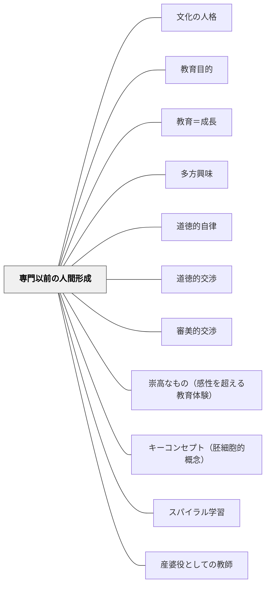

# 専門以前の人間形成

> 「人間は弁護士、医師、商人、製造業者である以前に、何よりも人間なのです。」——J.S. ミル（1867年）

---

## [Pattern Connection]

### J.S. ミル（1867）大学教育について——自由主義的教養教育論の核心

本パタンはミルのセント・アンドルーズ大学就任講演から直接展開したものである。

- **既存パタンとの関連**：[[パタン/教育目的]] が「何のために教育するか」という問いを扱うなら、本パタンは「専門技術の習得の前に何が必要か」という具体的な優先順位の問いを扱う。[[概念/教養と人格形成]] の概念的基盤をパタン形式に落とし込んだもの。
- **補強された点**：「人格形成が先、専門化は後」という原則が、19世紀の大学論において明確に定式化されていたことが示された。この論理は牧口常三郎の「自然の個性→文化の人格」の変容論（[[パタン/文化の人格]]）と収束する。
- **修正・拡張**：教育目的論を「学校全般」に適用するとき、ミルの論理は「知識の体系化（全領域の地図）」という独自の要素を加える——断片的な知識習得ではなく、知識間の関係を見渡す視点の育成。
- **他のパタンへの波及**：[[パタン/多方興味]] — 「文科と理科の両輪」という多方面教育の根拠；[[パタン/道徳的自律]] — 独断なき倫理教育；[[パタン/審美的交渉]] — 感情の陶冶・美的教育

---

### 牧口常三郎（1930-31）創価教育学体系との収束

牧口の「六段階の人格変容（感情の理性化→個人の社会化→自律化…）」は、ミルの「人間形成が専門化に先行する」という論理と深く収束する。牧口が「文化の人格」と呼んだものは、ミルが「教養ある有能な人間（liberal and humane）」と呼んだものの日本版として読める。

---

## 背景（Context）

現代の教育制度——小学校から大学まで——はしばしば「役立つ人材の育成」として設計されている。保護者・社会・政策立案者が教育に求めるのは、しばしば職業的スキル・テストの成績・経済的競争力である。

学校も教師も、この圧力に応答しながら教育設計をする。その結果、授業は「この技術が身につくか」「このスキルが測定できるか」という軸で評価され、知識・技能の伝達が教育の主たる目的として扱われることが多い。

## 問題（Problem）

専門技術やテストスキルを中心に設計された教育は、技術的には有能だが「その技術を賢明・良心的に使えない人間」を育てるリスクを持つ。知識・スキルを持ちながら、なぜそれを使うのか・どう使うべきかを判断できない人間は、知識そのものを危険なものにしうる。

逆に、人格的に豊かで判断力のある人間は、特定の技術を後から自分の力で習得できる。しかし人格的素地の乏しい人間が技術だけを先に習得しても、その技術の正しい使い方は後から補えない。

## 力のかたち（Forces）

- 経済・就労のプレッシャーは「すぐに役立つスキル」を要求する
- しかし、スキルを「賢明に使う」能力は、スキルとは別の教育によって育つ
- 人格形成は時間を要する——短期的な指標で測定しにくい
- 「技術に先行する人間的素地」は、技術習得の速度と深さにも影響を与える
- 知識・技術の断片的習得は学習者に全体像を見失わせ、学びの意味を奪う

## 解決（Solution）

**「この技術を使いこなす人間を育てること」を、技術の習得に先行させるか、少なくとも並行させよ。**

教育設計の問いを「何ができるようになるか」から「どんな人間になるか——そしてその人間として何ができるようになるか」へと再構成する。

---

### 解決①：人間形成の目標を教育設計の最前面に置く

「今日の授業でどんな人間としての力が育つか」を、技術・スキルの目標と同等か先行するものとして位置づける。

例：
- 算数の目標：「筆算の手順を習得する」ではなく「試行錯誤しながら考え、諦めずに問いに向き合う人間になる。そのための道具として筆算の手順を学ぶ」
- 国語の目標：「物語のあらすじを把握する」ではなく「他者の経験に共感し、自分の言葉で表現できる人間になる。そのための練習として物語を読み・書く」

### 解決②：知識の「全領域の地図」を描く経験を設計する

断片的な単元・教科を教えるだけでなく、「これと前に学んだあれはどうつながるか」「この教科とあの教科は何を共有しているか」を問う機会を作る。

- 教科横断型の問いかけ：「算数で学った○○は、社会のあの問題とどうつながるか」
- 「今まで学んできたこと全部をどう結びつけるか」を振り返る時間
- → [[パタン/スパイラル学習]] [[パタン/キーコンセプト（胚細胞的概念）]]

### 解決③：独断なき道徳教育——比較による判断力の育成

一つの正解・価値観を植えつける道徳授業ではなく、「こういう立場・こういう価値観もある。あなたはどう判断するか」という比較と問い直しの場を設ける。

- 複数の立場を並べて比較する問い（→ [[パタン/道徳的交渉]]）
- 「先生が正しいと思うから」ではなく「あなた自身はどう考えるか」を問い続ける
- → [[パタン/道徳的自律]]

### 解決④：詩・芸術を「感情の陶冶」として本気で位置づける

国語の詩・音楽・図工を余暇・装飾として扱わず、「高尚な感情を育み、人格を豊かにするための柱」として正面から位置づける。

ミルが言うように：「詩には、魂を昂揚させ、高潔な感情を育み、われわれの本性の非利己的な側面に訴える偉大な力がある」。

- → [[パタン/審美的交渉]] [[パタン/崇高なもの（感性を超える教育体験）]]

---

## 結果（Consequences）

- 技術・スキルの使い道を「判断できる人間」が育つ——「賢明で良心的な」専門家
- 学習者が「なぜこれを学ぶのか」を問える力を持つ
- 知識が断片として蓄積されるのではなく、相互に関連した「地図」として整理される
- ただし：「人間形成」は短期間の指標では測定しにくい——評価制度との葛藤が生じる
- また：「人間形成が先」という原則は、緊急の職業的ニーズを否定しない。ミルは「専門職のための学校は結構なことだ」と言いながら、それを本来の大学の目的と区別した

## 関連パタン

- [[パタン/文化の人格]] — 牧口の「自然の個性→文化の人格」——ミルの「人間形成が先」と収束する変容論
- [[パタン/教育目的]] — 教育の目的を幸福・力能・人格形成として問い直す
- [[パタン/教育＝成長]] — デューイの「教育は成長そのもの」——人格形成としての教育
- [[パタン/多方興味]] — 多方面の興味を育てることが人格形成の入口
- [[パタン/道徳的自律]] — 独断に服従するのでなく自分で判断できる人間を育てる
- [[パタン/道徳的交渉]] — 道徳的問いを通じて判断力を育てる実践
- [[パタン/審美的交渉]] — 詩・芸術を通じた感情の陶冶
- [[パタン/崇高なもの（感性を超える教育体験）]] — 詩・芸術・体験が生む崇高の感覚
- [[パタン/キーコンセプト（胚細胞的概念）]] — 知識の体系化の核心となる概念の設計
- [[パタン/スパイラル学習]] — 各教科・単元を体系的に関連づけて学ぶ
- [[パタン/産婆役としての教師]] — 知識を伝達するのでなく、学習者の内側から引き出す教師
- [[概念/教養と人格形成]] — 本パタンの概念的基盤

---

## クラスター図

## Actionable Insight

- 今週の授業で「このスキルを習得する以前に、どんな人間として成長しているか」を一文で語る——教師の目標設定の枠を広げる
- 単元末の振り返りに「今回学んだことが他のどの知識とつながるか」を問う設問を一つ加える
- 道徳授業で「先生はAだと思う」と言う前に「Aと思う人の考え方・Bと思う人の考え方、それぞれを理解してみましょう」という比較の場を作る
- 詩・音楽・図工の授業目標に「感情の陶冶」「人間としての深み」という視点を一言追加して、自分の指導観を問い直す

---

## 出典

Mill, J.S. (1867). *Inaugural Address delivered to the University of St. Andrews, Feb. 1st 1867*. London: Longman, Green, Reader, and Dyer.

ミル, J.S.（竹内一誠訳）（2013）．*大学教育について*．岩波文庫（34-116-10）．ISBN 978-4-00-391011-5. → [[文献/大学教育について（J.S.ミル）]]

> 「人間は、弁護士、医師、商人、製造業者である以前に、何よりも人間なのです。有能で賢明な人間に育て上げれば、後は自分自身の力で有能で賢明な弁護士や医師になることでしょう。」——J.S. ミル（1867年）

> 「専門技術を賢明かつ良心的に使用するか悪用するかは、教育制度がいかなる種類の知性と良心を彼らの心に植えつけたかによって決定されるのです。」——J.S. ミル（1867年）
