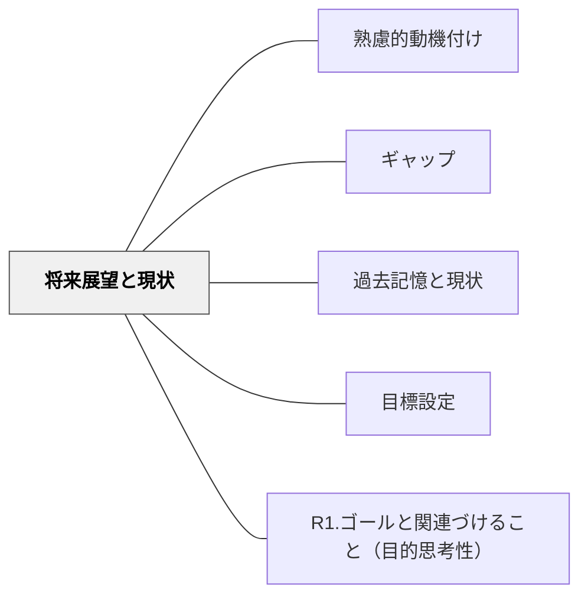

# 将来展望と現状

> 夢や目標と今の自分のギャップを見つめるとき、「そこに向かうためにこれを学ぼう」という方向性が生まれる。将来への展望が現在の学習に意味を与える。

## 背景（Context）
将来の目標・夢・なりたい姿と現在の自分の状態とのギャップを認識することは、強力な動機の源泉になる。特に青年期の学習者においては、アイデンティティの形成と学習動機が深く結びついており、将来展望は学習の意味づけに不可欠な役割を果たす。

## 問題（Problem）
「将来のために学ぶ」という意識が薄いまま学習すると、目の前の課題が「なぜやるのか」わからないものになってしまう。将来展望が具体的でないと、それを動機に使うこともできない。

## 力のかたち（Forces）
- 将来展望は抽象的になりやすく、現在の具体的な行動と結びつけるには橋渡しが必要
- 夢や目標は変化するものであり、固定化を強いることは逆効果になりうる
- 将来展望がリアルすぎる（現実的すぎる）と夢が縮小し、抽象的すぎると行動につながらない
- 学習者が将来について安心して語り、探索できる環境が重要

## 解決（Solution）
**学習者が将来の自分像を描き、それと現在の自分とのギャップを認識することで、「そこに向かうためにこれを学ぼう」という内発的な方向性を生み出す。**

キャリア探索の対話や体験活動、「10年後の自分へ手紙を書く」活動、将来像から逆算して今必要なことを考えるワーク、ロールモデルとの対話などが有効である。将来展望を「決める」のではなく「探索する」場として設計することが重要。

## 結果（Consequences）
- 学習者が「今学ぶことの意味」を将来との接続として捉えられるようになる
- 将来展望の探索を通じて自己理解・アイデンティティ形成が促される
- 動機の方向性が明確になり、目標設定や行動計画につながる

## クラスター図

## Actionable Insight

- 学期の最初に「10年後の自分への手紙」を書く活動を設け、単元末に再び読み返す——将来への問いが現在の学習に方向性と意味を与える動機の起点になる
- 今日学ぶ内容と「将来のどんな場面で役立つか」を1つ具体的に示す——将来との橋渡しが「なぜこれを学ぶのか」という問いへの答えを学習者に与える
- 「将来なりたい自分」の探索を「決める」ではなく「発見する」姿勢で設計する——探索としての将来像が固定化への不安を防ぎ多様な動機を尊重する

## 出典

- 一つの教育のパタン・ランゲージ（岩井輝久）

## 関連パタン
- [[パタン/熟慮的動機付け]] — 親パタン
- [[パタン/ギャップ]] — 関連パタン
- [[パタン/過去記憶と現状]] — 関連パタン
- [[パタン/目標設定]] — 関連パタン
- [[パタン/R1.ゴールと関連づけること（目的思考性）]] — 関連パタン（ARCSとの接点）
