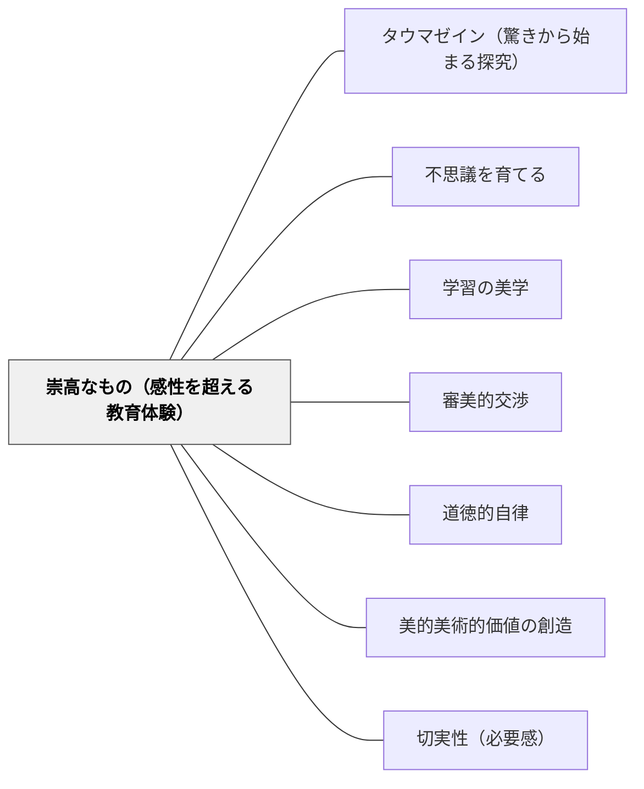

# 崇高なもの（感性を超える教育体験）

> 把握しきれない大きさや力との出会いが、学習者に「自分はこれを超えた何かを持っている」という感覚を与える。——カント「判断力批判」§25-29

---

## Pattern Connection（カント1790 判断力批判統合）

**哲学的根拠の提供**：崇高の感情（das Erhabene）は「美」とは根本的に異なる美的体験。

- **美**：快の感情（構想力と知性の調和的遊び）
- **崇高**：不快→快の感情（構想力が理性の理念に不適合であることを認識した後、理性的使命への尊敬が生まれる）

**数学的崇高（mathematisch Erhabene）**：宇宙の大きさ・数学的無限・地球の年齢など、把握しきれない大きさが感性を圧倒する。しかしその無限を「一つの全体として思考できる」という事実が、人間に超感性的能力があることを示す。

**力学的崇高（dynamisch Erhabene）**：嵐・断崖・大瀑布など、物理的に圧倒的な自然の力。しかし人間は「自分の安全が確保されていれば」そこに崇高を感じる——なぜなら道徳的主体としての人間の尊厳は自然の力に支配されないから。

**崇高が指し示す使命**：「自然における崇高なものの感情は、わたしたちに課せられた使命にたいする尊敬の感情である」

**接続パタン**：[[パタン/不思議を育てる]] [[パタン/学習の美学]] [[パタン/審美的交渉]] [[パタン/道徳的自律]]

---

## 背景（Context）

カントは「判断力批判」（1790）において、「美（das Schöne）」と「崇高（das Erhabene）」を明確に区別した。美が調和と秩序（目的なき合目的性）に基づくのに対し、崇高は学習者の感性的能力の限界を超えた体験——把握しきれない大きさや、圧倒的な力——から生まれる。日本の教育では審美的体験は「美しいもの・調和のとれたもの」に偏りがちで、崇高の体験が意図的に設計されることは少ない。

## 問題（Problem）

宇宙の大きさ・数学的無限・地球の歴史・生命の複雑さ・自然の圧倒的な力——これらは学習の対象として提示されるが、その「把握しきれなさ」が教育的体験として設計されることは少ない。「理解できないから難しい」で終わるのではなく、「理解しきれないことそのものが何かを指し示している」という体験の次元が見落とされている。

## 力のかたち（Forces）

- 崇高な体験は不快（把握できない圧倒感）と快（理性的使命への尊敬）の両方を含む——この二重性が単なる「楽しい体験」と違う
- 数学的崇高は教室で設計できる（無限・宇宙のスケール・素数の無限性・カントール集合）
- 力学的崇高は自然体験が必要だが、映像・物語・文学を通じても近似できる
- 安全が確保されていることが前提——恐怖ではなく畏敬の念を育てる
- 崇高の体験には「自分の限界の意識」と「その限界を超えた自分の能力の発見」の両方が必要

## 解決（Solution）

**学習者の感性的能力が対処しきれない大きさ・力・深さを持つ対象を意図的に設計し、「把握できないこと」から始まる体験を学習の核心に置く。把握しきれない体験を「失敗」ではなく「人間の使命を指し示す感情」として位置づける。**

### 具体例

1. **数学の崇高**：無限の問い（「自然数は偶数より多いか？」「無限の先には何があるか？」）を小学校段階から提示。答えを急がず「理解しきれない感覚」を歓迎する。
2. **宇宙の崇高**：宇宙の年齢138億年を1年に縮めたカレンダー（宇宙カレンダー）で人類の歴史が12月31日の最後の数秒であることを体験。
3. **自然の崇高**：大雨・嵐・崖・広大な海の映像や体験——自然の力の前での人間の小ささと、それでも「ここに立って眺めている」自分の存在の不思議を問う。
4. **歴史の崇高**：46億年の地球史を10mのロープで表し、人類の歴史が1mmにも満たない事実と向き合う。「それでも人間は46億年を思考できる」という逆説を問う。

## 結果（Consequences）

- 「理解しきれない」ことへの恐れが減り、知の限界を前向きに受け止める態度が育つ
- 自然・宇宙・歴史への畏敬の念が内発的な探究動機になる
- 道徳的主体としての人間の尊厳への感覚が育つ（自然の力に支配されない自分を発見する）
- 学習の「美的瞬間」が美の体験だけでなく崇高の体験も含むようになり、授業設計の幅が広がる

---

## クラスター図

## Actionable Insight

- 算数・数学で「無限」を扱うとき、「数は何個まであるか」から始めて「無限に大きい数でも、それより大きい無限がある」に進む——理解しきれない感覚を恐れず歓迎するメッセージを先に伝える
- 理科で宇宙の大きさを扱うとき、数字を言うだけでなく「これをどうやって1日の長さに例えると何になるか」と学習者に計算させ、スケール感を体で感じさせる——崇高な体験は感性的な把握の失敗から始まる
- 授業の後に「今日、理解しきれなかった最も大きな問いは何か」と書かせる——崇高の体験を「失敗」ではなく「授業の成果」として位置づける
- 「自然の力は人間を支配できるが、人間の理性は自然の全体を思考できる——どちらが大きいか」をディスカッションの問いにする——力学的崇高から道徳的主体性への接続

---

## 関連パタン
- [[パタン/タウマゼイン（驚きから始まる探究）]]

- [[パタン/不思議を育てる]] — 崇高は畏敬の念・Wonderと連動する
- [[パタン/学習の美学]] — 美的瞬間の一形式としての崇高
- [[パタン/審美的交渉]] — 美的動機付けの崇高バージョン
- [[パタン/道徳的自律]] — 崇高の感情が指し示す超感性的使命と道徳的自律の接続
- [[パタン/美的美術的価値の創造]] — 美と崇高の対比（美＝調和・崇高＝圧倒）
- [[パタン/切実性（必要感）]] — 崇高な問いは内発的な切実性を生む
- [[文献/判断力批判（上）（カント、中山元訳）]] — 出典

---

## 出典

Kant, I. (1790). *Kritik der Urteilskraft* [判断力批判].
邦訳: カント著, 中山元訳（2009）『判断力批判 上』光文社古典新訳文庫.

> 「自然における崇高なものの感情は、わたしたちに課せられた使命にたいする尊敬の感情である」——カント『判断力批判』§27

→ [[文献/判断力批判（上）（カント、中山元訳）]]
