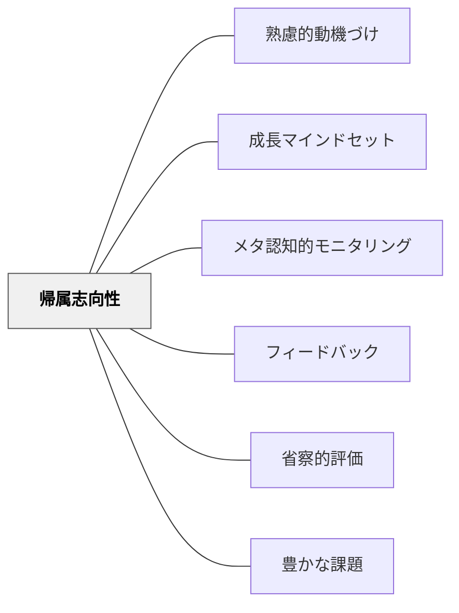

# 帰属志向性

> 成功・失敗の原因をどこに求めるかが、次の挑戦への意欲を決める。

## 背景（Context）
ワイナーの帰属理論に基づく動機付けの概念。成功・失敗の原因をどこに帰属させるかが、以後の動機・感情・行動に大きく影響する。努力への帰属は動機を高め、固定された能力や運への帰属は動機を低下させやすい。

## 問題（Problem）
「また失敗した。どうせ自分には才能がない」という能力への帰属や、「運が悪かっただけ」という運への帰属は、次への挑戦意欲を低下させる。一方で、失敗をすべて自分の努力不足に帰属するだけでも過度な自己批判になりうる。

## 力のかたち（Forces）
- 内的・外的（自分か環境か）
- 安定・不安定（変わらないか変わるか）
- 統制可能・不可能（自分でコントロールできるか）の3次元が帰属を規定する
- 努力帰属は「次はやれる」という動機を生む
- 能力帰属は学習性無力感につながるリスクがある

## 解決（Solution）
**成功・失敗の振り返りにおいて、変えられる・コントロールできる要因（努力・方略・環境）への帰属を促し、学習者が自己効力感を保てるようにする。**

「今回うまくいった（いかなかった）のはなぜ？」という問いを、努力・方略・環境の視点で考えさせる。「才能がない」という能力帰属を「まだスキルが足りない、練習が必要」という成長可能な視点に言い換えるフィードバックを提供する。

## 結果（Consequences）
- 努力帰属が定着すると、困難に対する粘り強さが育まれる
- 失敗への過度な自己批判が減少する
- 成長マインドセットの形成に寄与する

- [[概念/動機づけ]] — 帰属志向性の動機付け理論的背景

## クラスター図

## Actionable Insight

- 学習者が失敗したとき「次は何の方略を変えてみようか？」と問い返す——能力ではなく方略への帰属を促すことで「変えられる」という感覚と継続意欲が生まれる
- 学習者が成功したとき「今回うまくいったのは何が効いたと思う？」と理由を問う——成功を「才能」でなく「努力や工夫」に結びつける経験が自己効力感を育てる
- 振り返りの問いを「どんな結果だったか」でなく「自分の何がこの結果をもたらしたか」にする——コントロール可能な要因への意識が成長マインドセットの土台になる

## 出典

- 一つの教育のパタン・ランゲージ（岩井輝久）

## 関連パタン
- [[パタン/熟慮的動機づけ]] — 親パタン
- [[パタン/成長マインドセット]] — 帰属志向性と密接に関連するパタン
- [[パタン/メタ認知的モニタリング]] — 自己の状態への気づきと連動
- [[パタン/フィードバック]] — 適切な帰属を促すフィードバックの設計
- [[パタン/省察的評価]] — 原因帰属の振り返りが学習改善を促す
- [[パタン/豊かな課題]] — 内的帰属が豊かな課題への動機を高める
- [[概念/自我関与と課題関与（フィードバックが向ける先）]] — 帰属の三変数（personalisation・permanence・specificity）と褒め方の落とし穴
