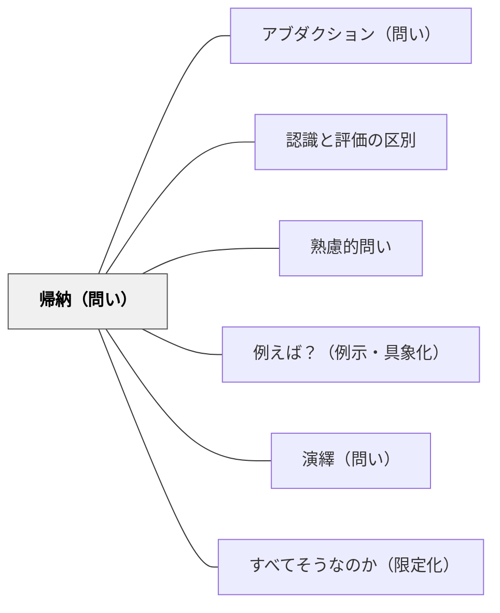

# 帰納（問い）

> 「これらの例から何がいえるか？」と問い、個別の事実から法則・パターンへと思考を昇華させる。

## 背景（Context）
学習の多くは具体的な事例・観察・経験から始まる。
複数の事例を並べたとき、そこに潜むパターンや規則性を見出すことが深い理解につながる。
しかし、事例を眺めているだけでは一般化は起きない。
帰納的な問いかけが、事例の観察から法則の発見へと学習者を導く。

## 問題（Problem）
複数の具体的な事例や観察結果が提示されたとき、そこから一般的な法則・パターン・原理を導き出す思考をどう促すか。

## 力のかたち（Forces）
- 複数の事例に共通するパターンを見出すことは、自然な認知活動だが、意図しないと起きにくい。
- 帰納的推論は科学的思考の基盤であり、習慣として身につける価値がある。
- 一方で、サンプルが少ない場合や偏っている場合には誤った一般化を生みやすい。
- 帰納と演繹を行き来することで、思考の往復運動が豊かになる。

## 解決（Solution）
「これらの例に共通することは何か？」「この事例群から何が言えるか？」「パターンや規則性はあるか？」と問いかける。
学習者が自分で複数の事例を見比べ、共通点・相違点を分析する時間を確保する。
一般化の言葉（「〜の場合、たいていは〜だ」「〜には〜という傾向がある」）を引き出す。
導き出された法則の妥当性を問い返すことで、[[パタン/すべてそうなのか（限定化）]]へとつなげる。

## 結果（Consequences）
個別の知識が統合され、より高い抽象レベルの理解が生まれる。
学習者は「法則を与えられる」のではなく「法則を発見する」経験をする。
帰納的推論の癖がつくと、日常的な経験からも学ぶ姿勢が育つ。
ただし、帰納から得られた法則は暫定的なものであることを自覚させる必要がある。

## 関連パタン
- [[パタン/アブダクション（問い）]]
- [[パタン/認識と評価の区別]]
- [[パタン/熟慮的問い]] — 親パタン
- [[パタン/例えば？（例示・具象化）]] — 帰納の素材となる具体例を集める問い
- [[パタン/演繹（問い）]] — 帰納で得た法則を個別に適用する
- [[パタン/すべてそうなのか（限定化）]] — 帰納的一般化を検証する問い

## クラスター図

## Actionable Insight

- 複数の具体例を並べた後「これらに共通していることは何か？」と問う——法則を「与える」より「発見させる」ことで深い理解と記憶への定着が生まれる
- 学習者が一般化を言語化した後「いつでもそう言えるか？例外はないか？」と問い返す——帰納的結論の暫定性への気づきが批判的思考の習慣をつくる
- 教科書で「先に法則」が出てくる場合でも、先に具体例をいくつか見せてから法則を提示する——具体→抽象の順番が理解の深さを変える

## 出典
- [[文献/熟慮的問いのパターンリスト（動画記録）]]
