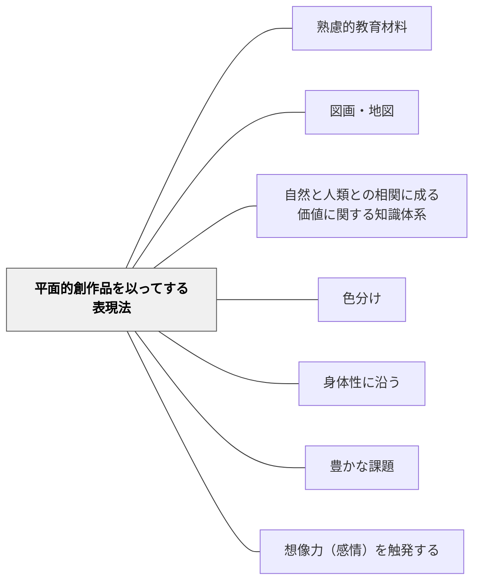

# 平面的創作品を以ってする表現法

> 絵・図・地図——平面的な視覚表現で価値を表現し伝える。

## 背景（Context）

牧口常三郎の表現法分類の第三項目。絵画・スケッチ・地図・グラフ・デザインなど、平面上での視覚的表現活動。図工・美術・社会科（地図）・算数（グラフ）など多くの教科に関わる。

## 問題（Problem）

「絵を描く」が評価対象から外れると、視覚的表現力と空間的認識が育ちにくい。

## 力のかたち（Forces）

- 視覚的表現は言語では伝えにくい関係・構造を伝える
- 描くプロセスが観察力・注意力を育てる

## 解決（Solution）

**絵・図・地図・グラフを描く活動を教育材料として意図的に設計し、視覚的表現力と空間的認識を育てる。**

## 結果（Consequences）

- 観察力・視覚的表現力が育つ
- 概念の視覚的理解が深まる

## 関連パタン

- [[パタン/熟慮的教材教具]] — 親パタン
- [[パタン/図画・地図]] — 同じ活動を一般語彙で記述。本パタンは牧口の表現法四分類（教育材料論）の一部
- [[パタン/自然と人類との相関に成る価値に関する知識体系]] — 上位分類
- [[パタン/色分け]] — 視覚的色彩による表現

- [[パタン/身体性に沿う]] — 絵を描く・地図を作る身体的活動が理解を深める
- [[パタン/豊かな課題]] — 平面的創作を核にした豊かな課題設計
- [[パタン/想像力（感情）を触発する]] — 創作が感情・想像力を引き出す
## クラスター図

## Actionable Insight

- 算数・社会・理科の授業で「今日学んだことを絵や図で表してみよう」を1回取り入れる——描く行為が観察力・空間的認識・言語では伝えにくい理解を同時に育てる
- 描くプロセスを「観察力と注意力の育成」として意識的に位置づけ時間を確保する——「絵が上手い下手」でなく「描きながら考える」ことに価値を置くメッセージが学習者の参加を広げる
- 描いた図を「他者への説明の道具」として使い発表・比較させる——視覚的表現を言語と統合させることで平面表現が理解の深化に直接つながる

## 出典

- 牧口常三郎（1972）『牧口常三郎全集第4巻 創価教育学体系 上』聖教新聞社
