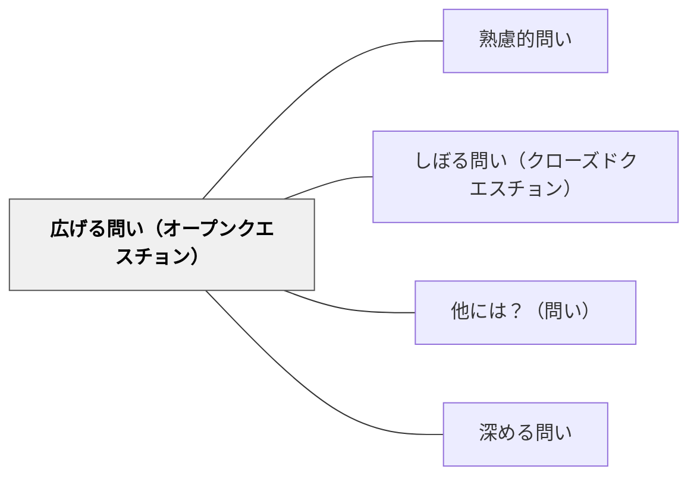

# 広げる問い（オープンクエスチョン）

> 多様な答えを引き出す開放的な問いで、探索・発散・創造的思考を促す。

## 背景（Context）
一つの正解を求める問いだけでは、学習者の多様な視点や創造的思考が引き出せない。オープンな問いは、様々な経験や考え方を持つ学習者全員が参加でき、思考の多様性と豊かさを生み出す。

## 問題（Problem）
閉じた問いに慣れた学習者は、「正解がある」という前提で思考し、自由に考えることをためらう。オープンクエスチョンなしでは、探索的・発散的な思考が育たず、創造性が発揮される機会が失われる。

## 力のかたち（Forces）
- 多様な答えが出ることで、視点の多様性が可視化される
- 正解・不正解がないため、学習者が安心して参加できる
- 発散した思考を後で収束させるプロセスが学びになる
- 教師も予測できない答えが出ることが、対話の面白さになる

## 解決（Solution）
「この物語を読んでどう感じた？」「もし自分だったらどうする？」「この問題には他にどんな解き方があると思う？」「なぜ人々はこの出来事を大切にするのだろう？」などと、一つの正解がない問いを投げかける。答えを評価せず「他には？」と続けて広げることで、発散的思考を促す。

## 結果（Consequences）
- 多様な視点が生まれ、クラス全体の思考が豊かになる
- 学習者が自分の考えを自由に表現する習慣が育つ
- 創造的・探索的な思考力の基盤が形成される

## 関連パタン
- [[パタン/熟慮的問い]] — 親パタン
- [[パタン/しぼる問い（クローズドクエスチョン）]] — 対になる問いの形式
- [[パタン/他には？（問い）]] — さらに広げる
- [[パタン/深める問い]] — 広げた後に深める

## クラスター図

## Actionable Insight

- 閉じた問いの後に「他に考え方はありますか？」と開放的な問いを1つ追加する——多様な答えが出る空間をつくるだけで発散的思考のスイッチが入る
- 授業の冒頭に「今日のテーマについて、どんなことが気になりますか？」と問う——正解のない問いが学習者の関心と自由な思考を引き出す
- 学習者の答えに対して「他の人はどう思う？違う考えは？」と続ける習慣をつける——「他には？」を続けることで視点の多様性がクラス全体に可視化される

## 出典
- [[文献/熟慮的問いのパターンリスト（動画記録）]]
