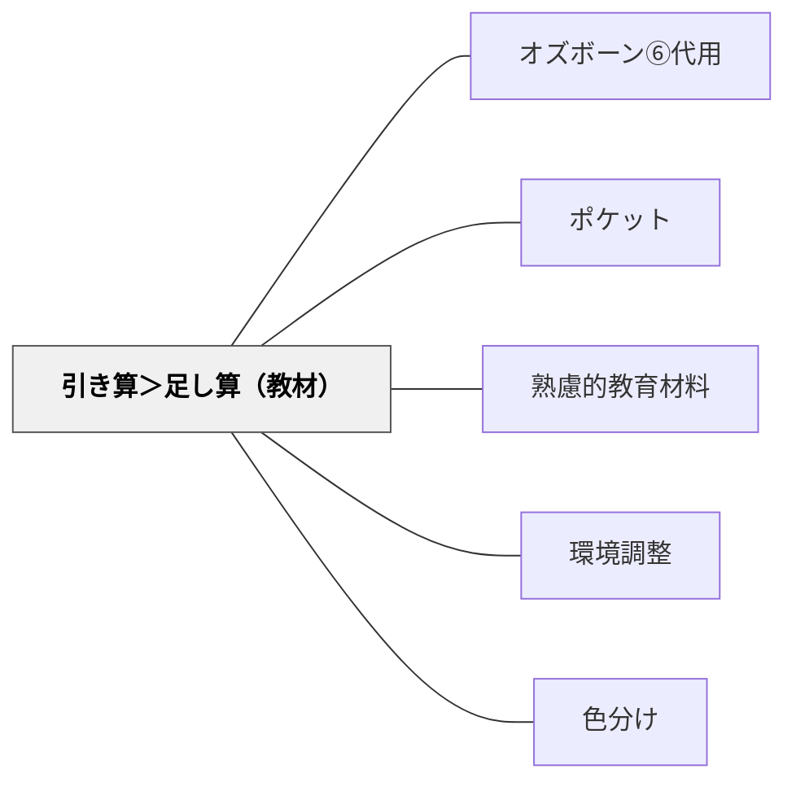

# 引き算＞足し算（教材）

> 教材設計において「何を加えるか」より「何を省くか」が重要である。

## [Pattern Connection]

### 俵万智（2004）考える短歌 統合（2026-06-02）：言語表現の引き算——削ることで言葉が輝く

『考える短歌』の全8講は「削ること」という一つの原理で貫かれている。これは「何を加えるか」より「何を省くか」という本パタンの核心を、言語表現の次元で具体化する。

俵万智が一首ごとの添削で示す削り方：

- **「も」を削る**：「ここにいる僕より君はケータイ**も**話し相手に笑顔を見せる」→「の」に変え→さらに「ケータイ**で**話す相手に」と置き換える。焦点をぼかす「も」を削ることで主体と対象が一気に明確になる
- **副詞を削る**：「ふと」「ゆっくり」「すっと」は誰でも使えて個性が生まれない→削って数字（「7分」「百回」）に置き換えると客観性と鮮明さが同時に生まれる
- **主観的形容詞を削る**：「誰が墓ぞ赤い小さな風車**寂しく**ひとりまわってる」→「寂しく」を削り、「カラカラまわる」という擬音語と情景描写に置き換えることで読者が自ら「寂しさ」を発見する
- **あいまいな「の」を削る**：「ケータイ**の**知らない人」→「ケータイ**で**話す相手」に変えると関係が的確になる

共通原理：**不要なものを削ると、残ったものが輝く**。これは教材設計の「引き算」と同じ原理が、言語表現の領域で働いている。

> 「主観的な形容詞に頼れば、ひとことですんでしまうが、その思いは読者には伝わらない」——俵万智（2004）

- **既存パタンとの関連**：本パタンが「教材素材の引き算」（色・装飾・情報量を削る）を扱うのに対し、俵万智は「言語表現の引き算」（助詞・副詞・形容詞を削る）を体系化した。同じ「削る」原理が異なる次元で働いている
- **補強された点**：「削ることへの心理的抵抗がある」という力のかたちに対して、俵万智の「削ったら輝いた」という具体的な添削事例群が、削ることの有効性を直感的に納得させる事例として使える
- **他のパタンへの波及**：[[パタン/作家のクラフト]] — 削ることが "Show, don't tell" の別方向からのアプローチになる；[[パタン/推敲（Revision）]] — 推敲の主要な作業として「削る観点」が加わる

[[文献/考える短歌（俵万智）]]

---

### 北大路翼（2019）生き抜くための俳句塾 統合（2026-06-02）：17文字の引き算——制約が磨く表現の核

俵万智が「31文字から削る」なら、北大路翼は「17文字に削る」。俳句という詩形は教材設計における引き算の思想的な極限形態である。

**5W1H→削る：俳句の制作プロセス：**
北大路翼が示す俳句的思考回路（第二講）では、まずモノを五感で把握し、5W1H（いつ・どこで・誰が・何を・なぜ・どのように）で情報を集めてから削る。「足し算で集めて引き算で選ぶ」という制作プロセスが俳句の基本。

> 「うごけば、寒い」（橋本夢道）——たった6文字。新興俳句事件で逮捕されたときの一句。

この句は「刑務所の独房で、冬の寒さの中、じっとしていないと余計寒い」というすべての情報を捨て、「うごけば、寒い」だけを残した。「捨てることが詩になる」という引き算の極限形態。

**「音数よりも音量」——削ることの本質：**

> 「字余り・字足らずは気にしない。音数よりも音量。」——北大路翼（2019）第四講

17文字という数字への拘泥を捨て、「何をどのくらいの力で伝えるか」を優先する——これは教材設計における「要素の数より伝える力」の優先、つまり「削ることへの心理的抵抗」を乗り越えた先の設計思想。

**「多作多捨」——捨てることを制度化する：**
「作ったらすぐ捨てろ」（第一講）——量を作って捨てることがセット。教材設計でも「作っては捨てる」実験的態度が、削ることの実践的訓練になる。完成品への執着が「削れない」原因のひとつ。

- **既存パタンとの関連**：俵万智が「言語表現の引き算（助詞・副詞・形容詞を削る）」を示すとすれば、北大路翼は「俳句という17文字の極限制約」という形で引き算の最終形を示す。「削ることへの心理的抵抗」（力のかたち）に対して、「多作多捨（捨てることを習慣にする）」という実践的な解を加える
- **補強された点**：「うごけば、寒い」のような極限の引き算事例が加わる。「これだけ削ってもこれだけ伝わる」という具体例が「削ることへの抵抗」を減らす
- **他のパタンへの波及**：[[パタン/制限化限定化]] — 17文字という制約が削る動機を必然化する；[[文献/生き抜くための俳句塾（北大路翼）]] — 本統合の出典

[[文献/生き抜くための俳句塾（北大路翼）]]

---

## 背景（Context）

「経済を原理とする」というメタパタンの応用。教材・教具も「足し算」思考で素材を増やし続けると、認知的負荷が高まり学習者の注意が分散する。必要最低限の要素に絞ったシンプルな教材が最も学習効果を発揮することが多い。環境調整の文脈でも「引き算の整備」が強調されている。

## 問題（Problem）

「充実した教材」を目指して素材・情報・色・装飾を増やし続けると、学習者が本質に集中できなくなる。

## 力のかたち（Forces）

- 情報量が多いほど認知的負荷が高まる
- シンプルな教材は作り直しや改善がしやすい
- 削ることへの心理的抵抗がある

## 解決（Solution）

**教材設計で「何を削れるか」を先に考える。目標達成に不要な情報・装飾・ステップを取り除いたミニマルな教材を目指す。**

## 結果（Consequences）

- 学習者が本質的な内容に集中できる
- 教材の作成・改善コストが下がる

## 関連パタン
- [[パタン/オズボーン⑥代用]]
- [[特別支援/TEACCHとシグニファイア]]
- [[実践/個別教材の設計]]
- [[パタン/ポケット]]

- [[パタン/熟慮的教材教具]] — 親パタン
- [[パタン/環境調整]] — 引き算の原理（大きなパタン）
- [[メタパタン/経済を原理とする]] — 経済の原理
- [[パタン/色分け]] — 視覚的シンプルさの実装例
- [[文献/考える短歌（俵万智）]] — 言語表現の引き算の具体例（俵万智, 2004）
- [[文献/生き抜くための俳句塾（北大路翼）]] — 17文字の極限引き算・多作多捨・「音数よりも音量」（北大路翼, 2019）

## クラスター図

## Actionable Insight

- 既存の教材・プリントを見直し「なくても学習目標が達成できる要素」を1つ以上削除する——引き算の視点で教材の本質が浮き彫りになる
- 新しい教材を設計するとき、まず要素リストを作り「これは本当に必要か」と1つずつ問う——省くべきものを先に特定することで認知負荷が下がる
- 「情報を増やしたのに学習者が混乱した」事例を振り返り、どこを削れたかを検討する——削ることの効果を体感することで引き算思考が定着する

## 出典

- [[文献/熟慮的教育材料のパターンリスト（動画記録）]]
