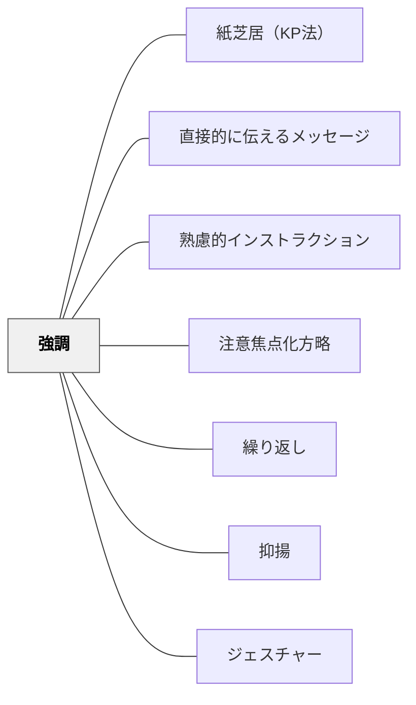

# 強調

> 重要な部分を際立たせることで、受け手は何に注意を向けるべきかが分かる。

## 背景（Context）
人間の注意資源は有限であり、すべての情報に等しく注意を向けることはできない。指示や説明の中でどこが重要かを際立たせなければ、受け手は情報を平均化して受け取り、重要な部分が埋もれてしまう。声・板書・テキストなどあらゆる伝達媒体で強調は意図的に設計できる。

## 問題（Problem）
すべての情報を同じトーンで伝えると、受け手はどれが重要かを判断できず、認知的負荷が増す。重要な指示が「流れ」の中に埋まってしまうと、聞き漏らしや忘却が起きやすくなる。強調がなければ、情報は受け手の中で均質に（すなわち浅く）処理される。

## 力のかたち（Forces）
- 強調が多すぎると全体が均質になり、強調の意味が失われる
- 声の変化・板書・視覚的マーカーなど複数の強調手段を組み合わせると効果が高まる
- 何を強調するかの判断が指示・説明の設計の質を反映する
- 意図しない強調（怒った声・派手な板書）が誤ったメッセージを送ることもある

## 解決（Solution）
**声を大きくする・話すスピードを落とす・間を置く・板書に下線を引く・色を変える・繰り返すなど、複数の強調手段を組み合わせて重要な部分を際立たせる。**
「ここが一番大事です」と言語的に明示することと、非言語的な強調（声・ジェスチャー・視覚的マーカー）を組み合わせることで効果が最大化する。一つの授業や説明の中で強調する箇所を3〜5か所に絞り、受け手の注意が散漫にならないよう設計する。

## 結果（Consequences）
- 受け手が重要な情報と補足的な情報を区別して処理できるようになる
- 指示の核心が記憶に残りやすくなり、実行の精度が上がる
- 教師の説明の設計力（何が重要かを判断する力）が可視化される

## クラスター図

## Actionable Insight

- 「ここが一番大事です」と言語的に明示することと、声を大きくする・話すスピードを落とす・間を置くなどの非言語的強調を組み合わせる——重要な情報と補足的な情報を区別して処理できるようになる
- 一つの授業で強調する箇所を3〜5か所に絞る——強調が多すぎると全体が均質になり強調の意味が失われる
- 板書に下線・色変えなどの視覚的マーカーを使う——指示の核心が記憶に残りやすくなり実行の精度が上がる

## 出典

- 一つの教育のパタン・ランゲージ（岩井輝久）

## 関連パタン
- [[パタン/紙芝居（KP法）]]
- [[パタン/直接的に伝えるメッセージ]]
- [[パタン/熟慮的インストラクション]] — 親パタン
- [[パタン/注意焦点化方略]] — 注意を特定の部分に向ける方略
- [[パタン/繰り返し]] — 繰り返しによる強調
- [[パタン/抑揚]] — 声による強調技法
- [[パタン/ジェスチャー]] — 身体による強調
