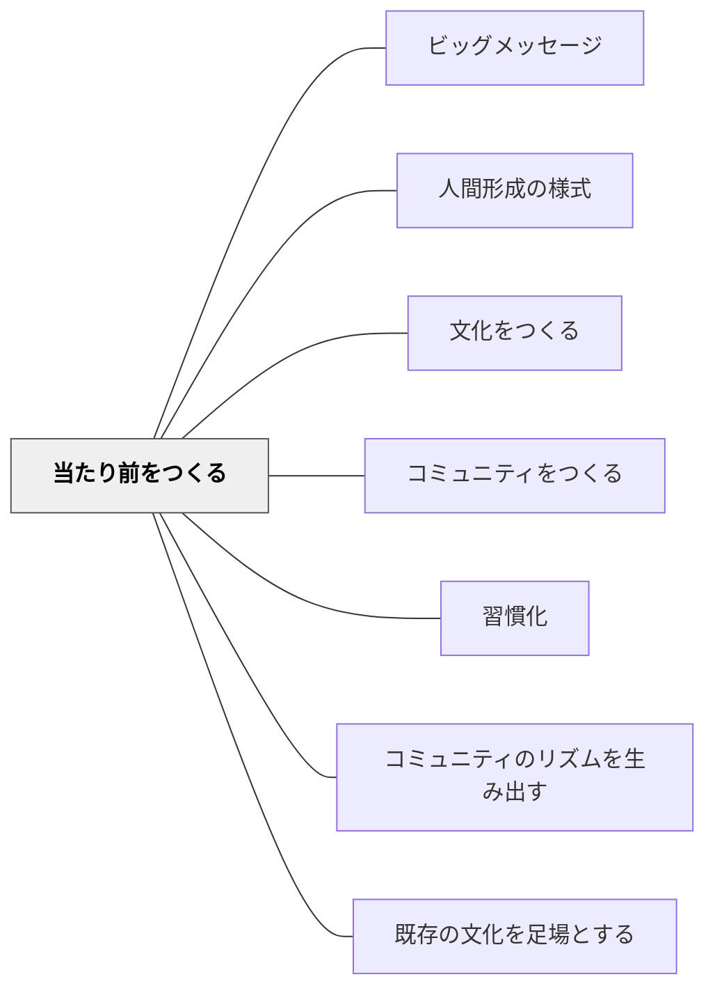

# 当たり前をつくる

> 文化とは、「ここではこれが当たり前」という集合的な了解である。

## 背景（Context）

どのクラスにも「当たり前」がある。「先生が話しているときは静かにする」も当たり前だが、「困ったら仲間に聞きに行く」も当たり前にできる。問題は、何が「当たり前」になるかである。

## 問題（Problem）

明示的に望ましい規範を作らなければ、デフォルトの当たり前（正解を待つ、間違えない、目立たない）が形成され、学習文化が育たない。

## 力のかたち（Forces）

- 明文化されたルールよりも暗黙の「当たり前」の方が行動を規定する力が強い
- 当たり前は繰り返し実践される中で形成される；宣言だけでは生まれない
- 新しい「当たり前」は既存の「当たり前」との競合を生む

## 解決（Solution）

**望ましい行動を意図的に繰り返し実践し、それが「もちろんそうする」となるまで育てる。**

手順の例：
1. 望ましい規範を選ぶ（例：「間違えたときに話してくれてありがとう」）
2. その行動が現れたときに言語化・賞賛する
3. 全員で振り返り「私たちのクラスではこれが当たり前」と宣言する
4. それを具体的なルーティン・儀式に組み込む（→[[パタン/習慣化]]）

## 結果（Consequences）

- 教師が個別に注意する必要が減り、文化がしつけの代わりを担う
- 学習者が教室外でも同じ「当たり前」を持ち込むようになる
- クラス替え・進級後も、一定程度文化が引き継がれる

## クラスター図

## Actionable Insight

- 「困ったら仲間に聞きに行く」などの望ましい行動が現れたとき、その場で全体に言語化・共有する——「今の○○さんの行動がよかった」という即時の言語化が当たり前の芽になる
- 学期のはじめに「このクラスで当たり前にしたい1つのこと」を子どもたちと決め、教室に掲示する——子どもが作った言葉が文化の種として機能する
- 毎週の振り返りで「今週、この当たり前ができた場面は？」を1分確認する——繰り返しの振り返りが規範を「意識的な実践」から「自然な当たり前」へと変える

## 出典

- 一つの教育のパタン・ランゲージ（岩井輝久）

## 関連パタン
- [[学級経営/学級経営で使えるパタン]]
- [[実践/デイリー5の起動]]
- [[学級経営/オンボーディング]]
- [[学級経営/文化をつくる]]
- [[パタン/ビッグメッセージ]]
- [[パタン/人間形成の様式]]

- [[パタン/文化をつくる]] — 親パタン
- [[パタン/コミュニティをつくる]] — 当たり前を共有する集団
- [[パタン/習慣化]] — 当たり前が自動化されるプロセス
- [[パタン/コミュニティのリズムを生み出す]] — リズムが当たり前を支える
- [[パタン/既存の文化を足場とする]] — 既存の当たり前を起点にする
