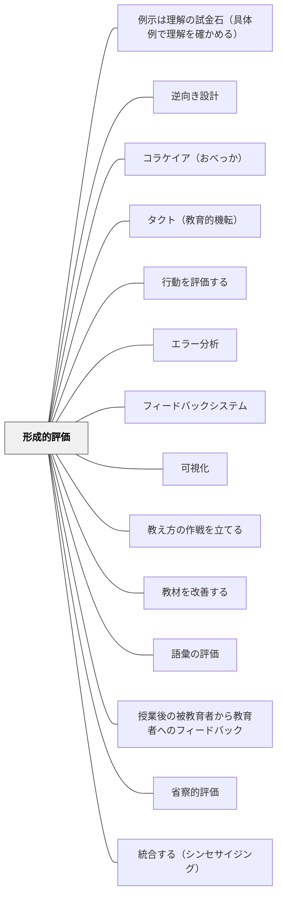

# 形成的評価

**一文でいうと**：学習の途中で理解やつまずきを見取り、その場で指導と学習を調整する。

---

## [Pattern Connection]

**カント（1787）統合：**

- **哲学的基盤の提供**：カントの「物自体（Ding an sich）は認識できず、現象のみが認識対象になる」という洞察が、形成的評価を**哲学的に必然のもの**にする根拠を与える。教師が直接見えるのは常に「現象」——学習者の発言・書いたもの・テストの答え——であり、学習者の「理解そのもの（物自体）」には決して直接アクセスできない。
- **なぜ一回の確認では不十分か**：正解を書いた、というのは一つの現象に過ぎない。「なぜそうなるか説明して」「別の例を作って」「図で表して」と異なる形の現象を重ねることで、初めて理解の全体像（物自体に近い何か）に近づける。
- **誤答の扱い**：「間違い＝理解できていない（物自体）」という判断も早計。誤った現象の背後には多様な物自体——真の誤概念、一時的な混乱、読み間違え——が潜む。だからこそ「なぜこう考えたの？」という問いかけが不可欠。
- **波及するパタン**：[[パタン/コペルニクス的転回（認識論）]] — 学習者の認識は「物自体」ではなく、認識形式を通じた「現象」として現れる。この認識論的謙虚さが学習者中心設計の根拠となる。

→ 出典：[[文献/純粋理性批判 1（カント、中山元訳）]]

**Black & Wiliam（1998）統合：**

この論文がこのパタンに与えたのは、定義・核心・そして強い留保の三つである。

- **定義——「テストの種類」ではなく「情報が使われること」**：「教師によって、および／またはその生徒たちによって行われるすべての活動であって、彼らが従事している教授・学習活動を**修正するためのフィードバックとして用いられる**情報を提供するもの」（pp.7-8）。主体に**学習者自身が含まれる**こと、そして情報が**実際に使われて教授と学習が変わる**ことが要件である。テストを増やしても、結果が行動を変えなければ形成的ではない。
- **核心は二つの行為の連鎖**：「第一は、望ましい目標と自分の現在の状態との間の**ギャップを学習者が知覚すること**。第二は、そのギャップを埋めるために**学習者がとる行動**である」（p.20）。教師のフィードバックは第一を助けうるが、第二を起こすのは学習者しかいない。だから「学習者を**行動への呼びかけの受動的受け手**と見なすのは誤りである」。
- **形成的か総括的かは「機能」で決まる**：比較には三つの様式がある（p.53）。①等価性（同じか違うか）②距離（基準にどれだけ足りないか）③**診断**（そこに到達するために私は何をする必要があるか）。形成的機能を果たすのは③のときだけである。評価は**目的においては形成的でも、機能においては形成的でない**ことがありうる——ここが実務で最も見落とされる。
- **強い留保——周辺的な追加としては成立しない**：「形成的評価の革新は教室作業の**周辺的変化としては扱えない**」（p.16）。それは相互作用の質に関わり、相互作用の質は教育方法の核心にあるからである。政策節の結論も同じ——「立ち現れるのは一組の**導きの原理**であり……必要とされる教室実践の変化は**周辺的ではなく中心的**であり、各教師が**自分自身のやり方で**自分の実践に組み込まねばならない」（p.62）。この Wiki がパタン・ランゲージの形式をとることの、外からの裏づけになっている。
- **効果量の読み方**：Fuchs & Fuchs（1986）で0.70、マスタリー・ラーニングで0.82、フィードバック全般（Kluger & DeNisi 1996）で0.40。ただし政策節の「効果量0.7」の例証は「**もし全国規模で達成できたなら**」という条件法で書かれている（p.61）。条件節を落として引用しないこと。なお本文冒頭で挙げているハッティの0.9前後という値は、対象範囲の異なる別のメタ分析に由来する——形成的評価の効果量は、何を形成的評価と数えるかで大きく動く。

→ 出典：[[文献/Assessment and Classroom Learning（Black & Wiliam）]]

---

## 使いどころ・使いすぎ注意

| 観点         | 内容                                     |
| ------------ | ---------------------------------------- |
| 使いどころ   | 授業途中で見取り、調整したいとき。       |
| 使いすぎ注意 | 見取りが多すぎると、活動の流れが切れる。 |

> 評価は学習を終わらせるためではなく、学習を育てるためにある。

## 背景（Context）

教育における評価には大きく二つの目的がある。一つは学習の結果を確認・認定すること（総括的評価）、もう一つは学習の途中で情報を得て改善に活かすこと（形成的評価）だ。形成的評価は「学習のための評価（Assessment for Learning）」とも呼ばれ、学習者の成長を支援する機能をもつ。

ジョン・ハッティのメタ分析研究では、形成的評価は効果量0.9前後という非常に高い学習効果を示しており、学習成果に対する最も影響力の大きい実践の一つとして位置づけられている。

## 問題（Problem）

多くの教育現場では、評価が学習の「終わり」にのみ行われ、学習が完了した後で成績や評点が与えられる。この構造では、評価の結果が次の学習サイクルに活かされないまま、新しい単元へと移行してしまう。

学習者は自分が「どこで間違えたのか」「どうすれば良くなるのか」を理解しないまま評価を受け取り、改善の機会を失う。また教師も、学習者の理解状況を学習中に把握できないため、指導の軌道修正が遅れる。

## 力のかたち（Forces）

- 学習の途中でフィードバックを受けることで、誤概念や誤りを早期に修正できる
- 形成的評価には追加の時間と労力が必要で、カリキュラムの進度と緊張関係が生まれることがある
- 形成的評価が効果をもつためには、その情報を学習改善に実際に活用する文化と仕組みが必要

## 解決（Solution）

授業・単元・学期の進行中に、継続的に学習者の理解状況を把握し、それを学習改善に活かす仕組みを設計する。具体的な実践として、授業中の口頭確認（挙手・ミニホワイトボード・終わりの質問）、ピアフィードバック、自己評価チェックリスト、短い確認テスト、授業終了時の振り返りメモ（「今日学んだこと・まだわからないこと」）などがある。

重要なのは、形成的評価によって得られた情報を、教師が指導の修正に、学習者が自分の学習の修正に実際に使うことだ。情報収集だけに終わり、改善行動につながらなければ形成的評価の機能は果たされない。

## 結果（Consequences）

- 学習者が自分の理解状況をリアルタイムで把握でき、自己調整学習が促進される
- 教師が学習者の状況に応じて指導を柔軟に調整できるようになる
- 誤概念が早期に発見・修正され、積み重ねの失敗を防ぐことができる

## 関連パタン
- [[パタン/例示は理解の試金石（具体例で理解を確かめる）]]
- [[パタン/逆向き設計]]
- [[パタン/コラケイア（おべっか）]]
- [[パタン/タクト（教育的機転）]]
- [[学級経営/学級経営で使えるパタン]]
- [[実践/BDA読解授業の設計]]
- [[実践/学習科学の6方略]]
- [[パタン/行動を評価する]]
- [[パタン/エラー分析]]
- [[パタン/フィードバックシステム]]
- [[パタン/可視化]]
- [[パタン/教え方の作戦を立てる]]
- [[パタン/教材を改善する]]
- [[パタン/語彙の評価]]
- [[パタン/授業後の被教育者から教育者へのフィードバック]]
- [[パタン/省察的評価]]
- [[パタン/統合する（シンセサイジング）]]
- [[パタン/被教育者にフィードバックを提供し理解できるようにする]]

- [[パタン/フィードバック]] — 親パタン
- [[パタン/総括的評価]] — 対比となる評価形式。両者が相補的に機能することが望ましい
- [[パタン/フィードフォワード（次に何をするべきか）]] — 形成的評価が明らかにしたギャップを行動に転換する
- [[パタン/テストを繰り返す]] — 形成的目的でのテスト活用
- [[パタン/相関と因果の区別（教育評価の落とし穴）]] — フィードバックの効果を「本当に効いたか」と因果的に問う謙虚さ
- [[パタン/学習のための評価（A4L）]] — Boaler による算数教育固有の A4L 実装。グレードを外した診断コメント・Exit Ticket・再提出許可など具体的技法を体系化している
- [[パタン/チェックイン（Checking In）]] — 毎日2〜3分・全員へのゾーン確認という形成的評価の最小単位。「今どこにいるか」を毎日確認するリズムが取り残しを防ぐ（Atwell, 2016）
- [[パタン/再提出を許す（リトライ・サイクル）]] — フィードバックを「使う機会」を制度化し、形成的評価を成立させる前提条件
- [[パタン/誤概念の組み替え（素朴概念を資源にする）]] — 形成的評価が見取った誤概念を、適用範囲の再交渉として組み替える具体的設計
- [[パタン/ガイデッド・リーディング（小グループの読み指導）]] — 観察記録→グループ編成更新→テキスト選定という循環は、読み指導における形成的評価の典型実装
- [[パタン/IRE型応答の脱却（Talk Move）]] — 教師の第3ターンを「評価」から「情報収集と調整」へ転換する点で同じ思想。子どもの応答は採点対象でなく指導調整の資源として扱う
- [[パタン/つまずきを構造で記録する（診断の粒度設計）]] — 形成的評価は「何のために記録するか」（改善のための評価という目的）を扱う上位パタン。本パタン（つまずきを構造で記録する）は「どの粒度で記録するか」という具体的な実装の型——上位の目的を実現するために記録の粒度設計が機能する
- [[パタン/補充機構の常設化（匡救設計）]] — 形成的評価の「評価→指導改善のサイクル」の具体的な補充実装が本パタン。形成的評価が目的・哲学を担い、補充機構がその実行手段として機能する
- [[パタン/AIフィードバックと教師の二重ループ]] — 形成的評価の頻度と即時性をAIで上げつつ、最終判断は人間が持つ
- [[パタン/評価的専門性を渡す（ギルド知識のダウンロード）]] — 形成的評価が最終的に目指す地点。評価する力そのものを学習者へ渡す（Sadler, 1989）
- [[パタン/制作しながら質を判断する（産出中のモニタリング）]] — 評価の担い手が学習者自身になり、時点が産出のただ中まで前倒しされた極（Sadler, 1989）
- [[パタン/最適なギャップ（願望水準の交渉）]] — 見取ったギャップの大きさそのものを設計変数として扱う（Sadler, 1989）
- [[文献/Formative Assessment and the Design of Instructional Systems（Sadler）]] — 形成的評価の3条件とフィードバックから自己モニタリングへの移行を論じた原典（Sadler, 1989）
- [[文献/Assessment and Classroom Learning（Black & Wiliam）]] — このパタンの定義を与えた系統的レビュー。効果の証拠と「周辺的変化では成立しない」という留保の両方の出所（Black & Wiliam, 1998）
- [[パタン/評点なしで返す（コメントだけの一巡）]] — 形成的な情報が総括的な情報と同居すると消える、という実験的知見の実装
- [[パタン/見取ったあとの手を決めておく（データ利用のルール化）]] — 見取りを指導改善につなぐ機構。ルール化の有無で効果量が0.92と0.42に分かれる
- [[パタン/進歩の傾きを見る（水準ではなく変化率）]] — 見取りの対象を「点」から「変化率」へ移す
- [[パタン/理解のしるしを読む（fit と match）]] — 何をもって「わかった」と見取るかの実務。正答は理解の証拠にならない
- [[パタン/聴き方を変える（評価的・解釈的・解釈学的）]] — 見取る側の構えそのものを扱う。教師の聴き方が形成的評価の質を規定する
- [[概念/自我関与と課題関与（フィードバックが向ける先）]] — 見取った情報をどう返すかで、学習者の注意が課題に向くか自己に向かうかが決まる
- [[概念/教授学的契約（やり過ごしの均衡）]] — 形成的評価が導入時に最初にぶつかる壁。契約を組み替えないと子どもは間違いを隠す

- [[パタン/評定（成績評価）]] — 対比。評定は総括的機能に限定し、形成的な場面では返さない時間を確保する
## クラスター図

## Actionable Insight

- 授業終了5分前に「今日学んだこと1つ・まだわからないこと1つ」をメモさせる——エグジットチケットが形成的評価の最もシンプルな実践
- 次の授業の冒頭に「前回学んだことを3つ書く」ウォームアップを入れる——形成的評価の情報を次の授業改善に活かすサイクルが生まれる
- 前回の評価で出てきた「まだわからないこと」を翌週の授業で取り上げる——評価が学習改善に実際につながることで形成的評価の文化が育つ

## 出典

Black, P., & Wiliam, D. (1998). Assessment and classroom learning. _Assessment in Education: Principles, Policy & Practice, 5_(1), 7–74.（定義・二つの行為の連鎖・「周辺的変化では成立しない」の出所となる系統的レビュー）
Black, P. & Wiliam, D. (1998). Inside the Black Box. _Phi Delta Kappan_, 80(2), 139–148.（上記レビューを実践者向けに圧縮した小冊子版）
Hattie, J. (2009). _Visible Learning_. Routledge.
Wiliam, D. (2011). _Embedded Formative Assessment_. Solution Tree.
