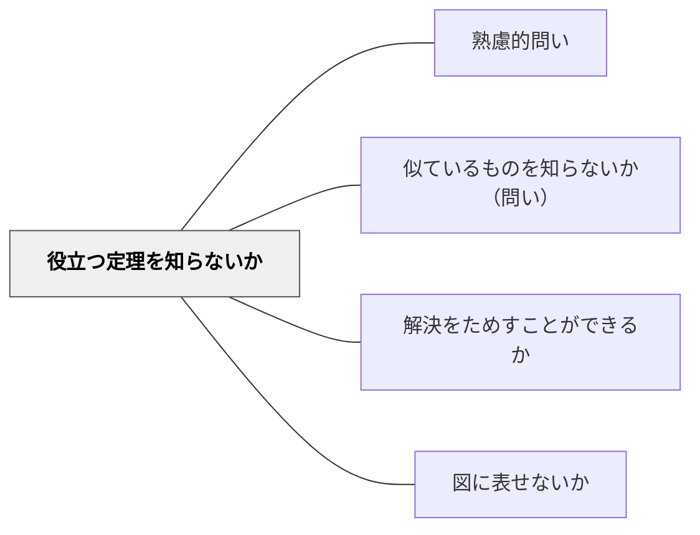

# 役立つ定理を知らないか

> 問題の解決に使えそうな知識・原理・定理を能動的に探索する問い。

## 背景（Context）
学習者は多くの知識を持っていても、それが目の前の問題に使えるとは気づかないことが多い。知識の「想起」と「適用」の間には大きなギャップがある。問いを通じて既習知識を意識的に探索することで、そのギャップを埋めることができる。

## 問題（Problem）
「何を使えばいいか分からない」という状況は、知識がないのではなく、知識と問題の接続ができていないことが原因であることが多い。定理や公式を暗記していても、どの場面で使うかという判断が訓練されていないと、知識は死んだものになってしまう。

## 力のかたち（Forces）
- 知識の活用は「探す意識」があって初めて可能になる
- 既習内容との関連付けが、深い理解と長期記憶を促進する
- 「使えそうなものを探す」という姿勢が能動的学習を生む
- 不適切な定理を試みることも、適切なものを絞り込む助けになる

## 解決（Solution）
「今までに学んだ定理や原理で、この問題に使えそうなものはないか？」と問いかける。例えば幾何の問題なら「ピタゴラスの定理は使えるか？相似の関係はないか？」と具体的な候補を提示しながら探索させる。「なぜそれが使えると思うか？」と理由も問うことで、適用の判断力を育てる。

## 結果（Consequences）
- 知識の「再活性化」が起こり、記憶の定着が強化される
- 知識と問題の接続が習慣化し、応用力が向上する
- 自分の知識体系を俯瞰する力が育つ

## 関連パタン
- [[パタン/熟慮的問い]] — 親パタン
- [[パタン/似ているものを知らないか（問い）]] — アナロジーで知識を探す関連パタン
- [[パタン/解決をためすことができるか]] — 想起した定理で解を検証する
- [[パタン/図に表せないか]] — 図示で定理の適用可能性を確かめる

## クラスター図

## Actionable Insight

- 問題提示後に「今まで習った中で使えそうな公式・定理・原理をノートに3つ書き出してみよう」と促す——探す行為が既習知識を再活性化する
- 「その定理が使えると思う理由は？」と追い問いする——適用の判断に根拠を求めることで知識と問題の接続が深まる
- 「試してみたが合わなかった定理」も記録させる——不適用の試みも知識整理のプロセスとして価値づける

## 出典
- [[文献/熟慮的問いのパターンリスト（動画記録）]]
- ジョージ・ポリア（1954）『いかにして問題をとくか』丸善出版
