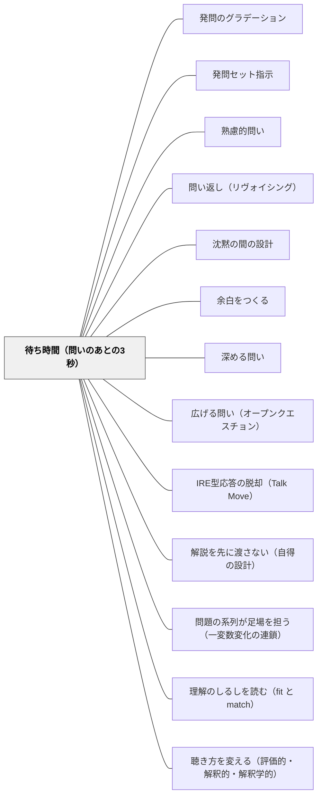

# 待ち時間（問いのあとの3秒）

> 問うたあとに「い・ち・に・さん」と心の中で数える——その3秒が、できる子だけの早押し競争を「全員の思考の時間」に変える。

## [Pattern Connection]

- **既存パタンとの関連**：本パタンは Mary Budd Rowe による Wait Time 研究（1974, 1986）を、本Wikiの発問系パタン群の「効果条件」として統合する。[[パタン/発問のグラデーション]] や [[パタン/熟慮的問い]] がどれほど洗練されていても、発問の直後に1秒で打ち切ってしまえば、その問いは機能しない。Rowe の研究はこの「マイクロな時間制御」が応答の質を決定的に左右することを実証した。
- **補強された点**：「待つ」は精神論ではなく、計測可能な指導行為であること。教師が無意識に確保している待ち時間は平均約1秒であり、これを3秒以上に延ばすだけで、応答の長さ・思考的発言・子ども同士の応答・子どもからの問いが増え、無応答が減る。Tobin（1987）のレビューはこの効果の頑健性を確認している。
- **修正・拡張された点**：「待ち時間」が**2種類**あることの明示。Wait Time I（発問の直後）に加えて、Wait Time II（子どもの応答の直後）が見落とされやすい。教師は子どもの発言が終わるとほぼ即座に評価・言い換え・次の指名へ進むが、ここに数秒の沈黙を置くと、応答者自身が言葉を足し、他の子が反応し始める。Rowe（1986）の「遅くすることが速くする方法になりうる（Slowing down may be a way of speeding up）」という命題は、この Wait Time II に特に強く当てはまる。
- **他のパタンへの波及**：[[パタン/問い返し（リヴォイシング）]] の前には Wait Time II が必要であり、待たずに問い返せば「問い返し」が単なる教師の言い換えに堕する。[[パタン/沈黙の間の設計]] [[パタン/余白をつくる]] が授業全体や活動レベルの「間」を扱うのに対し、本パタンはそれらが成立するための**マイクロな単位**（数秒）を扱う点で補完関係にある。

## 背景（Context）

教師は発問を磨き、グラデーションを設計し、子どもが応えやすい問いを準備する。教室では発問→応答→評価→次の発問という連鎖が分単位で進む。しかしこの連鎖の継ぎ目には、ごく短いが決定的な「数秒」がある——発問の直後と、子どもの応答の直後である。この数秒の使い方は、ほとんどの教師にとって無自覚な習慣として固まっている。

## 問題（Problem）

教師は自分の発問のあと、平均して約1秒しか待たずに次の言葉を発する。「えーっと、たとえばね」「誰か分かる人？」「じゃあ○○さん」——こうして沈黙を埋めると、思考に時間がかかる子は問いを処理し終える前に応答機会を逃す。結果として応答するのは「即答できる少数の子」だけになり、教師はそれを「クラスの理解」と誤認する。

同じことが応答の直後にも起きる。子どもが話し終えた瞬間に教師が「いいね」「つまり○○ってこと？」と引き取ると、その子は自分の言葉を最後まで言い切る前に区切られ、他の子はその発言を受け止めて反応する時間を奪われる。沈黙を埋める教師の善意が、思考の場を閉じてしまう。

## 力のかたち（Forces）

- 発問後の沈黙は教師にとって不安である——授業が止まっているように見え、自分の発問が悪かったのではないかと感じる
- 速いテンポは授業の「キレ」を生むが、応答できる子が固定化し、できる子だけの早押し競争になりやすい
- 一方で待ちすぎると緊張・気まずさになり、参加意欲を下げる——3〜5秒が目安で、無限に待つことではない
- 処理速度がゆっくりな子・言語処理に困難を抱える子にとって、待ち時間は「配慮」ではなく**参加の前提条件**である
- 教師自身も「沈黙を測る」「自分が早く話しすぎていないかを自覚する」という身体感覚を持っていないことが多い
- 発問の質を上げるよりも、待ち時間を3秒に延ばすほうが投資対効果が高い場合がある——発問が同じでも結果が変わる

## 解決（Solution）

**発問のあとと、子どもの応答のあとの両方に、意図的に3秒以上の沈黙を確保する。教師は「い・ち・に・さん」と心の中で数えることでこれを身体化する。**

二つの待ち時間を区別する：

- **Wait Time I（問いのあとの3秒）**：発問を言い終えてから、最初の指名・補足・言い換えに進むまでの間。3〜5秒。
- **Wait Time II（応答のあとの3秒）**：子どもが応答し終えてから、教師が評価・問い返し・次の指名に進むまでの間。同じく3〜5秒。

---

**実技1：心の中で「い・ち・に・さん」と数える**

教師は時計を見ない。発問を言い終えた瞬間に、口を閉じ、心の中で「い・ち・に・さん」と一文字ずつ唱える。この3拍で約3秒になる。最初は不安で長く感じるが、録音して聞き返すと「思ったより短い」と気づく。応答が終わった瞬間にも同じ3拍を入れる。慣れてきたら「い・ち・に・さん・し・ご」まで延ばす。

子どもには「先生は問いを出したあと、3秒は黙って待つよ。すぐ手を挙げなくていいから、頭の中で考えてみて」と最初に宣言しておく。沈黙の意味が共有されれば、気まずさは消える。

---

**実技2：Wait Time II——応答の直後に黙る**

ある子が「○○だと思います」と言い終えた瞬間、教師は反射的に「いいね」「なるほど」と返したくなる。これを意識的に止め、3秒だけ沈黙を置く。すると次の3つのうちのどれかが起きる：

1. 応答した子自身が「……えーと、なぜかというと」と理由を足し始める
2. 別の子が「あ、それって○○ってこと？」と反応し始める
3. クラス全体が「いま言われたこと」を受け止めて、次の発言が深くなる

この3秒を惜しんで教師が即座に引き取ると、これら3つはどれも起こらない。「遅くすることが速くする方法になる」のは、この場面である。問い返し（リヴォイシング）の前には必ず Wait Time II が来る。

---

**実技3：処理速度がゆっくりな子のための「参加の前提条件」としての待ち時間**

特別支援学級や、通常学級内で言語処理に時間のかかる子にとって、待ち時間は「配慮」ではなく**参加そのものの前提**である。1秒で打ち切る教室では、その子は構造的に応答機会を奪われている。5〜10秒待つことで初めて「同じスタートライン」に立てる。

このとき有効なのは「全員が答えを準備してから合図で発表する」構造である：

- 「問いを出します。10秒後に親指を立ててください。考え中はぐっと握ったまま」
- 「ペアで30秒、まず自分の中で考えてから話す」
- 「ノートに3行書いてから、誰かを指名します」

待ち時間が「教師の我慢」ではなく「全員の準備時間」として構造化されると、教師の不安も減る。

## 結果（Consequences）

**利点**

- 応答の長さが伸び、単語応答から複文応答へ変わる
- 思考的発言（理由・推論・比較）の割合が増える
- 子どもから子どもへの応答・問いが増える
- 「分かりません」「無応答」が減る
- 応答する子の顔ぶれが広がり、できる子だけの早押し競争が解消される
- 処理速度がゆっくりな子が「同じ授業に参加している」という実感を持てる
- 教師自身が「沈黙に耐える」身体感覚を獲得し、授業全体に余裕が生まれる

**注意点**

- 3秒は「最低ライン」であって「上限」ではないが、無限に延ばすのは別の問題を生む。10秒を超える沈黙は緊張に転化しやすい。目安は3〜5秒、特別支援場面で10秒まで
- 「待つこと」自体が目的化すると、子どもにとって意味のある沈黙ではなく「不気味な間」になる。沈黙の意味（=考える時間）をクラスに宣言しておくことが前提
- 教師が我慢して「待っている顔」をすると、その表情自体がプレッシャーになる。視線は特定の子に集中させず、全体をふんわり見る
- 簡単な事実確認（「これは何ですか？」レベル）にまで3秒待つと、テンポが崩れる。待つべき発問とそうでない発問の見極めが必要
- Wait Time I だけ意識して Wait Time II を忘れる教師は多い。最も見落とされやすいのは応答の直後である

## 関連パタン

- [[パタン/発問のグラデーション]] — どの段階の発問でも、待ち時間がなければ機能しない。本パタンはグラデーション全体の効果条件
- [[パタン/発問セット指示]] — 発問とセットの指示（「ノートに書いてから」「ペアで話してから」）は待ち時間を構造として保証する手段
- [[パタン/熟慮的問い]] — 熟慮を求める問いほど Wait Time が長く必要。問いの深さと待ち時間は比例する
- [[パタン/問い返し（リヴォイシング）]] — 問い返しの前には必ず Wait Time II が来る。待たずに問い返すと教師の言い換えに堕する
- [[パタン/沈黙の間の設計]] — 授業全体・読み語り後など活動レベルの「間」を扱う。本パタンはそのマイクロ単位（発問・応答の直後の数秒）を扱い、両者は階層関係にある
- [[パタン/余白をつくる]] — 時間・空間・構造の余白の上位パタン。本パタンはその中で「発問・応答直後の数秒」という最小単位を担当
- [[パタン/深める問い]] — 深める問いには深い沈黙が要る。Wait Time が短いと深まりが起きない
- [[パタン/広げる問い（オープンクエスチョン）]] — 多様な応答を待つオープンクエスチョンほど Wait Time の効果が大きい
- [[パタン/IRE型応答の脱却（Talk Move）]] — 教師の第3ターンを評価からTalk Moveへ組み替える構造パタン。待ち時間はTalk Moveの一つとして位置づく
- [[パタン/解説を先に渡さない（自得の設計）]] — 渡さない姿勢の時間的側面（本パタン）と内容的側面（解説を先に渡さない）は相補関係にある
- [[パタン/問題の系列が足場を担う（一変数変化の連鎖）]] — 系列設計があって初めて「前の問題と比べよ」という待つ問いかけが活きる。系列設計は待ち時間の前提条件となる

- [[パタン/理解のしるしを読む（fit と match）]] — 慣習を外した一問は即答できない。待たなければこの診断の問いは機能しない
- [[パタン/聴き方を変える（評価的・解釈的・解釈学的）]] — 待てないのは技術ではなく構えの問題であることが多い。解釈的な聴き方は構造上長い Wait Time II を要求する

## クラスター図

## Actionable Insight

- 明日の1時間の授業で「い・ち・に・さん」と心の中で数えてから次の言葉を発する——発問のあとと、子どもの応答のあとの両方で。1日1時間でいい
- 授業を1回スマホで録音し、自分の発問から次の言葉までの秒数を計る——「思ったより待っていない」事実を数字で確認する
- 「先生は問いのあと3秒は黙って待ちます。すぐ手を挙げなくていい」と週の最初に宣言する——沈黙の意味をクラスで共有してから運用を始める

## 出典

- Rowe, M. B. (1974). Wait-time and rewards as instructional variables, their influence on language, logic, and fate control. *Journal of Research in Science Teaching*, 11(2), 81–94.
- Rowe, M. B. (1986). Wait time: Slowing down may be a way of speeding up! *Journal of Teacher Education*, 37(1), 43–50.
- Tobin, K. (1987). The role of wait time in higher cognitive level learning. *Review of Educational Research*, 57(1), 69–95.
