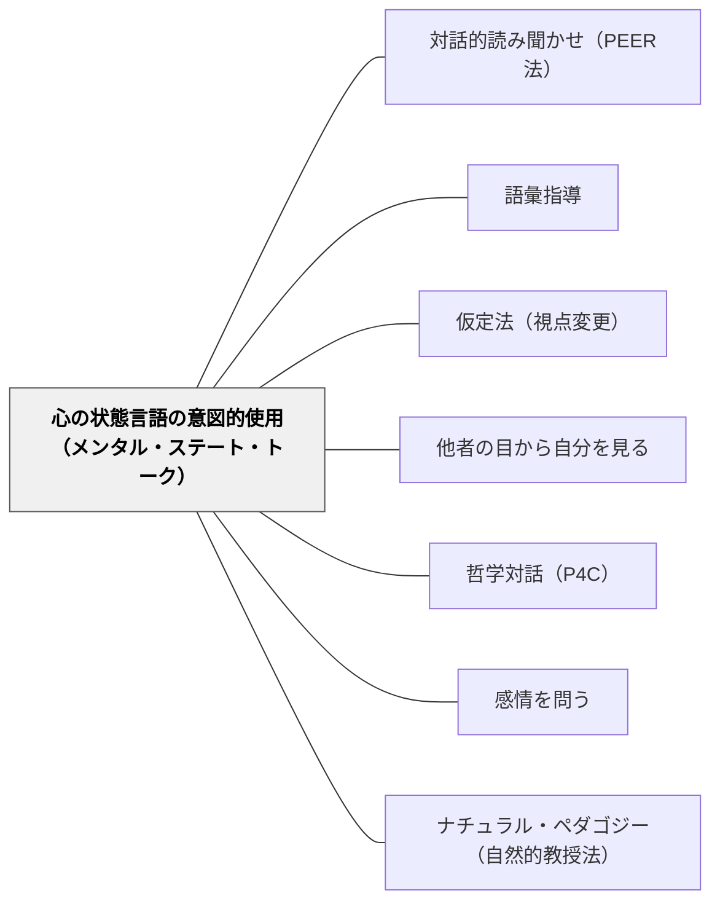

# 心の状態言語の意図的使用（メンタル・ステート・トーク）

> 「彼女は何が入っていると**思っている**のかな？」——教師がこの一言を言うとき、子どもの心の中に「信念は現実と違いうる」という認知の扉が開く。

---

## Pattern Connection（Carruthers, 2026）

**理論的基盤の強化**：Carruthers（2026）の one-system 説によれば、子どもは生後早期から SEE・INTEND・THINK・TELL という概念的プリミティブを備えた生得的なメンタライジングシステムを持つ（Section 4）。心の状態言語（メンタル・ステート・トーク）はこの既存のシステムへの言語的足場——子どもが「すでにある」概念の正確な言語ラベルと使用ルールを習得するプロセスを支援する。

**4歳以前の失敗の再解釈**：言語的偽信念課題を4歳前に失敗するのは「まだToMがない」からではなく、①実行機能の未熟（現実ベースの先走り反応を抑制できない）、②「思う」という語の語用論的混乱（日常では「彼は台所にいると思う」のように世界指示的に使われる）から来る（Carruthers, 2026）。つまり心の状態言語の指導は「能力のない子に教える」のではなく「すでにある能力を言語化する」支援である。

**他のパタンへの波及**：本パタンと [[パタン/ナチュラル・ペダゴジー（自然的教授法）]] の組み合わせ——呈示的シグナル（アイコンタクト・名前の呼びかけ）の後に心の状態言語を使うことで、子どもが「この言語習慣は一般化すべき文化的知識だ」と受け取りやすくなる（Csibra & Gergely 2011）。

---

## 背景（Context）

子どもたちが「他者の心」を理解できるようになるのは、言葉の発達と深く連動している。研究によれば、保護者が日常的に「〜だと思う」「〜を知っている」「〜と感じている」といった**心の状態言語（mental state language）**を豊富に使う家庭の子どもは、そうでない家庭の子どもよりも心の理論（Theory of Mind; ToM）の発達が早い（Ruffman et al., 2002）。

しかしSES（社会経済的地位）の低い家庭では、この心の状態言語が著しく少ない（Baker et al., 2021）。学校・幼稚園はこの格差を補完できる数少ない場の一つだ。

## 問題（Problem）

教師は「内容を伝える」ことに意識を向けるが、**「心について話す言葉」を意図的に使うことが発達的な介入になりうる**という視点はほとんど持ち込まれていない。結果として、授業中の教師の話は事実・手順・評価に集中し、キャラクターの信念・知識・推測・錯誤を言語化する機会が最小化される。

特に低SES環境の子どもたちは、家庭でも学校でも心の状態言語に乏しい環境に置かれ、ToMの発達が遅れるリスクを持つ。

## 力のかたち（Forces）

- 「think/know/believe/wonder」型の動詞（日本語：〜と思う・〜を知っている・〜と信じる・〜が気になる）は、子どもが心的状態のカテゴリーを形成する言語的足場になる（Gopnik & Meltzoff, 1997）
- 保護者の心の状態言語使用量は、6〜12ヶ月後の子どものToM性能を予測する——因果関係が示唆される唯一の言語カテゴリー（Ruffman et al., 2002）
- 補文節構造（"彼女は〜**だと思っている**"）は偽の埋め込み命題を真の文の中に置ける唯一の統語構造——「自分は知っているが彼女は知らない」という二重命題の表現が可能になる（de Villiers & de Villiers, 2000）
- 補文節訓練（"I think..." / "He thinks..."）は実際に偽信念理解を向上させる（Boeg Thomsen et al., 2025）
- 一人称「私は思う」よりも三人称「彼女は思っている」の方がToM的認知を明示的に要求する——ただし初期段階では一人称補文節の方が足場として有効（Boeg Thomsen et al., 2025）
- ToMが高い子は友人関係が豊か（Fink et al., 2014）で読解力・科学的推論も高い（Lecce & Devine, 2022）——ToMは社会性と学力の両方の基盤
- **非事実動詞の日本語版**：中国語研究では「偽に思う（*yiwei*）」のように補文が偽であることを語彙的に示す非事実動詞がToM発達の最も強力な予測因子になる（Brandt et al., 2023）。日本語の「〜**と思い込んでいた**」「**間違えて**〜と思った」「〜**と勘違いしていた**」は同様の機能を持つ——「その信念が間違いだ」という情報を埋め込んだ表現として特に効果的

## 解決（Solution）

**「〜と思っている」「〜を知っている」「〜と感じている」型の心の状態動詞を、教師が意図的に日常の教室言語に織り込む。特に読み聞かせ・学級での話し合い・仮説・振り返りの場面で。**

---

### 場面別：心の状態言語の使い方

#### 読み聞かせ・読書会

最も自然で豊かな文脈。登場人物の心を言語化する問いを意識的に差し込む。

| 場面 | 通常の問い | 心の状態言語を含む問い |
|---|---|---|
| 絵本の途中 | 「次に何が起きると思う？」 | 「この子は、箱の中に何が入っている**と思っている**かな？」 |
| キャラクターの行動 | 「なぜ逃げたの？」 | 「彼は何を**怖い**と**感じていた**のかな？ 何が起きる**と思っていた**のかな？」 |
| 偽信念の場面 | 「どこを探すと思う？」 | 「マックスは中身が変わったことを**知らない**ね。だから彼は〜**だと思っている**んだよ。」 |
| 読後の振り返り | 「どう思いましたか？」 | 「この登場人物は何を**信じていた**のに、何を**知ることになった**んだろう？」 |

#### 学級での話し合い・トラブル解決

対人場面でのToMの活用。「相手が何を感じ・何を思ったか」を言語化する。

- 「Aさんは**どう感じた**と思う？ Bさんのことを**どんな子だと思っていた**かな？」
- 「二人の間で**知っていること**と**知らないこと**の違いは何だろう？」
- 「あなたはからかいだと**分かっていたけれど**、相手は**どう受け取ったと思う**？」

#### 理科・算数：発見の前後

知識状態の変化を明示する——「思っていたこと」から「知ったこと」への移行を言語化する。

- 「実験を始める前、みんなは水が冷たいまま**だと思っていた**よね。今は何を**知っている**？」
- 「予想（= 今の時点では**思っていること**）と結果（= これから**知ること**）の違いに注目して」

#### 一人称での自己開示

教師自身が「思う/知る/気になる」を意図的に使う——モデリングとして。

- 「**私は**まだその答えを**知らない**けれど、〜じゃないかな**と思っている**」
- 「**気になって**いるのは…どうして彼はそうしたんだろう**と思って**いる」

---

### 段階的な導入（始め方）

**Step 1** — まず読み聞かせで1箇所だけ「彼女は〜**だと思っている**かな？」と問いかける。慣れたら読書会・授業に拡大。

**Step 2** — 自分が使った心の状態言語に気づく練習として、1週間だけ使った言葉を付箋メモにする（"think" "know" "wonder" を○で囲む等）。

**Step 3** — 子ども同士が使い合えるように、学級での対話で「○○さんは〜**と思っていた**みたいだね」という返し方を教師が率先してモデルにする。

---

## 結果（Consequences）

**利点**
- 心の状態言語の豊富な教室体験はToM発達を支え、特にSES低い環境の子への補完的支援になる
- 補文節型問い（"彼は〜だと思っているね。でも私たちは何を知っている？"）は視点の違いを明示化し、文学理解を深める
- ToMの向上が友人関係・読解力・科学的推論に波及する（Fink et al., 2014; Lecce & Devine, 2022）

**注意・リスク**
- 不自然・形式的になると子どもは「変な言い方」として体験する——文脈に沿った使用が必須
- 「彼女の気持ちを答えなさい」型のテスト的問いとは本質的に異なる——正解を求める問いではなく、他者の心を一緒に「推測・想像」する対話として機能させる
- ASDの子どもはToM発達に別経路・別ペースを持つ場合がある——「正解を求める」雰囲気を排除し、「みんなで考える」文脈に保つ

## 関連パタン

- [[パタン/対話的読み聞かせ（PEER法）]] — PEER法のPrompt（特にWh-questions）が心の状態言語の自然な活性化文脈になる。本パタンはPEER法の「なぜ」の半分を担う
- [[パタン/語彙指導]] — 心の状態動詞（think/know/wonder/believe/feel）は意味的に微妙な差異を持つ語彙群。語彙指導の特殊ケースとして組み込める
- [[パタン/仮定法（視点変更）]] — 「もし〇〇の立場だったら？」という仮定法はToM的認知（他者の信念・知識の状態を想像する）を自然に要求する
- [[パタン/他者の目から自分を見る]] — 「他者から見ると自分はどう見える？」という詩の実践は、ToMの詩的体験版
- [[パタン/哲学対話（P4C）]] — 哲学対話での探究は「信じる/知る/疑う」という心の状態を言語化する最も豊富な文脈の一つ
- [[パタン/感情を問う]] — 感情理解はToMの構成要素。「何を感じているか」から「何を信じているか」へ段階的に発展できる
- [[概念/読書と人格形成]] — 文学読書がToMを育む機序の一部は、物語中の心の状態言語への曝露である
- [[パタン/ナチュラル・ペダゴジー（自然的教授法）]] — 呈示的シグナルを伴って心の状態言語を使うことで、その言語習慣が「一般化すべき文化的知識」として子どもに届きやすくなる
- [[概念/心の理論（Theory of Mind）]] — 本パタンが支援する認知発達の中核概念。ToMの発達軌跡・文化差・教育への影響を整理
- [[概念/証拠性標識（エビデンシャリティ）]] — 情報源を言語化する「どうやって知ったの？」の問いはToMとソース・モニタリングを同時に支える認識論的な姉妹実践

## クラスター図

## Actionable Insight

- 次の読み聞かせで1回だけ立ち止まり、「この子は今、箱の中に何が入っていると**思っている**かな？」と問いかける。正解を求めず、一緒に推測する雰囲気で——それだけで心の状態言語が一つ教室に生まれる
- 授業の最初に「今日みんなが**知っていること**と、今日終わりに**知るようになること**の違いに注目しよう」と言って始める——知識の変化を意識させる最小の仕掛け
- 学級のトラブルを振り返るとき、「Aさんは**どう感じていた**と思う？ Bさんは何を**知らなかった**のかな？」という問いに変える——「悪い/良い」判定でなく「知識状態の差」として問題を見る言葉に

## 出典

Brandt, S. (2026). *Theory of Mind and Language Development*. Cambridge University Press. DOI: 10.1017/9781009496292

Ruffman, T., Slade, L., & Crowe, E. (2002). The relation between children's and mothers' mental state language and theory-of-mind understanding. *Child Development*, 73(3), 734–751.

Boeg Thomsen, D., Kandemirci, B., Theakston, A., & Brandt, S. (2025). Do complement clauses with first- or third-person perspective support false-belief reasoning? A training study with English-speaking 3-year-olds. *Developmental Psychology*, 61(6), 1044–1062.

> "Using language to make children more aware of mental states can also have an indirect effect on their social and academic development." （Brandt, 2026, p. 58）
