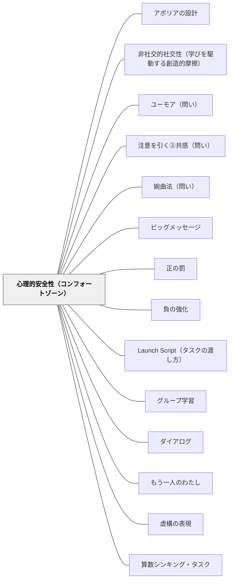

# 心理的安全性（コンフォートゾーン）

**一文でいうと**：間違い・未完成・挑戦を出せる安心の土台を作る。

## 使いどころ・使いすぎ注意

| 観点         | 内容                                       |
| ------------ | ------------------------------------------ |
| 使いどころ   | 発言・挑戦・失敗への不安が強いとき。       |
| 使いすぎ注意 | 安心だけに寄ると、必要な挑戦が起きにくい。 |

> 安心できる基盤があってこそ、挑戦への動機が生まれる。

## [Pattern Connection]

- **いるかどり（2023）統合（2026-05-20）**：発達障害のある子どもへの支援の文脈で、心理的安全性は「環境調整の前提」として機能することが示された。特にNさん（集団参加が苦手：感覚疲弊）のケースでは「ほめられる機会を設計する」ことが安全性の土台として提示される——失敗・困難に注目するのではなく、できていることを可視化して認めることで「ここは安全な場所だ」という感覚が育つ。また集団参加が難しい子に「安心して待機できる場所を教室内に用意する」ことが、参加への動機を生む逆説的な設計として示される（無理に参加を迫るほうが安全性を壊す）。
- **援助要求スキルとの接続**：[[パタン/援助要求スキル]]（いるかどり, 2023）との関係は根本的だ——援助要求は「助けを求めたら応えてもらえた」という体験の積み重ねによって育つ。心理的安全性のない環境では援助要求スキルは育たない。逆に言えば、援助要求スキルが育っている状態は、心理的安全性が機能していることの証拠でもある。
- **既存パタンとの関連**：[[パタン/段階的クールダウン]] との接続が強化された——「落ち着ける場所がある」という構造的担保が心理的安全性の物的・空間的実装として機能する。[[パタン/合図システム]]（Hammeken, 2007）も「伝える手段がある」という安心感を通じて心理的安全性を構造的に支える。
- **他のパタンへの波及**：[[パタン/発達特性と環境調整]] — 集団参加困難への「安心して待機できる場所」の設計は、心理的安全性の空間的実装として読むことができる。

## 背景（Context）

エドモンドソンの心理的安全性研究や、発達心理学における「安全基地」（アタッチメント理論）の概念が基盤。家族・友人関係・学校の居場所など、安心できる関係・環境（コンフォートゾーン）があることで、人は挑戦やリスクをとることができる。安全な場所に帰れる確信が、外へ踏み出す動機を生む。

## 問題（Problem）

挑戦・冒険・失敗への恐れが、学習への動機を阻む。批判・笑い・評価への不安があると、学習者はリスクをとることを避け、安全な行動のみをとるようになる。心理的安全性のない環境では、どんな動機付け技術も効果が半減する。

## 力のかたち（Forces）

- 心理的安全性は学習・創造・挑戦のすべての基盤となる
- コンフォートゾーンを完全に排除すると不安・停止が起きる
- 安全すぎると成長の機会がなくなる（「コンフォートゾーンを出る」との緊張関係）
- 教師・クラスメートとの関係性が安全性を大きく左右する

## 解決（Solution）

**学習者が「ここは安心できる」と感じられる関係・環境・ルールを整備し、その安全基地を出発点としてチャレンジへの動機を引き出す。**

失敗を受け入れる文化、批判せず受け止める対話の規範を作る。学習者が「戻れる場所」（クラスの仲間・担任との関係）を意識的に育てる。「安全な挑戦」の機会を段階的に設計し、コンフォートゾーンの外への踏み出しを支援する。

### 教室での使い方

**例①（年度初めの規範づくり）**：  
最初の授業で「このクラスでは間違えることが一番勉強になる」と言葉で宣言する。その後、教師自身が「先生も分からないことがある」と正直に言う機会を意図的に作る。

**例②（授業中の発言ルール）**：  
「笑わない・否定しない・まずは全員聴く」という3つのルールを掲示し、発言があるたびに「ありがとう」と返すことを習慣化する。間違いが出たときに「それが出てよかった、みんなで考えよう」と価値づけする。

**例③（算数・挑戦課題の前）**：  
難しい問題の前に「この問題は難しい。分からなくていい。まず考えてみるだけで十分」と伝える。最初に「分かった人より、まず考えた人を見たい」と言うことでリスクを下げる。

## 結果（Consequences）

- 学習者が失敗を恐れず挑戦できるようになる
- 学習共同体の信頼・つながりが深まる
- 心理的安全性が動機付けの全体的な基盤として機能する

## クラスター図

## Actionable Insight

- 学期の最初に「このクラスで大切にしたいルール」を子どもと一緒に3つ決めて掲示する——学習者が作ったルールは外から押し付けられた規則より強く文化として機能する
- 間違えた答えに「ありがとう、そのおかげで考えが広がった」と毎回応じる——教師の反応が心理的安全性の温度計になる。一貫性が安心の基盤を作る
- 授業の終わりに「今日挑戦してみたこと」を1文書かせる——挑戦を可視化する習慣が「ここは挑戦していい場所だ」という感覚を育てる

## 出典

- 一つの教育のパタン・ランゲージ（岩井輝久）/ いるかどり（2023）子どもの発達障害と環境調整のコツがわかる本

## 関連パタン
- [[パタン/アポリアの設計]]
- [[パタン/非社交的社交性（学びを駆動する創造的摩擦）]]
- [[学級経営/学級経営で使えるパタン]]
- [[パタン/ユーモア（問い）]]
- [[パタン/注意を引く②共感（問い）]]
- [[パタン/婉曲法（問い）]]
- [[教科/算数]]
- [[学級経営/心理的安全性]]
- [[学級経営/文化をつくる]]
- [[教科/算数・数学で使うパタン]]
- [[パタン/ビッグメッセージ]]
- [[パタン/正の罰]]
- [[パタン/負の強化]]
- [[パタン/Launch Script（タスクの渡し方）]]
- [[パタン/グループ学習]]
- [[パタン/ダイアログ]]
- [[パタン/もう一人のわたし]]
- [[パタン/虚構の表現]]
- [[パタン/算数シンキング・タスク]]
- [[パタン/算数の公平性]]
- [[パタン/思考の可視化]]
- [[パタン/失敗（インストラクション）]]
- [[パタン/失敗を組み込む]]
- [[パタン/冗談とユーモア]]
- [[パタン/数学のクラス規範]]
- [[パタン/世界観]]
- [[パタン/適切な行動に注目する]]
- [[パタン/非カリキュラムタスク（考える文化をつくる問い）]]
- [[パタン/非可視の教師]]
- [[パタン/複雑指導（Complex Instruction）]]
- [[パタン/未来のプロフィール詩]]
- [[パタン/問いかけの見立て]]
- [[パタン/問いを大切にする]]

- [[パタン/熟慮的動機付け]] — 親パタン
- [[パタン/安心基地]] — 安全な関係の構築
- [[パタン/間違いや失敗から学ぶ文化]] — 安全性を支える文化的側面
- [[パタン/アドベンチャー]] — 安全基地から出発する挑戦のパタン
- [[パタン/援助要求スキル]] — 心理的安全性があってこそ援助要求は起きる（いるかどり, 2023）
- [[パタン/段階的クールダウン]] — 「落ち着ける場所がある」という構造的な安全の担保
- [[パタン/合図システム]] — 「伝える手段がある」という安心感が安全性を支える
- [[パタン/発達特性と環境調整]] — 集団参加困難への「安心して待機できる場所」の設計
- [[パタン/心理的安全性（コンフォートゾーン）]] — 認められる経験を積み重ねることで心理的安全性を意図的に構築する
- [[パタン/認知的コンフリクト]] — コンフリクトは心理的安全性があってこそ脅威でなく探究の招待として受け取られる
- [[パタン/熟慮的問い]] — 問いへの挑戦を生む安全の基盤（アフターフォロー③ハードルを下げると対応）

## このパタンが働く実践
- [[実践/ライターズ・ノートの起動]]
- [[実践/学習する学校をつくる]]

| 実践パタン                    | どのように心理的安全性を支えるか                                                                       |
| ----------------------------- | ------------------------------------------------------------------------------------------------------ |
| [[パタン/数学ワークショップ]] | 途中の考え、別解、困りごとをジャーナルや学習チームで扱い、間違いを考える材料として共有できるようにする |
| [[パタン/ナンバートーク]]     | 答えを急がせず、複数の解法を受け止めることで、数学で発言してよい感覚をつくる                           |
