# 心理的安全性（コンフォートゾーン）

**一文でいうと**：間違い・未完成・挑戦を出せる安心の土台を作る。

## 使いどころ・使いすぎ注意

| 観点         | 内容                                       |
| ------------ | ------------------------------------------ |
| 使いどころ   | 発言・挑戦・失敗への不安が強いとき。       |
| 使いすぎ注意 | 安心だけに寄ると、必要な挑戦が起きにくい。 |

> 安心できる基盤があってこそ、挑戦への動機が生まれる。

## [Pattern Connection]

- **いるかどり（2023）統合（2026-05-20）**：発達障害のある子どもへの支援の文脈で、心理的安全性は「環境調整の前提」として機能することが示された。特にNさん（集団参加が苦手：感覚疲弊）のケースでは「ほめられる機会を設計する」ことが安全性の土台として提示される——失敗・困難に注目するのではなく、できていることを可視化して認めることで「ここは安全な場所だ」という感覚が育つ。また集団参加が難しい子に「安心して待機できる場所を教室内に用意する」ことが、参加への動機を生む逆説的な設計として示される（無理に参加を迫るほうが安全性を壊す）。
- **援助要求スキルとの接続**：[[パタン/援助要求スキル]]（いるかどり, 2023）との関係は根本的だ——援助要求は「助けを求めたら応えてもらえた」という体験の積み重ねによって育つ。心理的安全性のない環境では援助要求スキルは育たない。逆に言えば、援助要求スキルが育っている状態は、心理的安全性が機能していることの証拠でもある。
- **既存パタンとの関連**：[[パタン/段階的クールダウン]] との接続が強化された——「落ち着ける場所がある」という構造的担保が心理的安全性の物的・空間的実装として機能する。[[パタン/合図システム]]（Hammeken, 2007）も「伝える手段がある」という安心感を通じて心理的安全性を構造的に支える。
- **他のパタンへの波及**：[[パタン/発達特性と環境調整]] — 集団参加困難への「安心して待機できる場所」の設計は、心理的安全性の空間的実装として読むことができる。
- **土屋陽介（2019）統合（2026-06-01）**：P4Cは「知的に安全な空間（Intellectually Safe Community）」という固有の概念でこのパタンを補強する。「わからない」と言える・お互いに「わからない」を問い合える、という**知的な安全性**の側面が哲学対話の機能のための必要条件として位置づけられる。知的安全性のない場では哲学対話は機能しない——逆に言えば、哲学対話を継続することが知的安全性を教室に育てる最も直接的な実践でもある（土屋, 2019）。波及：[[パタン/哲学対話（P4C）]]、[[文献/僕らの世界を作りかえる哲学の授業（土屋）]]
- **ボウルビィのアタッチメント理論＝安心基地（secure base）系譜（2026-06-13 統合）**：旧パタン「安心基地」を本ページに統合した際に移植した系譜。ボウルビィのアタッチメント理論における「安全基地（Secure Base）」は、子どもが養育者を拠点として外の世界を探索する構造を示す——**安心できる基地があってこそ外への探索が可能になる**という発達心理学の知見が、本パタンの中核と連続している。これに先行する直観として、ペスタロッチ（1801）『ゲルトルート児童教育法』が母子関係を子どもの道徳的・認知的発達の根源として記述している。母親の愛と保護の中で育まれる「愛・信頼・感謝・従順」の感情が、後の「技能（Können）」の形成と道徳的自律の土台となる——失敗しても存在を否定されないという信頼関係がなければ、「できるようになる」プロセスは起動しない。ペスタロッチが「自然と学校の分離」を批判したように、学校が安心の基地として機能しなければ、知識は空虚なものに留まる。エドモンドソンの組織研究（チーム内の対人リスク）と、ボウルビィ／ペスタロッチの発達系譜（個と養育者の関係）は、別の現象を別の言語で記述しながら、**「安全な土台があってこそ挑戦が可能になる」という同じ構造**を指している。波及：[[パタン/道徳的交渉]]、[[文献/ゲルトルート児童教育法（ペスタロッチ）]]

## 背景（Context）

※旧パタン「安心基地」を本ページに統合（2026-06-13）

エドモンドソンの心理的安全性研究や、発達心理学における「安全基地」（ボウルビィのアタッチメント理論）の概念が基盤。家族・友人関係・学校の居場所など、安心できる関係・環境（コンフォートゾーン）があることで、人は挑戦やリスクをとることができる。安全な場所に帰れる確信が、外へ踏み出す動機を生む。

## 問題（Problem）

挑戦・冒険・失敗への恐れが、学習への動機を阻む。批判・笑い・評価への不安があると、学習者はリスクをとることを避け、安全な行動のみをとるようになる。心理的安全性のない環境では、どんな動機付け技術も効果が半減する。

## 力のかたち（Forces）

- 心理的安全性は学習・創造・挑戦のすべての基盤となる
- コンフォートゾーンを完全に排除すると不安・停止が起きる
- 安全すぎると成長の機会がなくなる（「コンフォートゾーンを出る」との緊張関係）
- 教師・クラスメートとの関係性が安全性を大きく左右する
- 安全でないと感じる学習者は認知的リソースを「この場でどう振る舞うか」「どうすれば傷つかないか」の監視に浪費し、学習に向ける分が残らない

## 解決（Solution）

**学習者が「ここは安心できる」と感じられる関係・環境・ルールを整備し、その安全基地を出発点としてチャレンジへの動機を引き出す。**

安心基地は「甘やかし」でも「規律なし」でもない。何があっても存在を否定されない信頼の基盤がある場所で、人はより高い挑戦ができる。

失敗を受け入れる文化、批判せず受け止める対話の規範を作る。学習者が「戻れる場所」（クラスの仲間・担任との関係）を意識的に育てる。「安全な挑戦」の機会を段階的に設計し、コンフォートゾーンの外への踏み出しを支援する。

### 教室での使い方

**例①（年度初めの規範づくり）**：  
最初の授業で「このクラスでは間違えることが一番勉強になる」と言葉で宣言する。その後、教師自身が「先生も分からないことがある」と正直に言う機会を意図的に作る。

**例②（授業中の発言ルール）**：  
「笑わない・否定しない・まずは全員聴く」という3つのルールを掲示し、発言があるたびに「ありがとう」と返すことを習慣化する。間違いが出たときに「それが出てよかった、みんなで考えよう」と価値づけする。

**例③（算数・挑戦課題の前）**：  
難しい問題の前に「この問題は難しい。分からなくていい。まず考えてみるだけで十分」と伝える。最初に「分かった人より、まず考えた人を見たい」と言うことでリスクを下げる。

## 結果（Consequences）

- 学習者が失敗を恐れず挑戦できるようになる
- 学習共同体の信頼・つながりが深まる
- 心理的安全性が動機付けの全体的な基盤として機能する

## クラスター図

```mermaid
flowchart LR
    ne5bf83e79086e79a84e5ae89e585a8e680a7efbc88e382b3e383b3e38395e382a9e383bce38388e382bee383bce383b3efbc89["心理的安全性（コンフォートゾーン）"]
    ne3839ce38388e383a0e382a2e38383e38397e59088e6848fe5bda2e68890["ボトムアップ合意形成"]
    ne4b880e888ace6848fe5bf97efbc88e585b1e9809ae59684e381b8e381aee5958fe38184efbc89["一般意志（共通善への問い）"]
    ne7a4bee4bc9ae5a591e7b484efbc88e59088e6848fe381abe38288e3828be585b1e5908ce4bd93efbc89["社会契約（合意による共同体）"]
    ne4bfaee5bea9e381aee58e9fe79086efbc88e381bee381a1e79bb4e38197efbc89["修復の原理（まち直し）"]
    ne5898de59091e3818de8b2ace4bbbbefbc88e7bdb0e381a7e381aae3818fe69caae69da5e381aee3819fe38281e381abefbc89["前向き責任（罰でなく未来のために）"]
    ne593b2e5ada6e382abe38395e382a7["哲学カフェ"]
    ne5bf85e784b6e680a7e381aee6b49ee5af9fefbc88e68092e3828ae381a8e887aae5b7b1e689b9e588a4e38292e6898be694bee38199efbc89["必然性の洞察（怒りと自己批判を手放す）"]
    ne7b2bee7a59ee381aee5b9b3e7a98f["精神の平穏"]
    ne38395e382a3e383aae382a2efbc88e585b1e5908ce4bd93e381aee58f8be6849befbc89["フィリア（共同体の友愛）"]
    ne3839fe382bde383ade382b4e382b9efbc88e8a880e8ab96e5ab8ce38184efbc89["ミソロゴス（言論嫌い）"]
    ne382a2e3839de383aae382a2e381aee8a8ade8a888["アポリアの設計"]
    ne99d9ee7a4bee4baa4e79a84e7a4bee4baa4e680a7efbc88e5ada6e381b3e38292e9a786e58b95e38199e3828be589b5e980a0e79a84e691a9e693a6efbc89["非社交的社交性（学びを駆動する創造的摩擦）"]
    ne383a6e383bce383a2e382a2efbc88e5958fe38184efbc89["ユーモア（問い）"]
    ne6b3a8e6848fe38292e5bc95e3818fe291a1e585b1e6849fefbc88e5958fe38184efbc89["注意を引く②共感（問い）"]

    ne5bf83e79086e79a84e5ae89e585a8e680a7efbc88e382b3e383b3e38395e382a9e383bce38388e382bee383bce383b3efbc89 --- ne3839ce38388e383a0e382a2e38383e38397e59088e6848fe5bda2e68890
    ne5bf83e79086e79a84e5ae89e585a8e680a7efbc88e382b3e383b3e38395e382a9e383bce38388e382bee383bce383b3efbc89 --- ne4b880e888ace6848fe5bf97efbc88e585b1e9809ae59684e381b8e381aee5958fe38184efbc89
    ne5bf83e79086e79a84e5ae89e585a8e680a7efbc88e382b3e383b3e38395e382a9e383bce38388e382bee383bce383b3efbc89 --- ne7a4bee4bc9ae5a591e7b484efbc88e59088e6848fe381abe38288e3828be585b1e5908ce4bd93efbc89
    ne5bf83e79086e79a84e5ae89e585a8e680a7efbc88e382b3e383b3e38395e382a9e383bce38388e382bee383bce383b3efbc89 --- ne4bfaee5bea9e381aee58e9fe79086efbc88e381bee381a1e79bb4e38197efbc89
    ne5bf83e79086e79a84e5ae89e585a8e680a7efbc88e382b3e383b3e38395e382a9e383bce38388e382bee383bce383b3efbc89 --- ne5898de59091e3818de8b2ace4bbbbefbc88e7bdb0e381a7e381aae3818fe69caae69da5e381aee3819fe38281e381abefbc89
    ne5bf83e79086e79a84e5ae89e585a8e680a7efbc88e382b3e383b3e38395e382a9e383bce38388e382bee383bce383b3efbc89 --- ne593b2e5ada6e382abe38395e382a7
    ne5bf83e79086e79a84e5ae89e585a8e680a7efbc88e382b3e383b3e38395e382a9e383bce38388e382bee383bce383b3efbc89 --- ne5bf85e784b6e680a7e381aee6b49ee5af9fefbc88e68092e3828ae381a8e887aae5b7b1e689b9e588a4e38292e6898be694bee38199efbc89
    ne5bf83e79086e79a84e5ae89e585a8e680a7efbc88e382b3e383b3e38395e382a9e383bce38388e382bee383bce383b3efbc89 --- ne7b2bee7a59ee381aee5b9b3e7a98f
    ne5bf83e79086e79a84e5ae89e585a8e680a7efbc88e382b3e383b3e38395e382a9e383bce38388e382bee383bce383b3efbc89 --- ne38395e382a3e383aae382a2efbc88e585b1e5908ce4bd93e381aee58f8be6849befbc89
    ne5bf83e79086e79a84e5ae89e585a8e680a7efbc88e382b3e383b3e38395e382a9e383bce38388e382bee383bce383b3efbc89 --- ne3839fe382bde383ade382b4e382b9efbc88e8a880e8ab96e5ab8ce38184efbc89
    ne5bf83e79086e79a84e5ae89e585a8e680a7efbc88e382b3e383b3e38395e382a9e383bce38388e382bee383bce383b3efbc89 --- ne382a2e3839de383aae382a2e381aee8a8ade8a888
    ne5bf83e79086e79a84e5ae89e585a8e680a7efbc88e382b3e383b3e38395e382a9e383bce38388e382bee383bce383b3efbc89 --- ne99d9ee7a4bee4baa4e79a84e7a4bee4baa4e680a7efbc88e5ada6e381b3e38292e9a786e58b95e38199e3828be589b5e980a0e79a84e691a9e693a6efbc89
    ne5bf83e79086e79a84e5ae89e585a8e680a7efbc88e382b3e383b3e38395e382a9e383bce38388e382bee383bce383b3efbc89 --- ne383a6e383bce383a2e382a2efbc88e5958fe38184efbc89
    ne5bf83e79086e79a84e5ae89e585a8e680a7efbc88e382b3e383b3e38395e382a9e383bce38388e382bee383bce383b3efbc89 --- ne6b3a8e6848fe38292e5bc95e3818fe291a1e585b1e6849fefbc88e5958fe38184efbc89

    classDef hub fill:#f0f0f0,stroke:#555,color:#000,font-weight:bold
    class ne5bf83e79086e79a84e5ae89e585a8e680a7efbc88e382b3e383b3e38395e382a9e383bce38388e382bee383bce383b3efbc89 hub
```

## Actionable Insight

- 学期の最初に「このクラスで大切にしたいルール」を子どもと一緒に3つ決めて掲示する——学習者が作ったルールは外から押し付けられた規則より強く文化として機能する
- 間違えた答えに「ありがとう、そのおかげで考えが広がった」と毎回応じる——教師の反応が心理的安全性の温度計になる。一貫性が安心の基盤を作る
- 授業の終わりに「今日挑戦してみたこと」を1文書かせる——挑戦を可視化する習慣が「ここは挑戦していい場所だ」という感覚を育てる

## 出典

- 一つの教育のパタン・ランゲージ（岩井輝久）/ いるかどり（2023）子どもの発達障害と環境調整のコツがわかる本
- [[文献/社会科教師の授業・学級づくり「仕掛け学」（小倉勝登）]]
- [[文献/ゲルトルート児童教育法（ペスタロッチ）]]

⚖ **緊張関係**: [[緊張関係マップ]] — [[パタン/親近感と刺激を組み合わせる]]・[[パタン/アドベンチャー]] と拮抗する。判断軸：〈安全基盤の上に挑戦を設計する〉

## 関連パタン
- [[パタン/ボトムアップ合意形成]]
- [[パタン/一般意志（共通善への問い）]]
- [[パタン/社会契約（合意による共同体）]]
- [[パタン/修復の原理（まち直し）]]
- [[パタン/前向き責任（罰でなく未来のために）]]
- [[パタン/哲学カフェ]]
- [[パタン/必然性の洞察（怒りと自己批判を手放す）]]
- [[パタン/精神の平穏]]
- [[パタン/フィリア（共同体の友愛）]]
- [[パタン/ミソロゴス（言論嫌い）]]
- [[パタン/アポリアの設計]]
- [[パタン/非社交的社交性（学びを駆動する創造的摩擦）]]
- [[学級経営/学級経営で使えるパタン]]
- [[パタン/ユーモア（問い）]]
- [[パタン/注意を引く②共感（問い）]]
- [[パタン/婉曲法（問い）]]
- [[教科/算数]]
- [[学級経営/心理的安全性]]
- [[学級経営/文化をつくる]]
- [[教科/算数・数学で使うパタン]]
- [[パタン/ビッグメッセージ]]
- [[パタン/正の罰]]
- [[パタン/負の強化]]
- [[パタン/Launch Script（タスクの渡し方）]]
- [[パタン/グループ学習]]
- [[パタン/ダイアログ]]
- [[パタン/もう一人のわたし]]
- [[パタン/虚構の表現]]
- [[パタン/算数シンキング・タスク]]
- [[パタン/算数の公平性]]
- [[パタン/思考の可視化]]
- [[パタン/失敗（インストラクション）]]
- [[パタン/失敗を組み込む]]
- [[パタン/冗談とユーモア]]
- [[パタン/数学のクラス規範]]
- [[パタン/世界観]]
- [[パタン/適切な行動に注目する]]
- [[パタン/非カリキュラムタスク（考える文化をつくる問い）]]
- [[パタン/非可視の教師]]
- [[パタン/複雑指導（Complex Instruction）]]
- [[パタン/未来のプロフィール詩]]
- [[パタン/問いかけの見立て]]
- [[パタン/問いを大切にする]]

- [[パタン/熟慮的動機づけ]] — 親パタン
- [[パタン/間違いや失敗から学ぶ文化]] — 安全性を支える文化的側面
- [[パタン/アドベンチャー]] — 安全基地から出発する挑戦のパタン
- [[パタン/援助要求スキル]] — 心理的安全性があってこそ援助要求は起きる（いるかどり, 2023）
- [[パタン/段階的クールダウン]] — 「落ち着ける場所がある」という構造的な安全の担保
- [[パタン/合図システム]] — 「伝える手段がある」という安心感が安全性を支える
- [[パタン/発達特性と環境調整]] — 集団参加困難への「安心して待機できる場所」の設計
- [[パタン/心理的安全性（コンフォートゾーン）]] — 認められる経験を積み重ねることで心理的安全性を意図的に構築する
- [[パタン/認知的コンフリクト]] — コンフリクトは心理的安全性があってこそ脅威でなく探究の招待として受け取られる
- [[パタン/熟慮的問い]] — 問いへの挑戦を生む安全の基盤（アフターフォロー③ハードルを下げると対応）
- [[パタン/ことばの武器化の三段階（スティグマ化・非人間化・ハーム）]] — スティグマ化が最初に壊すのは心理的安全性。安全な場づくりが第1段階への防衛になる（Pentón Herrera, 2026）
- [[パタン/切り貼り]] — 失敗コストを物理的に下げることで試みる安全を実装するパタン
- [[パタン/哲学対話（P4C）]] — 「知的に安全な空間（Intellectually Safe Community）」の教室実装——P4Cが要請する知的安全性の具体的実践
- [[メタパタン/非知の文化]] — 「知らない」の表明を可能にする安全の基盤として接続
- [[パタン/聴き合う文化]] — 聴いてもらえる安心感が安全性を支える（旧「安心基地」から統合）
- [[パタン/沈黙の間の設計]] — 沈黙が安心して保てるのは心理的安全があってこそ（旧「安心基地」から統合）
- [[パタン/つぶやき技法]] — 安心がなければつぶやきは届かない（旧「安心基地」から統合）
- [[パタン/間接的に説明するメッセージ（会話のメタメッセージ）]] — 失敗を許容するメタメッセージの基盤（旧「安心基地」から統合）
- [[パタン/空白禁止の原則]] — 空白が不安につながらない関係性の基盤（旧「安心基地」から統合）
- [[パタン/思いやりの文化]] — 思いやりの文化が生む心理的安全（旧「安心基地」から統合）
- [[パタン/指示後に質問を受ける]] — 質問しやすい心理的安全性の基盤（旧「安心基地」から統合）
- [[パタン/親近感と刺激を組み合わせる]] — 親近感の土台（旧「安心基地」から統合）
- [[パタン/文化をつくる]] — 文化をつくるための心理的安全（旧「安心基地」から統合）
- [[パタン/オンボーディング]] — 学習に参加するための心理的土台の上位パタン（旧「安心基地」から統合）
- [[パタン/ソーシャル]] — 学習共同体の中での安全・信頼関係（旧「安心基地」から統合）
- [[パタン/余白をつくる]] — 余白には心理的安全があることが前提（旧「安心基地」から統合）
- [[パタン/問い返しのデザイン]] — 批判なく問い返すことが安全を維持する（旧「安心基地」から統合）
- [[パタン/35プラス1]] — 教師自身がチームの一員として参加する姿勢が心理的安全の下地をつくる（小倉勝登／旧「安心基地」から統合）
- [[パタン/三行日記]] — 毎日の往復書簡が「見てもらえている」感覚として安全性を構築する（旧「安心基地」から統合）

- [[概念/自我関与と課題関与（フィードバックが向ける先）]] — 自我モードの教室では安全性は成立しない。同じ現象の別の記述
- [[概念/教授学的契約（やり過ごしの均衡）]] — 「間違えていい」の宣言だけでは均衡は動かない。損得の構造を組み替える必要がある
## このパタンが働く実践
- [[実践/ライターズ・ノートの起動]]
- [[実践/学習する学校をつくる]]

| 実践パタン                    | どのように心理的安全性を支えるか                                                                       |
| ----------------------------- | ------------------------------------------------------------------------------------------------------ |
| [[パタン/数学ワークショップ]] | 途中の考え、別解、困りごとをジャーナルや学習チームで扱い、間違いを考える材料として共有できるようにする |
| [[パタン/ナンバートーク]]     | 答えを急がせず、複数の解法を受け止めることで、数学で発言してよい感覚をつくる                           |
