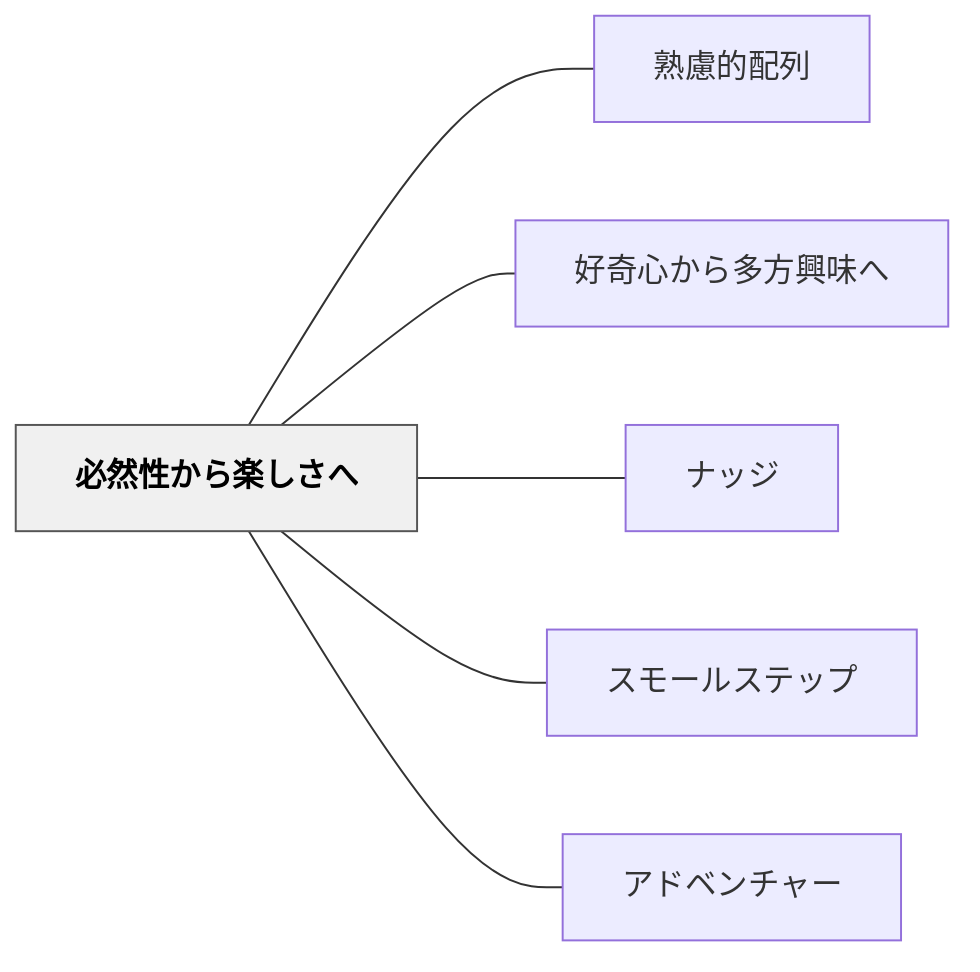

# 必然性から楽しさへ

> まず「やらなければ」から始まり、やがて「やりたい」に変わる。

## 背景（Context）

[[パタン/熟慮的配列]] の動機づけ次元。スポーツ・楽器・語学など、習得に時間がかかる技能領域で特に重要な原則。内発的な楽しさは、ある程度の熟達が生まれてからはじめて現れることが多い。

## 問題（Problem）

「楽しくなければ学ばない」という前提で授業設計すると、難しい技能習得の初期段階（まだ楽しさを感じられない段階）に必要な反復・練習が軽視される。一方で、必然性・義務だけを強調し続けると、内発的動機は育たない。

## 力のかたち（Forces）

- 内発的動機づけは長期的な学習継続に不可欠
- 習得の初期段階では外発的な動機・必然性が重要な役割を果たす
- 過度な外的強制は内発的動機を阻害する（過剰正当化効果）
- 「楽しさ」は個人・文化・文脈によって大きく異なる

## 解決（Solution）

**学習の初期段階では、必然性（「これが必要だ」という状況・課題・要求）から入り、技能や理解が一定の水準に達したとき「楽しい」と感じられる経験を意図的に設計する。初期の必然性から、内発的な楽しさへの移行を段階的に設計する。**

実践例：
- 楽器：まず「この曲が弾きたい」「発表会がある」という必然性→ある程度弾けるようになって生まれる楽しさ
- 読書：「調べなければならない」という必然性から入った読書が、やがて「読みたい」に変わる経験を大切にする
- 算数：「お金の計算が必要」という生活上の必然性→計算が速くなることの爽快感へ
- 体育：ゲームをするために必要なルール理解→ゲームを楽しむ

[[パタン/ナッジ]] を活用して、必然性の中に楽しさへの入口を組み込む。

## 結果（Consequences）

- 内発的動機が着実に育つ段階的な学習設計ができる
- 「まだ楽しくない段階」を教師と学習者が共に承認できる
- 楽しさが生まれたとき、学習者の自律的な学習が加速する

## クラスター図

## Actionable Insight

- 「まだ楽しくない段階」を学習者と一緒に言語化し「今は習得の途中だから」と共に承認する——初期の必然性の段階を否定しないことが学習者の諦めを防ぐ
- 「この曲が弾けるようになったら演奏できる場」「この技術があれば参加できる活動」という具体的な必然性を設定する——ゴールと必然性が見えることで初期の苦しさを乗り越えやすくなる
- 少しできるようになってきたとき「どう感じる？」と問う——楽しさが芽生え始めた瞬間を本人が意識することで内発的動機への移行が加速する

## 出典

- 一つの教育のパタン・ランゲージ（岩井輝久）

## 関連パタン

- [[パタン/熟慮的配列]] — 上位パタン
- [[パタン/好奇心から多方興味へ]] — 楽しさからさらに多方興味へ
- [[パタン/ナッジ]] — 必然性の中に楽しさへの入口を作る
- [[パタン/スモールステップ]] — 楽しさが生まれるための有能感を段階的に育てる
- [[パタン/アドベンチャー]] — 楽しさの一形態としての冒険感
