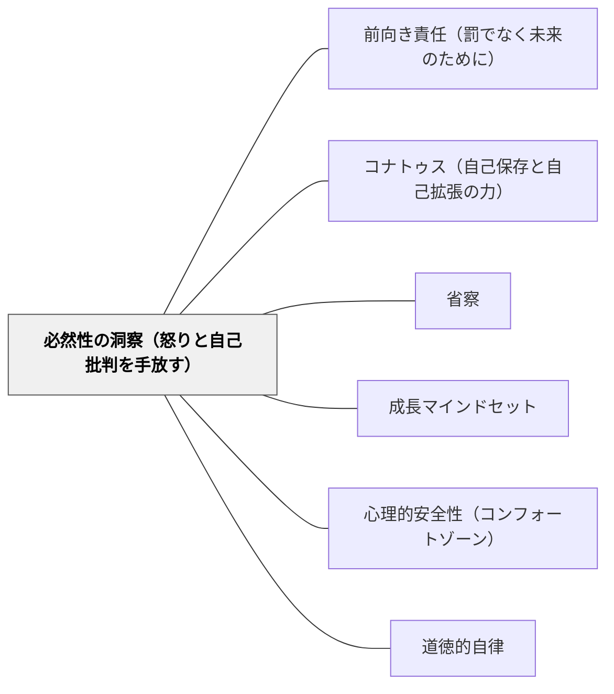

# 必然性の洞察（怒りと自己批判を手放す）

> 起きたことは、起きざるをえなかった。あのとき「別のことができたはず」という反事実的な仮定に基づく怒り・後悔・自己批判は、論理的に根拠がない。過去への反応的感情を手放すことで、「今後どうするか」への集中が生まれる。

---

## [Pattern Connection]

**Spinoza on Free Will（Kisner, 2026）統合：**

スピノザの**必然主義（Necessitarianism）**は「すべての出来事はただ一つの仕方でしか起きえない」という主張である（Kisner, 2026, Ch.4）。これは決定論のより強い形態で、「起きたことは物理法則・心理状態・環境の連鎖から必然的に生じた」という洞察を意味する。

Kisnerの整理によれば、必然主義が責任論・感情論に与える示唆は二層ある：

**第一層：反事実的怒りの無効化**
「あの時、あなたは別のことができたはずだ」という前提に基づく怒り・報復・怨恨は、必然主義の立場からは根拠がない。その状況の全体（その人の知識・感情・身体状態・環境）が与えられれば、その行動は必然的に生じた。別の行動への前提が成立しない。

**第二層：前向き責任への集中**
しかしスピノザは責任を全否定しない。「今後どうなりうるか」という前向きな問いは成立する——未来の状態（知識・感情・環境）を変えることで、未来の行動は変わりうる。必然主義は過去への報復を否定しながら、未来への働きかけを肯定する。

- **既存パタンとの関連**：[[パタン/前向き責任（罰でなく未来のために）]] の哲学的根拠として機能する。前向き責任が「応報的罰を拒否し未来志向にする」という実践論であるとすれば、必然性の洞察はその「なぜ応報的罰の根拠がないのか」という認識論的根拠になる。
- **補強された点**：[[パタン/成長マインドセット]] に哲学的深度を加える。成長マインドセットが「能力は変えられる」という信念であるとすれば、必然主義は「今のあなたの状態が今の行動を必然的に生じさせた——だからこそ今の状態を変えることで未来の行動が変わる」という哲学的支持を与える。
- **自己批判への応用**：教師自身の自己批判（「あの時もっとうまくできたはず」）にも同じ洞察が適用される。あの時の自分の知識・状態・環境が与えられれば、あの実践は必然的だった。後悔の中に「もっとできたはず」という仮定が含まれているとき、それは必然主義的に根拠を欠く。
- **他のパタンへの波及**：[[パタン/コナトゥス（自己保存と自己拡張の力）]] — 怒り・後悔は悲しみ（力の減少）の典型。必然性の洞察によってこれらを手放すことは、コナトゥスの保護になる。

---

## 背景（Context）

「もしあの時こうしていれば」「なんであんなことをしたのか」「あなたはできたはずなのに」——教師も、子どもも、この思考パターンに捕まることがある。

後悔・怒り・怨恨・自己批判は、どれも「別の行動が可能だった」という反事実的仮定（counterfactual assumption）に基づく。その仮定が成立するなら、報復・自責・叱責は一定の根拠を持つ。しかし成立しないなら、これらの感情は論理的根拠なく力を消耗させているだけになる。

スピノザの必然主義（Kisner, 2026）はこの仮定に挑戦する。出来事は原因の連鎖から必然的に生じる——心理状態・知識・身体・環境が揃えば、その行動は「起きざるをえなかった」。

## 問題（Problem）

反事実的感情（怒り・後悔・自己批判）が持続するとき、いくつかの問題が起きる：

- 「あの子は悪い子だ」という静的なラベルが貼られ、変化の可能性が見えなくなる
- 教師が「自分はダメな教師だ」という自己批判の繰り返しにはまり、省察が自責になる
- 子どもが「また怒られる」という恐怖から、行動の動機が外部（罰の回避）に移る
- 「あの時別のことができたはず」という怒りは、「今後どうするか」という問いよりエネルギーを消費する

## 力のかたち（Forces）

- 反事実的怒りは「起きたことへの感情的反応」として自然に生じる——完全に消すことは目標ではない
- しかし怒りを規律実践の根拠にするとき、その根拠（「あの時別のことができたはず」）を吟味する必要がある
- 必然主義は決定論の哲学的立場——すべての人が必ずこれを受け入れる必要はないが、この視点を「使える道具」として持つことには価値がある
- 「起きたことは変えられない、変えられるのは未来だけ」という実践的洞察は、決定論を受け入れなくても成立する
- 自己批判と省察は違う——省察は「次はどうするか」を問い、自己批判は「あの時なぜそうしたか」を責め続ける

## 解決（Solution）

**「あの時別のことができたはず」という反事実的仮定に気づき、そこから離れる。「今後どうするか・今の状態をどう変えるか」という前向きな問いに集中を移す。怒り・後悔・自己批判を「そう感じた事実」として認め、しかしその感情を規律実践・教育判断の根拠にしない。**

---

### 教師自身への適用

**省察と自己批判を区別する**

| 自己批判 | 省察 |
|---|---|
| 「なぜあんなことをしたのか、もっとできたはず」 | 「あの時の状況で何が起きていたか、次はどうするか」 |
| 過去を裁く | 過去を観察して未来を設計する |
| 「ダメな教師」という静的なラベル | 「変化し続ける実践者」という成長の視点 |
| 力を消耗させる | 力を増大させる（コナトゥスを守る） |

**授業後の振り返り実践**
「今日の授業のうまくいかなかったこと」を書くとき、「なぜダメだったか（自己批判）」でなく「あの状況で何が起きていたか、次回この状況になったらどうするか（省察）」という問いで振り返る。

---

### 子どもへの適用

**「悪い子」でなく「その状況で必然的にそう行動した子」として見る**

問題行動を見たとき、「この子は悪い」でなく「この子のその時の知識・感情・身体・環境の状態が、この行動を生んだ」という見方に切り替える。これは甘やかしではなく、変化の可能性を最大化する視点——状態を変えることで行動が変わることを前提にした関わり方。

**叱責の前に問いを立てる**
「なぜそんなことをしたの（反事実的責め）」でなく「今どんな状況だった？何があったの？（状態の理解）」を先に聞く。理解から始まる対話が、前向きな変化を生む。

---

### 具体例

**例1：授業がうまくいかなかった後**
「今日の5時間目は全然うまくいかなかった」——この後に続く自己批判（「なぜちゃんと準備しなかったのか・もっとできたはず」）に気づいたら、問いを切り替える。「今日の5時間目に何が起きていたか（事実の観察）→次回同じ状況になったらどうするか（前向きな設計）」。

**例2：けんかした子どもへの関わり**
「なぜそんなことをしたの！」という怒りが生じたとき、その感情を認めながらも、対話は「あの時どうしたかった・何に困っていたか（動機の理解）→次回どうできそうか（前向き責任）」に持っていく。

**例3：岩井の数学デイリーでの自己適用**
「今日の問題が解けなかった」後に「なぜ解けなかったのか・もっとできたはず」という自己批判に入るとき——「今の自分の状態でこの問題は解けなかった（事実）→どんな補足をすれば解けるようになるか（前向き）」に問いを切り替える。

## 結果（Consequences）

- 反事実的怒り・後悔・自己批判が減り、コナトゥスが守られる（力の消耗が減る）
- 「状態を変えれば行動が変わる」という前提から関わることで、教育的介入の設計がより具体的になる
- 教師の省察が自責から学習へと変換される——失敗から等しく学べるようになる
- ただし、この洞察を「何でも許容する」という放任と混同しない——行動の結果への対応・境界線の設定は必要。必然主義は「何が起きてもよい」を意味しない。

## 関連パタン

- [[パタン/前向き責任（罰でなく未来のために）]] — 必然性の洞察が前向き責任の認識論的根拠になる
- [[パタン/コナトゥス（自己保存と自己拡張の力）]] — 怒り・後悔は悲しみ（力の減少）；必然性の洞察でコナトゥスを守る
- [[パタン/省察]] — 自己批判でなく省察——「次はどうするか」を問う
- [[パタン/成長マインドセット]] — 「能力は変えられる」は必然主義と整合する：今の状態が変われば、行動も変わる
- [[パタン/心理的安全性（コンフォートゾーン）]] — 必然性の洞察が「失敗しても大丈夫」という安全性の哲学的根拠になる
- [[パタン/道徳的自律]] — 怒りを手放し前向きに働きかける姿勢が道徳的自律の実践形態
- [[文献/Spinoza on Free Will（Kisner）]] — 本パタンの出典

---

## クラスター図

## Actionable Insight

- 授業後の振り返りで「なぜダメだったか」ではなく「何が起きていたか・次回どうするか」という問いの向きを使う習慣をつくる——自己批判から省察への切り替えを意図的に練習する
- 子どもに怒りを感じたとき、「この子は今どんな状態だったから、この行動が必然的に生じたか」を10秒考えてみる——感情的反応を一時停止し、理解から始まる関わりへの入口
- 「もっとできたはず」という思考に気づいたら、「あの時の自分の知識・状態・環境でそれは本当に可能だったか」と問い返す——自己批判の根拠を吟味することで、前向きな省察に転換できる

---

## 出典

Kisner, M. J. (2026). *Spinoza on Free Will*. Cambridge Elements: The Philosophy of Benedict de Spinoza. Cambridge University Press.  
DOI: https://doi.org/10.1017/9781009698917
