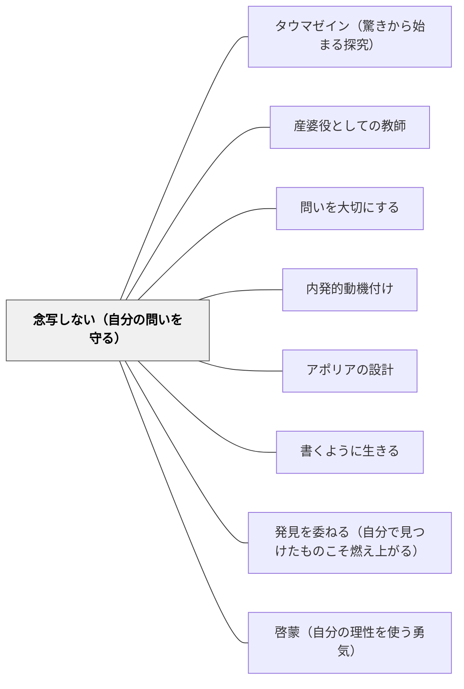

# 念写しない（自分の問いを守る）

> 先生の心の中にある唯一の正しい答えを念写する方法に習熟した人は、優等生として絶えざる転向の常習犯になる。解けない問いをかかえ続けることが、思考を育てる。

## [Pattern Connection]

### 鶴見俊輔（2010）思い出袋——「念写する優等生＝転向の常習犯」

鶴見俊輔は自伝的エッセイ集『思い出袋』の中で、日本の学校教育の核心的な問題を「念写」という言葉で描いた。

> 「先生の心の中にある唯一の正しい答えを念写する方法に習熟する人は、優等生として絶えざる転向の常習犯となり、自分がそうあることを不思議と思わない。」——鶴見（2010）

「念写」とは、超感覚的に他者の心の中を読み取って転写する行為の比喩である。「先生の正解を推測して書く」という行為は、教師・時代・権威が変わるたびに念写の対象を更新するだけで済む——自分の問いを持つ必要がない。

> 「小学校から大学まで十八年教室で過ごす中で、生徒は（教師も）自分で問題をつくる訓練の場を得ることはない。」——鶴見（2010）

これは個人への批判ではなく、「自分で問題をつくる」という訓練が18年間の制度的教育の中に一度も組み込まれていないという、構造的な批判である。

**既存パタンとの関連：**
- [[パタン/タウマゼイン（驚きから始まる探究）]] — タウマゼインは「驚き→自分の問い→探究」の順序を示すが、念写の構造は「教師の正解の推測→提出→忘却」であり、問いが生まれない。念写しないことがタウマゼインの必要条件である。
- [[パタン/産婆役としての教師]] — 産婆役は「教師が答えを与えない」ことで機能するが、念写の習慣が根付いた学習者は「産婆役」に対しても「このソクラテスが求める答えは何か」と念写しようとする。パタンが機能するにはまず念写をやめることが必要。
- [[パタン/問いを大切にする]] — 「落とした問いを長くかかえる」ことが思考の種になるという鶴見の洞察は、このパタンを直接支える根拠になる。
- [[パタン/内発的動機付け]] — 念写は「外の権威への服従」という外発的動機の最も純粋な形態。自分の問いを守ることは内発的動機の守護でもある。

---

## 背景（Context）

学校では「正しい答え」を素早く正確に出すことが評価される。教師が心の中に持っている「唯一の正解」を推測し、それを答案に書く技術が高いほど「優秀」とされる。この技術は——鶴見が「念写」と呼ぶように——内側から考えるのではなく、外側の権威の心を読み取ることで成立する。

「念写がうまい子」は、小学校・中学校・大学と進むにつれて念写の対象（教師・教科書・時代の空気）が変わっても、その都度正確に念写し続ける。これは短期的に非常に有効な生存戦略である。

## 問題（Problem）

念写に習熟した人は、権威が変わるたびに念写の対象を変えることができる。自分がそうあることを不思議とも思わない——なぜなら念写した経験しかなく、「自分の問い」を持った記憶がないからである。

鶴見が「転向の常習犯」と呼ぶこの状態は、学習者個人の倫理的な失敗ではない。「自分で問題をつくる」訓練の場が18年間の学校生活に一度もなかった、という制度的な問題の帰結である。

解けた問いは快感とともに忘れられる。解けなかった問い——本当の問い——だけが残るが、それを記録し、かかえ続ける習慣も場もない。

> 「試験問題にはなることのない『なぜ生きているのか』は、今もわからない。ただ、もうすこし生きてみようと思って、問題をかかえているだけだ。問題を長くかかえているうちに、考えることはある。」——鶴見（2010）

## 力のかたち（Forces）

- 念写は「短期的に成功する」ほぼ完璧な戦略——成績が上がり、教師に喜ばれる
- 「自分で問題をつくる」は評価されにくい——問いは採点できない
- 解けた問いは「すっぽりはまる快感」とともに消える——「定義のふちをあふれ出る」体験は残る
- しかし残ったものこそが長期的な思考の種になる——鶴見は「落とした問題だけが68年後も記憶に残る」と書く
- 念写の習慣が定着すると「これが自分の問いか、念写か」の区別がつかなくなる

## 解決（Solution）

**答えを出す前に「自分はどう思うか」を問い、解けなかった問い・納得できなかった問いを記録し、かかえ続ける。「自分で問題をつくる」時間を授業に意図的に組み込む。**

---

### 実践1：「自分の問い」をつくる時間を設ける

単元の導入や終わりに、「この単元で生まれた自分の問いを書く」時間を設ける。

- 教師が問いを与えるのではなく、「あなたが気になることは何ですか」から始める
- 「よい問い」には一義的な答えがない——「答えがすぐ出ない問い」を評価する

**教室での声かけ例：**
「このページで、自分が一番不思議に思ったことは何ですか。先生が正解を知っていそうな問いでなくていい。自分が本当に気になることを書いてください。」

---

### 実践2：「落とした問い」ノートをつくる

解けなかった問い・解けたが納得できない問い・授業が終わっても頭に残っている問いを、ノートの一角に書き留める習慣をつくる。

- 解けた問いは「忘れてもよい」——解けなかった問いが長期的な思考の種になる（鶴見）
- 「未解決ノート」「問いポケット」などと名付けて価値づける
- 定期的に「昔の自分の問いを見返す」時間を設ける

---

### 実践3：「念写チェック」——答える前に立ち止まる

教師が問いを出した後、即座に答えを求めるのではなく、「あなたはどう思いますか」を先に問う。

- 「先生はどう思っていると思う？」ではなく「あなたはどう思う？」という問いかけを徹底する
- 学習者が「自分の考えを先に持つ」文化を作ることが念写の予防になる

---

### 実践4：「定義のふちをあふれ出る」問いを授業に入れる

「すっぽりはまる」問題（答えが定義の中に収まりきる）だけでなく、「ちょっと待って、これはどう考えたらいい？」という問いを意図的に入れる。

鶴見はこの「ふちをあふれ出る」体験を思考の成長の核心として位置づける：

> 「自分の定義でとらえることができないとき、経験が定義のふちをあふれそうになる……そのときの手ごたえ、そのはずみを得て、考えがのびてゆく。」——鶴見（2010）

定義にはまることで得る快感（念写の快感）と、ふちをあふれ出ることで得る「手ごたえ」（問いの快感）は、教師が意図的に両方を設計することではじめて対比できる。

## 結果（Consequences）

- 「念写」から「問いをかかえる」へと学習者の姿勢が変わる——時間がかかる
- 「解けない問い」を恥じる文化から「かかえ続ける問いがある」ことを誇りにする文化へ
- 教師が「唯一の正解を持つ人」から「共に問いをかかえる人」へとポジションが変わる
- 「転向しない」思考——権威が変わっても自分の問いの系譜を保てる——は育つが、評価・採点が難しい
- 念写の習慣が深く根付いた学習者には、「自分の問いは何か」を聞かれること自体が不安になる

## 関連パタン

- [[パタン/タウマゼイン（驚きから始まる探究）]] — 念写しないことがタウマゼインの前提条件；「定義のふちをあふれ出る」体験がタウマゼインの一形態
- [[パタン/産婆役としての教師]] — 産婆役は「念写しない学習者」を前提として機能する；「黒い丸の中の白い丸」を感心する先生の姿勢
- [[パタン/問いを大切にする]] — 「落とした問い」を長くかかえることが思考の種（鶴見）
- [[パタン/内発的動機付け]] — 念写は外発的動機の最純粋形；自分の問いを守ることは内発的動機の守護
- [[パタン/アポリアの設計]] — 「定義のふちをあふれ出る」体験はアポリアの設計と同構造
- [[パタン/書くように生きる]] — 「落とした問い」を書き留める習慣が「書くように生きる」の核心
- [[パタン/発見を委ねる（自分で見つけたものこそ燃え上がる）]] — 念写でなく発見させることの重要性
- [[パタン/啓蒙（自分の理性を使う勇気）]] — 「自分の問いを守る」はカントの「自分の理性を使う勇気」と同構造
- [[文献/思い出袋（鶴見俊輔）]] — 本パタンの出典

## クラスター図

## Actionable Insight

- **単元の最後に「自分の問いメモ」を書かせる**：「今日の授業で、まだ答えが出ていない自分の問いを1つ書いてください」——正解を求めず、問いを書く練習そのものが「念写しない」筋肉を育てる
- **「先生はどう思っていると思う？」という問い方を禁止する**：代わりに「あなたはどう思う？」を先に問う。学習者が「先生の答えを推測する」モードに入る前に、自分の考えを言語化させる
- **「うまく解けなかった問い」を称える**：「解けた問題は忘れてもいい。解けなかった問いが本物の問いだ」（鶴見）という視点を授業文化に入れる——解けなかった問いを書いた子を「よい問いをかかえている」として評価する

## 出典

鶴見俊輔（2010）『思い出袋』岩波新書（新赤版）1234

> 「先生の心の中にある唯一の正しい答えを念写する方法に習熟する人は、優等生として絶えざる転向の常習犯となり、自分がそうあることを不思議と思わない。」——鶴見俊輔（2010）

> 「小学校から大学まで十八年教室で過ごす中で、生徒は（教師も）自分で問題をつくる訓練の場を得ることはない。」——鶴見俊輔（2010）

> 「試験問題にはなることのない『なぜ生きているのか』は、今もわからない。ただ、もうすこし生きてみようと思って、問題をかかえているだけだ。問題を長くかかえているうちに、考えることはある。」——鶴見俊輔（2010）
