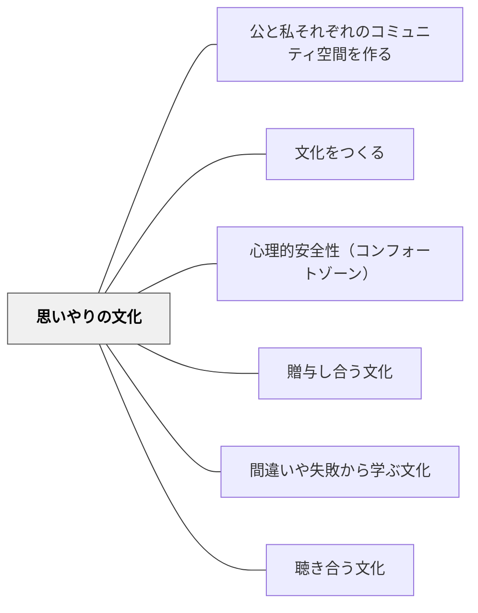

# 思いやりの文化

> 学びは脆弱さを要求する。脆弱さは安全を要求する。安全はケアを要求する。

## 背景（Context）

深く学ぶためには、「わからない」「間違えた」「助けてほしい」を表現できる必要がある。これはリスクを伴う。そのリスクを和らげるのが、互いへの思いやりの文化である。

## 問題（Problem）

思いやりの文化がないと、学習者は弱さを見せることを恐れ、安全な場所に留まろうとする。チャレンジしない、質問しない、失敗を隠す、という行動が生まれる。

## 力のかたち（Forces）

- 思いやりは感情であると同時に、練習できるスキルでもある
- 思いやりの表し方は文化によって異なる（言葉・行動・沈黙）
- 過度な保護は成長の機会を奪うこともある

## 解決（Solution）

**互いの感情・状態・努力に気づき、言語化し、応答する習慣をコミュニティに育てる。**

実践例：
- 「今日の調子は？」という開始のチェックイン
- 仲間の取り組みを具体的に称える言葉を練習する
- 困っている仲間に気づいたら声をかけることを期待値とする
- 教師が自分の失敗や葛藤を率直に共有してモデリングする

## 結果（Consequences）

- 学習者が安心してリスクを取るようになる
- 教師-学習者間だけでなく、学習者-学習者間のケア文化が育つ
- 学校がただの学習機関ではなく、コミュニティとして機能する

## クラスター図

## Actionable Insight

- 授業の最初に「今日の調子は？」を一言聞く——チェックインが感情への気づきと表現の習慣を育てる
- 教師が自分の失敗や葛藤を率直に共有してモデリングする——教師の脆弱さの開示が思いやりの文化の土台になる
- 仲間の取り組みを具体的に称える言葉を練習する（例：「今の○○さんの質問がみんなの役に立ったね」）——思いやりを言語化するスキルがコミュニティのケアを可視化する

## 出典

- 一つの教育のパタン・ランゲージ（岩井輝久）

## 関連パタン
- [[学級経営/学級経営で使えるパタン]]
- [[パタン/公と私それぞれのコミュニティ空間を作る]]

- [[パタン/文化をつくる]] — 親パタン
- [[パタン/心理的安全性（コンフォートゾーン）]] — 思いやりの文化が生む心理的安全（旧「安心基地」を統合）
- [[パタン/贈与し合う文化]] — ケアの循環
- [[パタン/間違いや失敗から学ぶ文化]] — 失敗を受け止めるケアの土台
- [[パタン/聴き合う文化]] — 思いやりの実践としての傾聴
