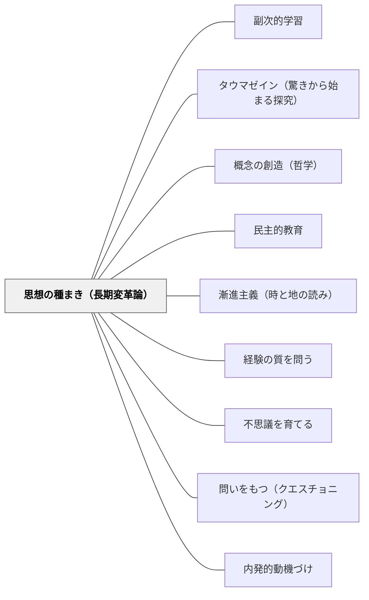

# 思想の種まき（長期変革論）

> 思想は種子であり、頭脳は畑だ——今日教室に蒔かれた問いの種は、数年後・数十年後に芽吹くかもしれない。授業の成果を「今日の到達点」だけで測ることへの根本的な問い直し。

## [Pattern Connection]

### 中江兆民（1887）三酔人経綸問答——「思想種子論」と漸進主義

南海先生は、急進的民主主義者（洋学紳士）に向かって言う：

> 「思想は種子であり、頭脳は畑です。きみが真に民主思想を喜ぶならば、これを口に論じ、書物に著わし、その趣旨を人々の頭脳にひろく植えつけるのです。数百年後、それが豊かに国中に生い茂っているかもしれません」——南海先生（三酔人経綸問答）

> 「時代は画布であり、思想は絵の具、事業は絵画です」——南海先生

> 「進化の神は、社会の頭上に君臨するのでも社会の足下にひそんでいるのでもなく、人々の頭脳のなかにうずくまっているのです」——南海先生

この三つの比喩が連動して示すのは：**社会変革（事業）は思想の成熟なしには起きない。思想を成熟させるのは教育・対話・著述という長期的な種まきの実践だ**、という認識論。

これは兆民晩年（1900年）のインタビューでも繰り返される：

> 「社会というものはな、秩序と進歩と相待ったものである。もし急激に事を処すると飛んだ間違いを起すものぢゃぞ……きわめて永久の年月を経て進歩する性質のものであるから、之れを改良するにはやはり進歩の法則に従い、次第に根本的改良に従事せねばならぬものぢゃ」——兆民

**「進化神の悪む所」**（部分：南海先生）：
> 「其の時と其の地とに於て必ず行なうことを得可からざる所を行なわんと欲すること、即ち是れのみ」

急激な改革への批判——「今この時と地でできることを見極めること」が進化の道理だ、という現実主義。

**既存パタンとの関連：**
- **補強点**：[[パタン/副次的学習]]（デューイ：「学習者が形成する態度は、内容より重要」）が示す「長期的な副次的効果」の重視と、兆民の「思想種子論」は同じ方向を向いている——教師の本当の仕事は「今日の到達」より「将来の思考の畑を耕すこと」だ。
- **接続点**：[[パタン/タウマゼイン（驚きから始まる探究）]] — 種として蒔かれるのは「驚き・問い」であり、到達すべき答えではない。
- **波及するパタン**：[[パタン/民主的教育]] — 思想種子論は「市民を育てる教育」の時間軸を与える；[[パタン/概念の創造（哲学）]] — 概念も「種として蒔く」ことで後に芽吹く

---

## 背景（Context）

教育の効果を「今日の授業で何を覚えたか」「単元テストで何点取れたか」という短期的尺度で評価する文化がある。これは必ずしも誤りではないが、教育の最も重要な効果——「考え方の転換」「問いを持ち続ける力」「価値観の形成」——はそのような短期評価には現れない。

中江兆民は、民主主義社会の実現という長期プロジェクトにおいて、急進的改革（洋学紳士）も軍事力（豪傑）も本質的な変革には至らないと論じた。なぜなら社会の変革は「思想の成熟」なしには持続しないから。思想を成熟させるのは、教育・著述・対話による「種まき」の実践だ——これが南海先生（兆民自身の声に近いとされる）の立場である。

教師の仕事を「種まき」として捉えると、授業の設計が変わる。目標は「今日の到達度」でなく「将来の芽吹きを可能にする問いの土壌を作ること」になる。

## 問題（Problem）

「今日の授業で理解させること」を目標とするとき、教師は「今すぐわかる説明」「今すぐ正解に到達できる問い」を優先する。しかしこれは往々にして：

- 難しい問いを回避し、「正解を渡す」授業になる
- 答えのない問いを「浮いたまま」にしておく力が育たない
- 「わからなかった」「考えが揺さぶられた」という経験が排除される
- 授業が「種を蒔く」でなく「すぐ刈り取る」設計になる

## 力のかたち（Forces）

- 単元評価・学期評価・学力調査がすべて短期的達成度を測る設計になっている
- 「今日理解できたか」は見えやすく、「10年後に芽吹く問いの種」は見えにくい
- 保護者・管理職への説明責任が「今日の成果」を要求する
- 長期的な種まきは、短期的には「何も達成しなかった授業」に見える
- 教師自身が「授業の成果とは今日の到達だ」という前提で授業を設計してきた

## 解決（Solution）

**「今日理解させること」と「将来の芽吹きのための種を蒔くこと」を意識的に区別し、後者を授業に組み込む。答えがすぐに出ない問いを、解決しないままにしておく勇気を持つ。**

---

### 具体例①：「種として蒔く問い」の設計

すぐに答えが出ない問いを、授業の最後に「宿題」として子どもの頭に残す：

| 「今日理解させる問い」 | 「種として蒔く問い」 |
|---|---|
| 「分数の割り算はどう計算しますか？」 | 「なぜ割り算するとき逆数をかけると同じになるのか——今日はわからなくていい、気になったら考え続けて」 |
| 「光合成の仕組みを説明できますか？」 | 「植物が光を食べて生きているとしたら、人間は何を『食べて』考えているのか？」 |
| 「民主主義とは多数決のことですか？」 | 「少数派はどうすればいい？——今日は答えを出さない、これは一生考える問いかもしれない」 |
| 「この詩の意味はわかりましたか？」 | 「10年後に読んだとき、今と違う意味に見えるかもしれない」 |

---

### 具体例②：「頭脳という畑を耕す」授業設計

兆民の比喩を授業設計に翻訳すると：

- **土を耕す**（背景知識・経験・問いの文脈を作る）→ 種を蒔く前の土台づくり
- **種を蒔く**（問いを授業に残す）→ 答えを出さずに終わってよい
- **水と光を与える**（関連する経験・読書・対話の機会を作る）→ 日常の中での熟成
- **芽吹きを待つ**（何年後かに子どもが自分でつながりを発見する）→ 教師が見届けられないこともある

「芽吹きを待つ」段階で教師がいなくても良い——種を蒔いた教師が卒業後まで関わることはほとんどない。しかし種は子どもの中で生き続ける可能性がある。

---

### 具体例③：「漸進主義」の授業設計——今この時と地でできることを見極める

南海先生の「進化神の悪む所は時と地を読まないこと」という判断軸を授業設計に適用する：

**問い**：「今このクラスで、今この時期に、できる次の一歩は何か？」

- 「完全な民主的教室」をいきなり目指すのでなく、「クラスの問いを1つ取り上げる」から始める
- 「全員が問いを持つ授業」より、「今日1人が問いを持った」を記録する
- 到達目標を「今日できること」と「種として残すこと」に分けて設計する

---

### 具体例④：兆民の物語構造が示す長期的視座

本書の結末は意味深長だ：「洋学紳士は北米へ、豪傑の客は上海へ。南海先生は相も変わらずただ酒を飲むのみ」——そして問答の書（本書）が残る。

問答は現実を変えなかった。しかし書物（思想の種子）が130年後も読まれている。

これを授業に適用すると：
- 今日の授業は「子どもの現在の行動を変えること」でなく「数十年後の子どもに届く問いの種を蒔くこと」かもしれない
- 「授業が終わったときにわかった状態」より「授業が終わった後も考え続けている状態」のほうが種として豊かかもしれない

---

## 結果（Consequences）

- 教師が「今日わかったか」という短期的評価への強迫から解放される
- 子どもが「答えが出なくてよい問い」と向き合う力が育つ
- 授業の設計に「即時の達成」と「長期の芽吹き」の二層が生まれる
- 教師自身が「自分が植えた種は今の子どもに見えないかもしれないが、10年後に芽吹くかもしれない」という長期的な信頼を持てるようになる

## 関連パタン

- [[パタン/副次的学習]] — 学習者が形成する態度は内容より重要——長期的な副次的効果の重視
- [[パタン/タウマゼイン（驚きから始まる探究）]] — 種として蒔かれるのは「驚き・問い」であり答えではない
- [[パタン/概念の創造（哲学）]] — 概念も「種として蒔く」ことで後に芽吹く
- [[パタン/民主的教育]] — 思想種子論は「市民を育てる教育」の時間軸を与える
- [[パタン/漸進主義（時と地の読み）]] — 時と地を読んで次の一歩を選ぶ実践知
- [[パタン/経験の質を問う]] — 長期的な「連続性」を教育経験の評価軸に加える（デューイ）
- [[パタン/不思議を育てる]] — 「答えのない問いを持ち続ける力」を育てること
- [[パタン/問いをもつ（クエスチョニング）]] — 問いを「今日答えるもの」でなく「長く持ち続けるもの」として育てる
- [[パタン/内発的動機づけ]] — 種が芽吹くのは外部評価でなく内発的動機から
- [[文献/三酔人経綸問答（中江兆民）]] — 本統合の出典

## クラスター図

## Actionable Insight

- 今週の授業の終わりに「今日答えが出なかった問い」を1つ、黒板に残して授業を終える——「まだ種のまま」という状態を肯定するシグナル
- 学期末や年度末に「今年蒔いた種リスト（答えが出なかった問い一覧）」を子どもと作る——「到達したこと」と「まだ芽吹いていない種」の両方を記録することで、学びの時間軸が変わる
- 「10年後の自分に届けるとしたら、今日の授業から何を持ち帰る？」という問いを単元の最後に書かせる——短期評価でなく長期の視座で授業を振り返る習慣を作る

## 出典

中江兆民（山田博雄訳）（2014）．『三酔人経綸問答』光文社古典新訳文庫．（原著: 1887年）

> 「思想は種子であり、頭脳は畑です。きみが真に民主思想を喜ぶならば、これを口に論じ、書物に著わし、その趣旨を人々の頭脳にひろく植えつけるのです。数百年後、それが豊かに国中に生い茂っているかもしれません」——南海先生（三酔人経綸問答）
